<!-- Written in 2025 by yasuakih -->
# 【制作中】モンテカルロ法によるデジタル印刷機の顧客未知パラメータ推定
<!--この記事は、デジタル印刷機を用いてオンデマンド印刷を営む印刷業者が製造している印刷物の特徴を、コンピュータ・シミュレーションによって推定するスタディである。-->

## 目的
デジタル印刷機の保守サービスを最適化するプロセスをコンピュータ上でシミュレーションを行う。この記事はプロセス全体を3つのテーマに分割した最初のステップを説明する。汎用プログラミング言語のPythonとパッケージでシミュレーションを構築し、架空の印刷機の未知パラメータを推定する。

- 顧客の未知パラメータ推定 【本記事の範囲】
- <font color="gray">部品ライフ推定</font>
- <font color="gray">機械の信頼度成長</font>

## 環境と構成要素
### デジタル印刷機
デジタル印刷機は高速・高性能な印刷装置であり、印刷物を生産財として必要な部数だけ生産するオンデマンド印刷に用いられる。その性能を維持するためにドラム、ブレード、ベルトなどの消耗品を定期的に交換する必要がある。メーカーは、定期交換部品ごとに寿命の管理目標を設定し、計画的に交換することで印刷機の故障を未然に防ぐ保守サービスを提供している。高い信頼性が求められるため、通信ネットワークを介して稼働状況を報告することもできる。

### 定期交換部品と部品ライフ
印刷機の性能を維持するために定期的に交換される部品を定期交換部品という。消耗した部品は一定の基準で交換される。消耗の度合いを部品ライフという。たとえば、ある部品で印刷した用紙の総数や、部品の回転数や摺動距離などの指標をもって数値化される。メーカーは、機械の設計時に部品ライフの仕様を定めてビジネス性を担保し、保守サービスでは管理目標を基準に部品を交換する。

### 遠隔保守で収集される情報
メーカーは、印刷業機から送られた稼働状況を用いて機械の状態を把握し、遠隔で保守サービスを提供することができる。印刷機から遠隔保守のために送信される情報として、たとえば、印刷機が消費したインクや用紙の量がある。遠隔保守では、これらの情報に基づいて部品ライフを推定し、次の交換時期を推定する。

### 予防交換と故障交換
作業安全のため、部品の交換は印刷機を止めて行うことが多く、印刷業者の業務計画に沿ってなされることが望まれる。保守サービス側でも保守作業を計画的にすることで限られた成員で対応し、補修部品の在庫量の適正化が可能となる。計画的な保守では部品ライフを管理目標と対比させ、次回の保守までに寿命に達すると見込まれる部品を一括で交換する「予防交換」を行う。これに対して突発的に故障が起こって稼働中の機械が止まった場合は、回復が急がれるため、問題を起こした部品のみ交換する「故障交換」が行われる。保守サービスでは部品コストと人的コストの両方を押さえるように管理目標が調整される。

<!--予防保守を顧客の業務に合わせて最適化するために顧客固有の情報が必要であるが、通常、顧客情報保護の観点から得られないため)、利用可能な情報から推定する必要がある。-->

### 印刷ジョブ
印刷業者が1つ1の印刷物を製造する最小の工程を印刷ジョブと呼び、次の例のような多くのパラメータの集まりである。印刷機はブラックボックスであり、外部から印刷ジョブを知ることはできない。

<!--* トータルエリアカバレッジ: 用紙面積に対するインクが塗布された面積の割合 (TAC値, エリアカバレッジとも)。印刷物の原稿によって決定される。
* 印刷ページ長: 印刷ジョブに含まれるページ数。複数部数の場合は印刷部数だけ同じ内容が繰り返される。
* 用紙サイズ: 印刷ジョブで指定される用紙の大きさ (例: はがき、A5、A4、B4、A3ノビ、長尺)
* 両面比率: 印刷物全体に対する両面印刷の比率。(両面印刷/(両面印刷+片面印刷))
カラー印刷物の場合は、色に関するパラメータも存在する。このスタディでは簡略化のためにモノクロとした。
* 色指定: 使用するインクの種類
* カラー比率: 印刷物全体に対するカラー印刷の比率で、カラー印刷/(カラー印刷+モノクロ印刷)で計算される。
-->

* 原稿: ページ上に印刷される画像の集まり
* 用紙: 用紙の大きさ、紙の銘柄や厚さ
* 印刷面: 用紙上に画像を出力する両面/片面の別
* 色: カラー/モノクロの別、インクや色数

## 未知パラメータと推定
### 部品ライフ管理の最適化と未知パラメータ
部品ライフは印刷機にかかる負荷によって左右される。部品の保守管理を最適化するために、顧客がどのように印刷機を使用し、どのような負荷が部品にかかるかを知る必要がある。その有力な情報源である<a href="#印刷ジョブ">印刷ジョブ</a>は、前述のように外部から知ることができない。そこで、入手できる情報をもとに部品ライフを表す別の指標を策定することとなる。こうした印刷業者の使い方を特徴づける情報を、外部から観測できないという意味で「未知パラメータ」と呼ぶ。

顧客が不良とみなす画質不具合の種類や程度などの品質基準も関心の対象となりうるが、印刷ジョブ同様に知ることはできないので、個々の印刷機の部品ライフに含まれると考える。

#### 部品ライフ管理最適化のために推定する未知パラメータ
部品にかかる負荷は印刷ジョブによって発生するが、印刷ジョブは1つ1つが異なっており、外部から観察できない。したがって、印刷ジョブを生成する要因へ着目し、未知パラメータとした。このスタディでは、顧客の印刷ジョブを生成する要因として次の項目に着目した。未知パラメータは1台1台の印刷機に固有である。

- インク関連
  - トータルエリアカバレッジ (用紙の単位面積あたりのインク塗布量)
- 用紙関連
  - ジョブ長 (印刷ジョブに含まれる総ページ数。書籍の場合、ページ数 x 部数)
  - 用紙サイズ (ページあたりの用紙面積、あるいは部品の回転数や移動距離)

### モンテカルロ法による未知パラメータ推定
印刷機は複雑なシステムのため、未知パラメータを推定する数式を作って解析的に解くことは困難と考えた。本スタディではコンピューターを用いたモンテカルロ法によって解を探索する。

#### モンテカルロ法シミュレーション
無作為に未知パラメータを仮定し、それに基づく印刷ジョブを多数発生させる。印刷ジョブを架空の印刷機に入力して消費される資源量を見積もる。累積資源量が上限を超えた時点でシミュレーションを終了する。この間に消費された累積資源量と、保守サービスで把握された稼働実績を比較する。両者の違いが無視できるなら、仮定した未知パラメータを「もっともらしい」と見なす。

<div align="center">
  <figure>
    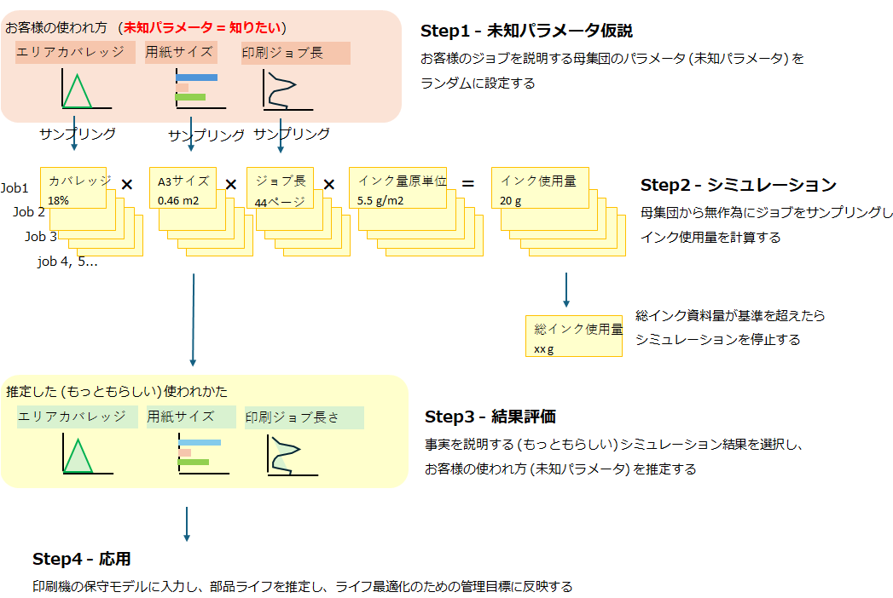
	<br/>
    <figcaption>図1. モンテカルロ法による未知パラメータ推定の流れ。Step1 未知パラメータ (潜在的な母集団を表すパラメータ) を無作為に仮定し、Step2 サンプリングした印刷ジョブから資源の消費量を計算し、その累積値が一定の上限に達した時点で止める。Step3 結果を事実と照らして仮定した未知パラメータが妥当かどうかを判断する。モンテカルロ法ではこれらのステップを多数繰り返し、妥当と見なした結果の集まりから未知パラメータに対する知見を得る。</figcaption>
  </figure>
</div>

#### 資源量の算出
印刷ジョブに対応する資源量 (インク、用紙) との関係は次の式で表わされる。未知パラメータとして、用紙サイズ、トータルエリアカバレッジ、印刷ジョブ長を与えれば、印刷ジョブを生成し、それに必要な資源量を算出できる。

- インク関連
  - インク量/ページ [g/page] = 用紙サイズ [m2/page] x トータルエリアカバレッジ [-] x インク原単位 [g/m2]
  - インク量/印刷ジョブ [g/job] = インク量/ページ [g/page] x 印刷ジョブ長[page/job]

- 用紙関連
  - (用紙サイズ別) 用紙枚数/印刷ジョブ [paper/job] = 印刷ジョブ長 [page/job] x 両面印刷比率 [-]

ここでインク原単位は、単位面積あたりに塗布されるインクの質量で、印刷機の機種ごとに決まる定数である。また、実際に使われる用紙枚数は、用紙に印刷される時の両面/片面の指示によって決まる。

#### シミュレーション結果の評価方法
シミュレーション結果の妥当性を、入力した印刷ジョブと、出力した資源量によって評価する。評価する基準として、保守サービスを通じた印刷機の稼働実績を用いる。例えば次のような項目が評価に利用できる。

- 印刷ジョブ関連
  - ジョブ数やページ数
- 資源量関連
  - インク総量
  - 用紙総量

#### 解への到達可能性
パラメータの組み合わせは無数にあるが、デジタル印刷機で制作する印刷物にはパターンが存在する。たとえば教科書のように文字が主体であれば、用紙サイズがB5～A4、エリアカバレッジは低い。また画像を多用したカタログであれば用紙サイズはA4～長尺、エリアカバレッジも高い。シミュレーションによる資源量の制約と評価を通じて、こうしたパターンが解として抽出されると期待される。

## シミュレーションの設計

### 全体の構造
アイディアを確認するためにシミュレーションを作成した。モンテカルロ法のロジックはPythonプログラミング言語で記述した。主なパッケージは、数値・統計計算に reliability、random、statistics、math、並列処理に multiprocessing、グラフィックスに matplotlib、seaborn、データ構造化に numpy、pandas を使用した。

下図は全体の構造である (丸括弧内はソースコード上の関数名)。処理は上から下へ、左から右へと進む。二つの主要なループがあり、「内側ループ」は仮定した未知パラメータに基づく印刷ジョブを繰り返し、総インク消費量が目標値に達するまで繰り返すことで、未知パラメータと資源消費量との対応を導き出す。一方「外側ループ」は、モンテカルロ法として妥当な解を探索するため、未知パラメータを仮定して、内側ループに引き継ぐことを繰り返す。

<pre><code><b>シミュレーション</b> (main)
  ├ <b>モンテカルロ法</b>を実行 (generate_monte_carlo_simulation)
  └ <b><a href="#シミュレーション結果の表示">シミュレーション結果の表示</a></b> (show_results)

    <b>モンテカルロ法</b> (generate_monte_carlo_simulation)
      ├ シミュレーション対象の印刷機を列挙
      ├ <b>印刷シミュレーション</b> (printing_simulation)
      └ シミュレーション結果の保存

        <b>印刷シミュレーション</b> (printing_simulation)
          └ シミュレーションを指定した回数だけ繰り返す。　　　　　　　　　　　　　　　　　← <b>外側ループ</b>
            ├ <b>顧客の印刷機に固有のオンデマンド印刷物の特徴</b>を作成 (class Customer)
            ├ <b>印刷ジョブ実行のシミュレーション</b> (simulate_job_printing)
            └ <b>仮説の妥当性評価</b> (validate_results)

              <b>顧客の印刷機に固有のオンデマンド印刷物の特徴</b> (class Customer)　　　　　← <b><a href="#未知パラメータ仮定">未知パラメータ仮定</a></b>
                └ オンデマンド印刷の特徴を作成 (generate_customer_printed_distribution)
                  ├ オンデマンド印刷機の印刷機セグメントを仮定
                  └ 印刷用紙のサイズ別割合を仮定 (split_job_by_paper_sizes)

              <b>印刷ジョブ実行のシミュレーション</b> (simulate_job_printing)
                └ 総インク消費量が目標値に達するまでループ　　　　　　　　　　　　　　　← <b>内側ループ</b>
                  ├ <b>印刷ジョブ</b>をランダムに生成 (class PrintedMatter)
                  ├ ジョブの<b><a href="#インク消費量の計算">インク消費量の計算</a></b> (ink_consumption_per_job)
                  └ 総インク消費量の計算

                    <b><a href="#印刷ジョブ生成">印刷ジョブ生成</a></b> (class PrintedMatter)
                     └ オンデマンド印刷物の特徴に基づき、用紙サイズ、エリアカバレッジ、ページ長、両面比を無作為に決める

              <b><a href="#仮説の妥当性評価">仮説の妥当性評価</a></b></b> (validate_results)
                ├ 評価0: 総インク量
                ├ 評価1: 用紙サイズ別の印刷枚数
                ├ 評価2: 用紙枚数総計
                ├ 評価3: ページ数分布
                └ OK-NG 判定 (ok_or_ng_decision)
</code></pre>

### 未知パラメータ仮定
#### 印刷機セグメント
印刷機セグメントは、印刷機の使われ方を二次元マップ上の位置で表すものである。Y軸, X軸はそれぞれ、トータルエリアカバレッジと印刷ジョブ長である。シミュレーションを簡単にするために、印刷機セグメントの両軸ともに離散的な 3段階 (Lo, Hi, Mid) とした。マップ上の位置で2つのパラメータの大きさを直感的に把握できる。モンテカルロ・シミュレーションでは、9つに分けた印刷機セグメントから 1つのアドレス (Q1-Q9) を無作為に選択した。これによってトータルエリアカバレッジ、および印刷ジョブ長も一意に決まる。

<div align="center">
  <figure>
    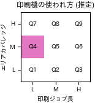
    <br/>
    <figcaption>図2. 印刷機の使われ方を説明する印刷機セグメントの二次元マップ。桃色で示す位置は、トータルエリアカバレッジ=Mid、印刷ジョブ長=Loに対応する。</figcaption>
  </figure>
</div>

#### トータルエリアカバレッジ
トータルエリアカバレッジは正規分布を仮定した。用紙サイズ別に3段階 (Hi, Mid, Lo) の平均と分散を設定し、印刷機セグメントの位置がトータルエリアカバレッジの母集団の分布を決める。それぞれの値はシミュレーションの結果を見て調節した。Lo(L) はテキスト主体 (教科書など)、Mid(M) は一般印刷物、High(H) は画像主体 (カタログなど) を想定するものである。シミュレーションではエリアカバレッジの範囲を 0 ＜ エリアカバレッジ ≦ 0.8 とした。

<figure>
  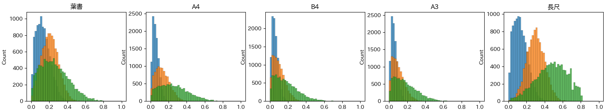
  <br/>
  <figcaption>図3. 用紙サイズごとのトータルエリアカバレッジの分布。印刷機セグメントの位置によって分布は異なる。横軸(X)はトータルエリアカバレッジ、縦軸(Y)は頻度。</figcaption>
</figure>

#### 印刷ジョブ長
印刷ジョブ長も同様に正規分布を仮定し、用紙サイズ別に、印刷量の規模に応じて 3段階 (Hi, Mid, Lo) の平均と分散を設定し、印刷機セグメントの位置が印刷ジョブ長の母集団の分布を決める。Lo(L)は部数の少ない小工場を、Mid(M)は中程度の工場を、High(H)は大量印刷まで行う大工場を想定した。A4、B4、A3 は書籍・ビジネス文書・チラシなど長いジョブが多く、長尺はポスターやカタログなど短いジョブが多いと想定した。シミュレーションでは印刷ジョブ長の範囲を 0 ＜ エリアカバレッジ ≦ 2000 とした。それぞれの値はシミュレーションの結果を見て調節した。

<figure>
  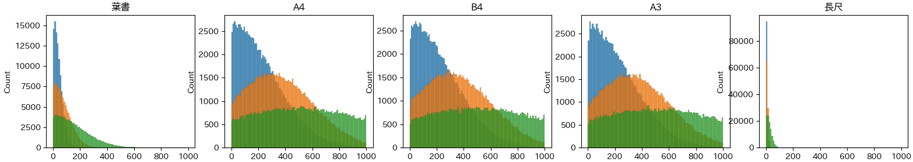
  <br/>
  <figcaption>図4. 用紙サイズごとの印刷ジョブ長の分布。印刷機セグメントの位置によって分布は異なる。横軸(X)は印刷ジョブ長、縦軸(Y)はジョブ数。</figcaption>
</figure>

#### 用紙サイズ比率
多数ある用紙サイズのうち、印刷機ごとに守備範囲があると考える。未知パラメータとして、使用する用紙サイズの種類を候補群 (葉書, A4, B4, A3, 長尺、計5種類) から無作為に 3-4種類を選択した。それぞれのサイズの合計が100%になるように、ランダムに配分を決めた。

### 印刷ジョブ生成
上記の未知パラメータに基づいて印刷ジョブを多数生成した。

#### 用紙サイズ
印刷機が利用可能な用紙サイズから、用紙サイズ比率に基づいて印刷ジョブを生成した。
<div align="center">
<figure>
  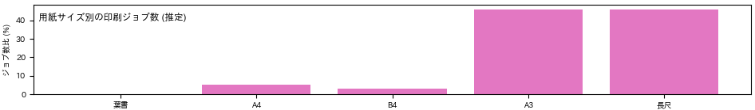
  <br/>
  <figcaption>図5. 用紙サイズ別のジョブ比率を示す印刷ジョブ母集団。この例では、葉書を除く 4種類の用紙が利用可能で、A3および長尺のジョブ数が大半を占めている。A3と長尺でジョブ数はほぼ同じでも、消費される用紙枚数は印刷ジョブ長の分布に応じて異なる。</figcaption>
</figure>
</div>

#### トータルエリアカバレッジ
用紙サイズに対応するトータルエリアカバレッジの母集団分布からサンプリングした。
<div align="center">
<figure>
  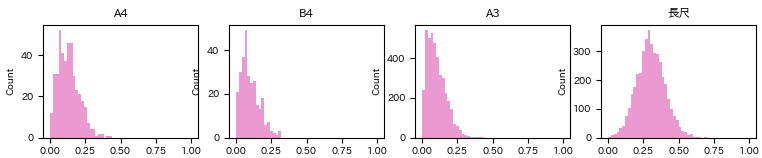
  <br/>
  <figcaption>図6. トータルエリアカバレッジの母集団からサンプリングした結果。エリアカバレッジ=M(Mid)</figcaption>
</figure>
</div>

#### 印刷ジョブ長
同様に用紙サイズに対応する印刷ジョブ長の母集団分布からサンプリングした。
<div align="center">
<figure>
  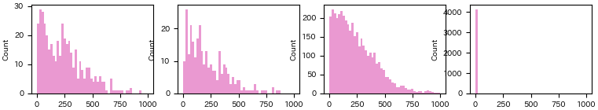
  <br/>
  <figcaption>図7. 印刷ジョブ長の母集団からサンプリングした結果。エリアカバレッジ=M(Mid)</figcaption>
</figure>
</div>

### インク消費量の計算
生成した印刷ジョブから、前述の「<a href="#資源量の算出">資源量の算出</a>」に示した式を用いて、そのジョブで消費したインク量を算出した。インク原単位 (単位面積あたりに塗布されるインクの質量) は、インク物性・用紙物性・塗布方法などによってさまざま考えられる。ここでは、粉体インク (トナー) を用いた市販のデジタル印刷機の値 (5.5 g/m2) を参考にした。シミュレーション全体を通じてインク量を累積して総インク消費量を算出し、事前に定めた総インク消費量を超えた時点でシミュレーションを終了した。

### 妥当性評価
シミュレーションの終了後、仮定した印刷機セグメントの妥当性評価を行った。架空の印刷機を想定し、期待値は<a href="#遠隔保守で収集される情報">遠隔保守で収集される情報</a>で得られる値とした。

#### 評価0: 総インク量
総インク量は印刷ジョブごとの消費インク量を累積して算出した。この量はシミュレーションの終了条件として用いるのみで、特別な比較はしていない。

<div align="center">
<figure>
  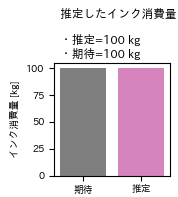
  <br/>
  <figcaption>図. インク消費量の期待値とシミュレーション値を比較した。シミュレーション終了条件でもあるので両者はほぼ一致している。</figcaption>
</figure>
</div>

#### 評価1: 用紙サイズ別の印刷枚数
期待値は用紙サイズ別の印刷枚数の総計とした。期待値とシミュレーション値との比較は、用紙サイズ別の分布として交差エントロピーで数値化して行った。

<div align="center">
<figure>
  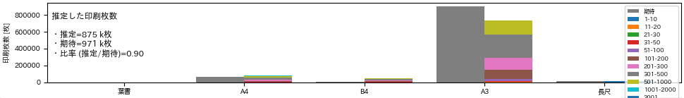
  <br/>
  <figcaption>図. 印刷用紙の消費量の期待値 (左=灰色)と、シミュレーション値 (右=色別) を比較する。用紙サイズ別に集計した印刷枚数の累積の例を示した。左端に総計と比率を示す。図の例では推定/期待の比率は0.90で10%の誤差がある。交差エントロピー h1_ce = 0.53 bit</figcaption>
</figure>
</div>

#### 評価2: 用紙枚数総計
用紙全体としての収支を評価できるよう、用紙枚数の総計を期待値とシミュレーション値とで比較した。上図の左端にその結果が示されている。

#### 評価3: ページ数分布
期待値はページ長の区間ごとの印刷ジョブ数の総計とした。簡略化のために用紙サイズによる分布の違いは無視した。そのためページ長が小さい区間は幅が狭く、大きくなるにつれて区間の幅を広げることで重み付けをした。期待値とシミュレーション値との比較は、区間ごとの分布として交差エントロピーで数値化して行った。

<div align="center">
<figure>
  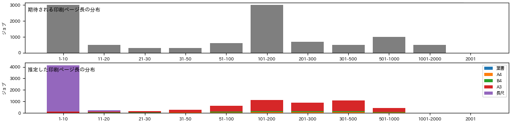
  <br/>
  <figcaption>図. ページ数分布を示す。上側は期待値、下側はシミュレーション値。用紙サイズによって分布が異なり、それらが重なって複数のピークを持った形状をしている。下側のシミュレーション結果では、用紙サイズで色別することで区間ごとの内訳がわかる。交差エントロピー h2_ce = 3.27 bit</figcaption>
</figure>
</div>

#### OK-NG 判定
OK-NG 判定は閾値をもうけて行った。次の3条件をいずれも満たす場合は OK、それ以外は NG とした。

| 項目                       | 閾値                               |
| -------------------------- | ---------------------------------- |
| 評価1: 用紙サイズ別の印刷枚数 | h1_ce ≦ 1.0                      | 
| 評価2: 用紙枚数総計          | 0.70 ≦ sumq1_sump1_ratio ≦ 1.30 |
| 評価3: ページ数分布          | h2_ce ≦ 3.3                      |

### シミュレーション結果の表示

#### 資源消費量の推定
シミュレーション全体のプロセスを視覚的に把握できるようにグラフィックスを作成した。下図のように、仮定した未知パラメータ、それに基づくシミュレーション結果、それぞれの評価項目の出力を 1枚に集約した。
<div align="center">
<figure>
  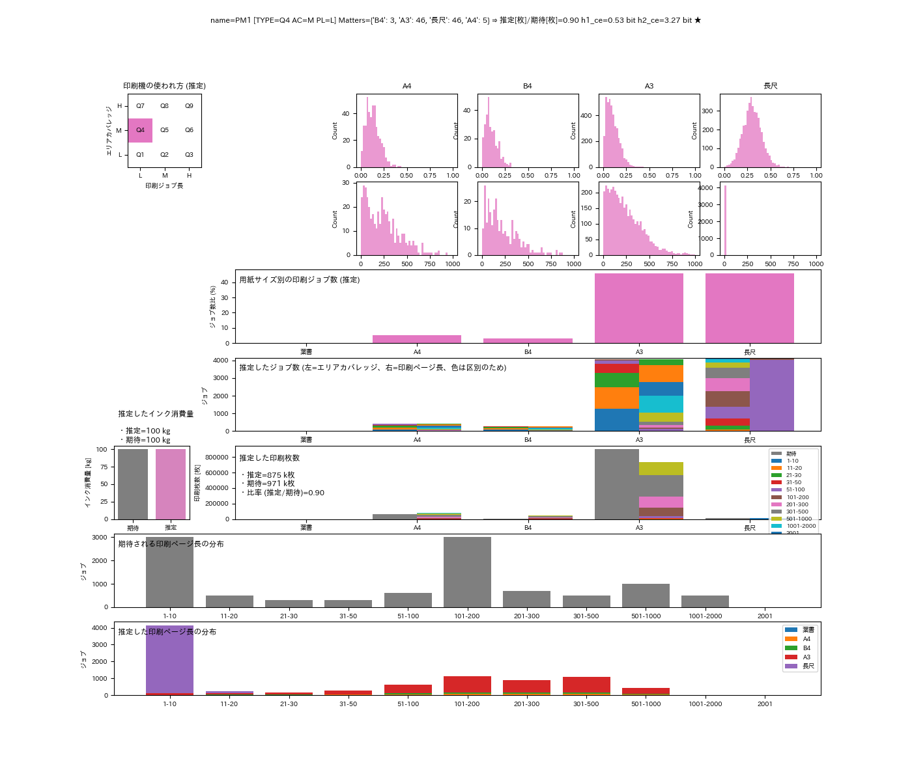
  <br/>
  <figcaption>図. 未知パラメータに基づくシミュレーション結果のサマリー。未知パラメータは、印刷機セグメント=Q4、エリアカバレッジ=M(Mid)、印刷ジョブ長=L(Low)、用紙サイズ=[A4:5%, B4:3%, A3:46%, 長尺:46%]である。シミュレーション結果は、サイズ別印刷枚数分布 h1_ce=0.53 bit、用紙枚数比 0.90、ページ数分布 h2_ce=3.27 bit。この結果は OK である。</figcaption>
</figure>
</div>

## 実験結果
次のコマンドラインを用いてシミュレーションを計300回行った結果、計4件の OK 結果を得た。

``` shell
python sim_hidden_param.py --iterations 300 --printing_machines PM1
```

### 印刷機セグメントの推定
印刷機セグメントマップ上で、計4件の OK 結果は図のように対応した。75%はトータルエリアカバレッジ=M(Mid)、印刷ジョブ長=L(Low)に集まった。残り25%も印刷ジョブ長=M(Mid)は隣接する別のセグメントであったが、エリアカバレッジは同じであった。この結果から、この架空の印刷機は、比較的中等のエリアカバレッジで、比較的少数部数の出力を行っていると見なせる。

<div align="center">
<figure>
  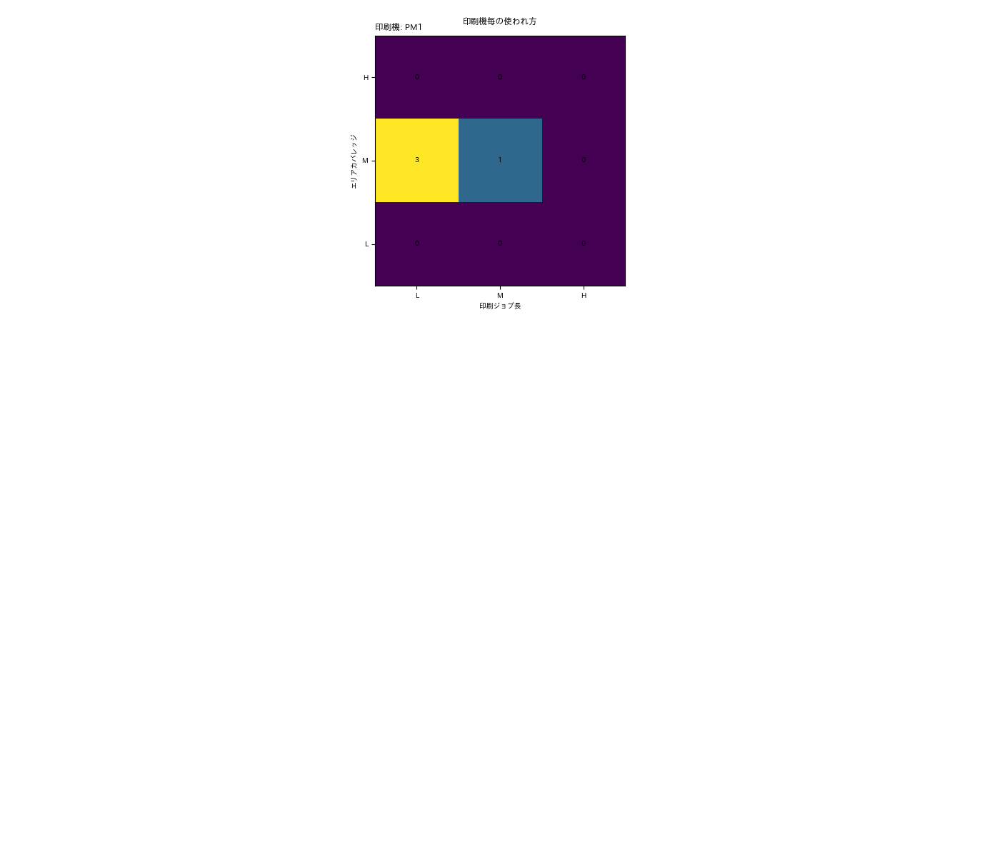
  <br/>
  <figcaption>図. 実験結果-印刷機セグメント.png</figcaption>
</figure>
</div>

## 考察
### シミュレーション回数
本シミュレーションで得られたOK件数は4件であり、3件は1つのセグメントに集まった。信頼区間を設定して得られた結果が偶然かどうかを示すことで、後続の用途により統計的優位性をもった予測として説明できるだろう。

### プログラムコード改善
現在のプログラムコードは、Python言語のclass機能を用いており、そうでない場合と比べ、シミュレーション時のメモリ消費量や、オブジェクトを永続的にストレージに保存するような場合に不利になる。シミュレーション回数を増やすためにはメモリ消費や処理時間の短縮が課題となるので、資源消費がより少ない設計にすることが求められる。

### 未知パラメータの拡張
本格的なライフ予測のためには、より多くの未知パラメータや、よりリアルなシナリオが求められる。たとえば次のようなものがあげられる。顧客と接する営業やエンジニアとの連携が重要となる。

1. 印刷物の種類 (書籍、カタログ、チラシ、帳票、ビジネス書類、漫画同人誌など)
2. カラー印刷
3. 用紙の物性や形状
4. 時間変化、季節性変化
5. 品質基準

## 結論
保守サービスを最適化を想定した「印刷機の使われ方」の探索をモンテカルロ法シミュレーションで行った。ブラックボックスである「印刷機の使われ方」を、3つの未知パラメータとして表現し、遠隔保守サービスで得られる統計的な情報から、これらの未知パラメータの「もっともらしい」値を推定することができた。この結果を次ステップ「部品ライフ推定」へ連携することで、保守サービスの管理目標の妥当性評価につながる。課題として、机上実験レベルから実データによる検証や調整への拡大と、機能面ではカラー印刷への対応がある。

## 参考資料
## 付録
### ソースコード
* [sim_hidden_param.py](sim_hidden_param.py)

### コマンドライン
``` shell
usage: sim_hidden_param.py [-h] [--iterations ITERATIONS] [--printing_machines [PRINTING_MACHINES ...]] [--pickle PICKLE] [--cpu_count CPU_COUNT] [--seed SEED] [--import_file IMPORT_FILE]

options:
  -h, --help            show this help message and exit
  --iterations ITERATIONS
                        モンテカルロ法の総実行回数を指定する (デフォルト: 1)。 実用上の上限は 1000 程度。 (例: --iterations 1000)
  --printing_machines [PRINTING_MACHINES ...]
                        シミュレーション対象の印刷機の名前 (例: --printing_machines PM1 PM2)
  --pickle PICKLE       既存のシミュレーション結果 pickle ファイルを指定する。この場合、シミュレーションは行わなずに、シミュレーション結果だけを表示する。大域変数 sim_result_all に格納されたデータはデバッグ時に生かせる。マルチプロセスの場合は機能しない制約がある。(例: --pickle )
  --cpu_count CPU_COUNT
                        シミュレーションをマルチプロセスで行う場合、使用するCPU数を指定する。1=シングルプロセス(デフォルト), 2以上=マルチプロセス)
  --seed SEED           random.seed() を指定する。0 の場合はシステム時刻を使う (デフォルト: 42)。 (例: --seed 0)
  --import_file IMPORT_FILE
                        印刷機のデータファイル
```

----
このページに掲載した作品 (テキスト、プログラムコードなど) はパブリック・ドメインに提供しています。詳細は [CC0 1.0 全世界 コモンズ証](https://creativecommons.org/publicdomain/zero/1.0/deed.ja) をご覧ください。
