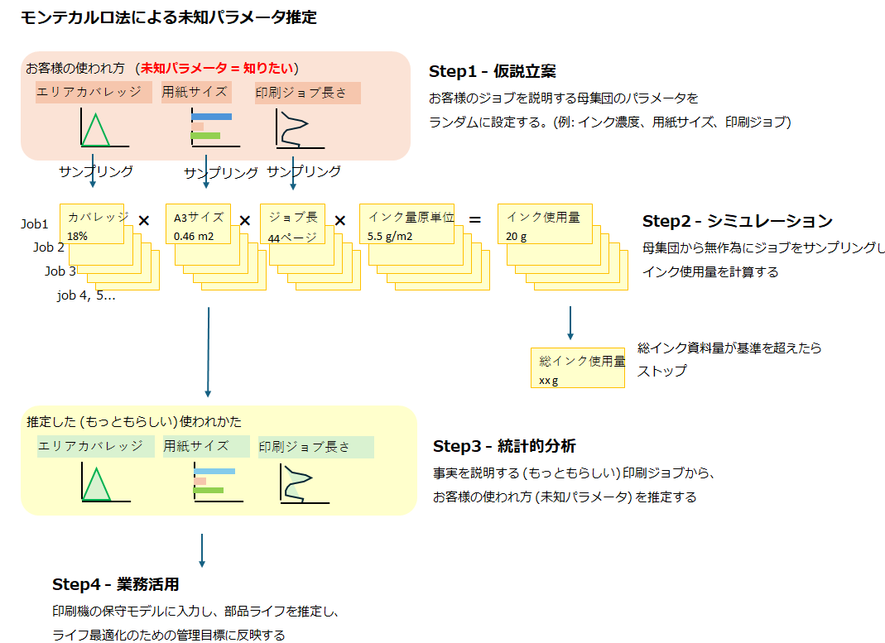
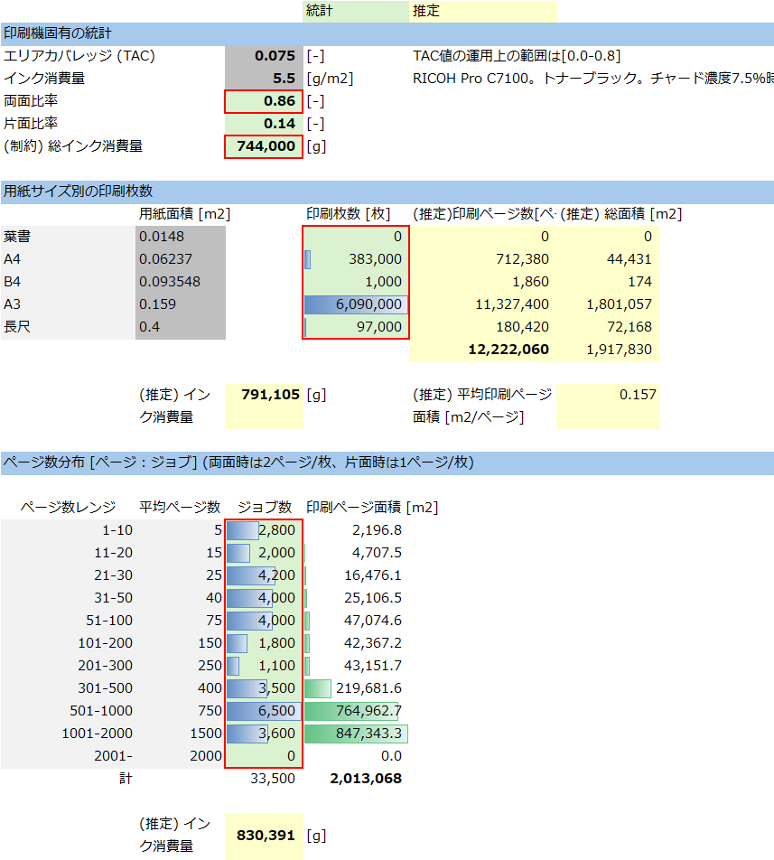
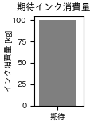
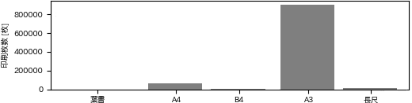
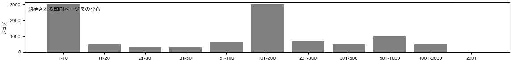

<!-- Written in 2025 by yasuakih -->
# 【制作中】モンテカルロ法によるデジタル印刷機の顧客未知パラメータ推定
<!--この記事は、デジタル印刷機を用いてオンデマンド印刷を営む印刷業者が製造している印刷物の特徴を、コンピュータ・シミュレーションによって推定するスタディである。-->

## 目的
デジタル印刷機の保守サービスを最適化するプロセスをコンピュータ上でシミュレーションを行う。この記事はプロセス全体を3つのテーマに分割した最初のステップを説明する。汎用のプログラミング言語Pythonとフリーソフトでシミュレーションを構築し、架空の印刷機の未知パラメータを推定する。

- 1.顧客の未知パラメータ推定 【本記事の範囲】
- 2.部品ライフ推定
- 3.機械の信頼度成長

## 環境と構成要素
### デジタル印刷機
デジタル印刷機とは高速で高性能な印刷装置であり、印刷物を生産財として必要な部数だけ生産するオンデマンド印刷に用いられる。その性能を維持するためにドラム、ブレード、ベルトなどの消耗品を定期的に交換する必要がある。メーカーは、定期交換部品ごとに寿命の管理目標を設定し、計画的に交換することで印刷機の故障を未然に防ぐ保守サービスを提供している。高い信頼性が求められるため、通信ネットワークを介して稼働状況を送信することができ、メーカーは、顧客である印刷業者から送られた稼働状況を用いて機械の状態を把握することができる。

### 定期交換部品と部品ライフ
印刷機の性能を維持するために定期的に交換される部品を定期交換部品という。消耗した部品は一定の基準で交換され、消耗の度合いを部品ライフという。たとえばその部品で印刷した用紙の枚数数や、部品の運動した回数や距離のような指標をもって数値化される。メーカーは機械の設計時に部品ライフの管理目標を策定し、保守サービスではこれを基準に部品を交換する。

### 遠隔保守で収集される情報
印刷機から遠隔保守のために送信される情報としてたとえば、印刷機が消費したインクや用紙の量がある。遠隔保守では、これらの情報に基づいて部品ライフを推定し、次の交換時期を推定する。

### 予防交換と故障交換
定期交換部品を交換は印刷機を止めて行うことが多く、印刷業者の業務計画に沿ってなされることが望まれる。保守サービス側でも保守作業を計画的にすることで限られた成員で対応できる。計画的な保守では部品ライフを管理目標と対比させ、次回の保守までに寿命に達すると見込まれる部品を一括で交換する「予防交換」を行う。これに対して突発的に故障が起こって稼働中の機械が止まった場合は、回復が急がれるため、問題を起こした部品のみ交換する「故障交換」が行われる。交換部品のコストと保守作業員のコストの両方を減らすように管理目標が調整される。

<!--予防保守を顧客の業務に合わせて最適化するために顧客固有の情報が必要であるが、通常、顧客情報保護の観点から得られないため)、利用可能な情報から推定する必要がある。-->

### 印刷ジョブ
印刷業者が1つ1の印刷物を製造する工程を印刷ジョブと呼び、次の例のような多くのパラメータの集まりである。印刷機はブラックボックスであるために、外部から印刷ジョブを知ることはできない。

<!--* トータルエリアカバレッジ: 用紙面積に対するインクが塗布された面積の割合 (TAC値, エリアカバレッジとも)。印刷物の原稿によって決定される。
* 印刷ページ長: 印刷ジョブに含まれるページ数。複数部数の場合は印刷部数だけ同じ内容が繰り返される。
* 用紙サイズ: 印刷ジョブで指定される用紙の大きさ (例: はがき、A5、A4、B4、A3ノビ、長尺)
* 両面比率: 印刷物全体に対する両面印刷の比率。(両面印刷/(両面印刷+片面印刷))
カラー印刷物の場合は、色に関するパラメータも存在する。このスタディでは簡略化のためにモノクロとした。
* 色指定: 使用するインクの種類
* カラー比率: 印刷物全体に対するカラー印刷の比率で、カラー印刷/(カラー印刷+モノクロ印刷)で計算される。
-->

* 原稿: ページ上に印刷される画像の集まり
* 用紙: 用紙の大きさ、紙の銘柄や厚さ
* 印刷面: 用紙上に画像を出力する両面/片面の別
* 色: カラー/モノクロの別、インクや色数

## 未知パラメータと推定
### 部品ライフ管理の最適化と未知パラメータ
部品ライフは印刷機にかかる負荷によって左右される。部品の保守管理を最適化するために、顧客がどのように印刷機を使用し、どのような負荷が部品にかかるかを知る必要があるが、前述のように印刷ジョブは外部から知ることができない。そこで、入手できる情報をもとに部品ライフを表す別の指標を策定する。こうした印刷業者の使い方を特徴づける情報を、外部から観測できないという意味で「未知パラメータ」と呼ぶ。

顧客が不良とみなす画質不具合の種類や程度などの品質基準も関心の対象となりうるが、印刷ジョブ同様に知ることはできないので、個々の印刷機の部品ライフに含まれると考える。

#### 部品ライフ管理最適化のために推定する未知パラメータ
部品にかかる負荷は印刷ジョブによって発生するが、印刷ジョブは1つ1つが異なっており、外部から観察できない。したがって、印刷ジョブを生成する要因へ着目し、未知パラメータとした。このスタディでは、顧客の印刷ジョブを生成する要因として次の項目に着目した。そして未知パラメータは1台1台の印刷機に固有なものとなる。

- インク関連
  - トータルエリアカバレッジ (用紙の単位面積あたりのインク塗布量)
- 用紙関連
  - ジョブ長 (印刷ジョブに含まれる総ページ数。書籍の場合、ページ数 x 部数)
  - 用紙サイズ (ページあたりの用紙面積、あるいは部品の回転数や移動距離)

### モンテカルロ法による未知パラメータ推定
印刷機は複雑なシステムのため、未知パラメータを推定する数式を作って解析的に解くことは困難だと考えた。本スタディではコンピューターを用いたモンテカルロ法によって解を探索する。

* 

#### モンテカルロ法シミュレーション
無作為に未知パラメータを仮定し、それに基づく印刷ジョブを多数発生させる。印刷ジョブを架空の印刷機に入力して消費される資源量を見積もる。累積資源量が上限を超えた時点でシミュレーションを終了する。この間に消費された累積資源量と、保守サービスで把握された稼働実績を比較する。両者の違いが無視できるなら、仮定した未知パラメータを「もっともらしい」と見なす。

#### 資源量の算出
印刷ジョブに対応する資源量 (インク、用紙) との関係は次の式で表わされる。未知パラメータとして、用紙サイズ、トータルエリアカバレッジ、印刷ジョブ長を与えれば、印刷ジョブを生成し、それに必要な資源量を算出できる。

- インク関連
  - インク量/ページ [g/page] = 用紙サイズ [m2/page] x トータルエリアカバレッジ [-] x インク原単位 [g/m2]
  - インク量/印刷ジョブ [g/job] = インク量/ページ [g/page] x 印刷ジョブ長[page/job]

- 用紙関連
  - (用紙サイズ別) 用紙枚数/印刷ジョブ [paper/job] = 印刷ジョブ長 [page/job] x 両面印刷比率 [-]

ここでインク原単位は、単位面積あたりに塗布されるインクの質量で、印刷機の機種ごとに決まる定数である。また、実際に使われる用紙枚数は、用紙に印刷される時の両面/片面の指示によって決まる。

#### シミュレーション結果評価
シミュレーション結果の妥当性を、入力した印刷ジョブと、出力した資源量によって評価する。評価する基準として、保守サービスを通じた印刷機の稼働実績を用いる。例えば次のような項目が評価に利用できる。

- 印刷ジョブ関連
  - ジョブ数や印刷ページ数
- 資源量関連
  - インク総量 (インクの色別)
  - 用紙総量 (大きさや厚さ別)

#### 解への到達可能性
パラメータの組み合わせは無数にあるが、デジタル印刷機で制作する印刷物には経験的なパターンが存在する。たとえば教科書のように文字が主体であれば、用紙サイズがB5～A4、エリアカバレッジは低い。また画像を多用したカタログであれば用紙サイズはA4～長尺、エリアカバレッジも高い。シミュレーションによる資源量の制約と評価を通じて、こうしたパターンが解として抽出されると期待される。

## シミュレーションの設計

### 全体の構造
設計はトップダウンである。プログラミング言語はPythonを用いた。モンテカルロ法は単純なので、Python言語の基本的な機能で大半を記述した。数値・統計計算に reliability、random、statistics、math、処理時間を短縮する並列処理に multiprocessing、グラフィックスに matplotlib、seaborn、データ構造化に pandasを使用した。

次は全体の構造である (丸括弧内はソースコード上の関数名)。この構造には二つの主要なループがある。「内側ループ」は未知パラメータに基づく印刷ジョブを繰り返して、総インク消費量が目標値に達するまで印刷ジョブを生成する。「外側ループ」は、モンテカルロ法として妥当な解を探索する。

<pre><code><b>シミュレーション</b> (main)
  ├ <b>モンテカルロ法</b>を実行 (generate_monte_carlo_simulation)
  └ シミュレーション結果の表示 (show_results)

    <b>モンテカルロ法</b> (generate_monte_carlo_simulation)
      ├ シミュレーション対象の印刷機を列挙
      ├ <b>印刷シミュレーション</b> (printing_simulation)
      └ シミュレーション結果の保存

        <b>印刷シミュレーション</b> (printing_simulation)
          └ シミュレーションを指定した回数だけ繰り返す。　　　　　　　　　　　　　　　　　← <b>外側ループ</b>
            ├ <b>顧客の印刷機に固有のオンデマンド印刷物の特徴</b>を作成 (class Customer)
            ├ <b>印刷ジョブ実行のシミュレーション</b> (simulate_job_printing)
            └ <b>仮説の妥当性判定</b> (validate_results)

              <b>顧客の印刷機に固有のオンデマンド印刷物の特徴</b> (class Customer)
                └ オンデマンド印刷の特徴を作成 (generate_customer_printed_distribution)
                  ├ オンデマンド印刷機の印刷機セグメントを仮定
                  └ 印刷用紙のサイズ別割合を仮定 (split_job_by_paper_sizes)

              <b>印刷ジョブ実行のシミュレーション</b> (simulate_job_printing)
                └ 総インク消費量が目標値に達するまでループ　　　　　　　　　　　　　　　← <b>内側ループ</b>
                  ├ <b>印刷ジョブ</b>をランダムに生成 (class PrintedMatter)
                  ├ ジョブのインク消費量の計算 (ink_consumption_per_job)
                  └ 総インク消費量の計算

                    <b>印刷ジョブ</b> (class PrintedMatter)
                     └ オンデマンド印刷物の特徴に基づき、用紙サイズ、エリアカバレッジ、ページ長、両面比を無作為に決める

              <b>仮説の妥当性判定</b> (validate_results)
                ├ 評価1: 用紙サイズ別の印刷枚数
                ├ 評価2: ページ数合計
                ├ 評価3: ページ数分布
                └ OK-NG 判定 (ok_or_ng_decision)
</code></pre>


### 未知パラメータ仮定
#### 印刷機セグメント
印刷機セグメントは、印刷機の使われ方を二次元マップ上の位置で表すものである。Y軸, X軸はそれぞれ、トータルエリアカバレッジと印刷ジョブ長である。シミュレーションを簡単にするために、印刷機セグメントの両軸ともに 3段階 (Lo, Hi, Mid) の離散的なものとした。モンテカルロ・シミュレーションでは9つに分けた印刷機セグメントから1つのアドレス (Q1-Q9) を無作為に選択した。これによってトータルエリアカバレッジ、および印刷ジョブ長も決まる。マップ上の位置で2つのパラメータの大きさを直感的に把握できる。

<div align="center">
  <figure>
    
    <figcaption>印刷機の使われ方を説明する印刷機セグメントの二次元マップ。桃色で示す位置は、トータルエリアカバレッジ=Mid、印刷ジョブ長=Loに対応する。</figcaption>
  </figure>
</div>

#### トータルエリアカバレッジ
トータルエリアカバレッジは正規分布を仮定した。用紙サイズ別に3段階 (Hi, Mid, Lo) の平均と分散を固定し、それぞれの値はシミュレーションの結果を見て調節した。Lo(L) はテキスト主体 (教科書など)、Mid(M) は一般印刷物、High(H) は画像主体 (カタログなど) を想定した。シミュレーションではエリアカバレッジの範囲を 0 < エリアカバレッジ <= 0.8 とした。

<figure>
  
  <figcaption>用紙サイズごとのトータルエリアカバレッジの分布。印刷機セグメントの位置によって分布は異なる。横軸(X)はトータルエリアカバレッジ、縦軸(Y)は頻度。</figcaption>
</figure>
<!--
``` python
        # トータルエリアカバレッジ - 用紙サイズ別に仮定
        area_coverage_list = {
            '葉書': {'L': [0.10, 0.10], 'M': [0.20, 0.10], 'H': [0.20, 0.20]},
            'A4'  : {'L': [0.03, 0.05], 'M': [0.10, 0.10], 'H': [0.20, 0.20]},
            'B4'  : {'L': [0.03, 0.05], 'M': [0.04, 0.10], 'H': [0.05, 0.20]},
            'A3'  : {'L': [0.03, 0.05], 'M': [0.04, 0.10], 'H': [0.05, 0.20]},
            '長尺': {'L': [0.10, 0.10], 'M': [0.30, 0.10], 'H': [0.50, 0.20]},
        }
```
-->

#### 印刷ジョブ長
印刷ジョブ長も同様に正規分布を仮定し、用紙サイズ別に、印刷量の規模に応じて 3段階 (Hi, Mid, Lo) の平均と分散を仮定し、シミュレーションの結果を見て値を調節した。シミュレーションでは印刷ジョブ長の範囲を 0 < エリアカバレッジ <= 2000 とした。

<figure>
  
  <figcaption>用紙サイズごとの印刷ジョブ長の分布。印刷機セグメントの位置によって分布は異なる。横軸(X)は印刷ジョブ長、縦軸(Y)はジョブ数。</figcaption>
</figure>
<!--
``` python
        # 印刷ページ長 - 用紙サイズ別に仮定
        page_length_list = {
            '葉書': {'L': [0,  50], 'M': [  0, 100], 'H': [  0, 200]},
            'A4'  : {'L': [0, 300], 'M': [300, 300], 'H': [500, 600]},
            'B4'  : {'L': [0, 300], 'M': [300, 300], 'H': [500, 600]},
            'A3'  : {'L': [0, 300], 'M': [300, 300], 'H': [500, 600]},
            '長尺': {'L': [0,   5], 'M': [  0,  10], 'H': [  0,  30]},
        }
```
-->

#### 用紙サイズ比率
多数ある用紙サイズのうち、印刷機によって得意とするものとそうでないものがあると考えた。用紙サイズの候補を、葉書, A4, B4, A3, 長尺の 5種類とし、無作為に 3-4種類を選択して、その配分が合計して100%になるようにランダムに配分を決めた。

### 印刷ジョブ生成
### 資源量算出
<figure>
  
  <figcaption>モデルの実現性スタディ 収支計算</figcaption>
</figure>

#### インク
#### 用紙
### 結果評価
#### インク量 (累積)
#### 用紙分布 (交差エントロピー)
#### ページ長分布 (交差エントロピー)
### 結果出力
#### 印刷物種類ごとの、ページ数、および部数


#### インク消費量の計算式
#### 制約条件 (インク量、用紙枚数、用紙枚数の交差エントロピー、印刷ジョブ長の交差エントロピー)
#### 印刷機セグメント部類 (トータルエリアカバレッジと印刷ジョブ長の仮定)
#### 用紙サイズ比率(3-4種類、合計して100%)

### Step2. モンテカルロ法シミュレーション

コンピューターの応用であるモンテカルロ法は、未知パラメータを推定するのに役立つ。

正解を与えるラベルも、パラメータのいずれも不明なため、モンテカルロ法を用いる。

シミュレーションで問題を解くために、潜在的なパラメータを特定したモデルを作成する。

仮設立案
それぞれの印刷物を特徴付ける「潜在的パラメータ」を設定する。

#### (1) オンデマンド印刷機の種類
はじめに、印刷業者のデジタル印刷機が属する「印刷機セグメント」を決める。


高速化
マルチプロセシング


### Step3. 結果の出力と評価

#### 印刷物種類ごとの、ページ数、および部数

#### 制約

<figure>
  
  <figcaption></figcaption>
</figure>

<figure>
  
  <figcaption></figcaption>
</figure>

<figure>
  
  <figcaption></figcaption>
</figure>


## 方法

## 結果

### 良好な結果

<figure>
  
  <figcaption></figcaption>
</figure>

### 不良な結果

## 考察

### 実験結果より
もっともらしい値を推定
次ステップへの結果の引き継ぎ

### 改善策
メモリ消費の削減クラスに換えて通常オブジェクトによる表現で

### 追加を検討したいパラメータ

1. 注文頻度（注文の頻繁さ）
2. カラー印刷 vs モノクロ印刷の割合
3. 納期
4. 顧客タイプ（法人 vs 個人）
5. 印刷物の仕上げ方法（仕上げ加工の有無）
6. 注文のカスタマイズ度合い（標準 vs カスタマイズ）

### 受注比率
注文全体に対する、その印刷物種類の比率。たとえば、ビジネス文書の注文率 = ビジネス文書の注文数/全体の注文数とする。

## 結論
## 参考資料
## 付録
### ソースコード

* [sim_hidden_param.py](sim_hidden_param.py)

### コマンドライン
``` shell
usage: sim_hidden_param.py [-h] [--iterations ITERATIONS] [--printing_machines [PRINTING_MACHINES ...]] [--pickle PICKLE] [--cpu_count CPU_COUNT] [--seed SEED] [--import_file IMPORT_FILE]

options:
  -h, --help            show this help message and exit
  --iterations ITERATIONS
                        モンテカルロ法の総実行回数を指定する (デフォルト: 1)。 実用上の上限は 1000 程度。 (例: --iterations 1000)
  --printing_machines [PRINTING_MACHINES ...]
                        シミュレーション対象の印刷機の名前 (例: --printing_machines PM1 PM2)
  --pickle PICKLE       既存のシミュレーション結果 pickle ファイルを指定する。この場合、シミュレーションは行わなずに、シミュレーション結果だけを表示する。大域変数 sim_result_all に格納されたデータはデバッグ時に生かせる。マルチプロセスの場合は機能しない制約がある。(例: --pickle )
  --cpu_count CPU_COUNT
                        シミュレーションをマルチプロセスで行う場合、使用するCPU数を指定する。1=シングルプロセス(デフォルト), 2以上=マルチプロセス)
  --seed SEED           random.seed() を指定する。0 の場合はシステム時刻を使う (デフォルト: 42)。 (例: --seed 0)
  --import_file IMPORT_FILE
                        印刷機のデータファイル
```

### 実行例

``` shell
python sim_hidden_param.py --iterations 100 --printing_machines PM1
```

----
このページに掲載した作品 (テキスト、プログラムコードなど) はパブリック・ドメインに提供しています。詳細は [CC0 1.0 全世界 コモンズ証](https://creativecommons.org/publicdomain/zero/1.0/deed.ja) をご覧ください。
