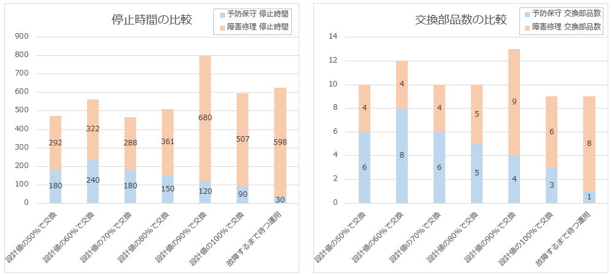

<!-- Written in 2025 by yasuakih -->
# 【制作中】定期交換部品のライフ推定による交換時期の最適化
この記事は、オンデマンド印刷機の定期交換部品の最適な交換時期をコンピュータシミュレーションによって決定するスタディである。

## 目的
デジタル印刷機の保守サービスを最適化するプロセスをコンピュータ上でシミュレーションを行う。この記事はプロセス全体を3つのテーマに分割した 2番目のステップを説明する。最初の記事で推定した<a href="../article1/">印刷機の使われ方</a>をもとに、定期交換部品を計画的に交換する管理目標によって、印刷機の停止時間 (ダウンタイム) と交換される部品数 (コスト) に及ぼす影響を推定し、保守サービスにおける最適な交換時期を決定する。汎用プログラミング言語のPythonと無償のシミューレション用パッケージ simpy でシミュレーションを構築する。

- <font color="gray">1 顧客の未知パラメータ推定</font>
- 2 部品ライフ推定 【本記事の範囲】
- <font color="gray">3 機械の信頼度成長</font>

## 印刷機の保守モデル

### 応力-強度モデル
[応力-強度モデル](https://en.wikipedia.org/wiki/Stress%E2%80%93strength_analysis) (Stress–strength analysis)

<div align="center">
  <figure>
    
	<br/>
    <figcaption>図. 応力-強度モデル
	by [Cdang](https://commons.wikimedia.org/wiki/File:Contrainte_resistance_2d_proche.svg) ([CC BY-SA 3.0](https://creativecommons.org/licenses/by-sa/3.0/deed.ja))
</figcaption>
  </figure>
</div>

### 印刷機の保守モデル

<div align="center">
  <figure>
    
	<br/>
    <figcaption>図. 印刷機の保守モデル (<a href="../img/印刷機の保守モデル.png" target="_blank">拡大</a>)</figcaption>
  </figure>
</div>

## シミュレーションの設計

### 全体の構造

<div align="center">
図2. 全体の構造
</div>

<pre><code>
<b>シミュレーション</b> (main)
  ├ シミュレーション環境作成
  ├ <b>印刷シミュレーションプロセス</b>(平行動作) (printingmachine_simulator_process)
  ├ シミュレーションを1年間行う
  └ 結果表示
   
    印刷シミュレーションプロセス (printingmachine_simulator_process)
      ├ <b>印刷機ユニット作成</b> (class PrintingMachine)
      ├ 印刷機ユニットを確保
      ├   <b>予防保守プロセス</b> - 部品の初回インストール (preventive_maintenance_process)
      ├ 印刷機の保守計画を作成 (10日ごとに予防保守を実施する) (class MaintenanceWork)
      ├   予防保守のスケジュールと実施プロセス (preventive_maintenance_setup_process)
      ├ シミュレーション開始時点で存在する印刷ジョブ生成 (class PrintJob)(printing_printjob_process)
      └ シミュレーション期間中に受注する印刷ジョブ生成 (仮定: 所要時間30分) (class PrintJob)(printing_printjob_process)

        印刷機ユニット (class PrintingMachine)
          └ リソース確保 (印刷ユニット、保守エンジニア確保) (init)
            :
          ├ <b>印刷実行プロセス(含む部品ライフ進行(摩耗))</b> (printout_process)
          ├   印刷時間待機 (時間: 印刷ジョブ長/印刷速度)
          └   部品ライフ進行 (run_printing_job)
            :
          ├ <b>障害修理プロセス</b> (corrective_maintenance_process)<!--
          ├   インストールされた交換部品を記録 -->
          ├   <b>交換部品のライフ進行と故障</b> (class ReplacementPart)
          └   作業時間待機 (時間: ランダム)
            :
          ├ <b>予防保守プロセス</b> (preventive_maintenance_process)<!--
          ├   インストールされた交換部品を記録 -->
          ├   <b>交換部品のライフ進行と故障</b> (class ReplacementPart)
          └   作業時間待機 (時間: ランダム)

        印刷ジョブ (class PrintJob)
          └ 印刷ジョブを生成 (generate_customer_print_job)

        印刷ジョブの出力プロセス (printing_printjob_process)
          ├ 印刷機ユニットを確保
          ├ 故障確率を算出
          ├   故障時、修理するエンジニアを確保
          ├   障害修理プロセス
          ├ 印刷実行プロセス(含む部品ライフ進行(摩耗)) (printout_process)
          └ print_job 毎の結果を記録 (印刷所要時間, 終了時刻と成否を記録

            <b>交換部品のライフ進行と故障</b> (class ReplacementPart)
              ├ 部品固有ライフを生成(ワイブル分布) (get_internal_part_life)
              ├ 計画部品ライフ、および部品固有ライフを生成 (init)
              ├ 部品ライフ進行 (累積印刷ページに「ページ長」を加算) (run_printing_job)
              └ 固有ライフ [ページ] <= 累積印刷ページ [ページ] となったら故障する (failure)

保守作業 (class MaintenanceWork)
  ├ 保守作業 保守エンジニア(リソース)を確保 (init)
  ├ 印刷機の予防保守のスケジュールと実施プロセス (preventive_maintenance_setup_process)
  ├   次回予防保守まで待機
  ├   部品ライフが計画部品ライフを超えているかいないか判断
  ├   計画部品ライフを超えたら部品を交換
  ├     部品を交換するためエンジニアを確保
  ├     印刷機ユニットを確保
  ├     予防保守プロセス (preventive_maintenance_process)
  └   次回の予防保守のスケジュールと実施プロセス (preventive_maintenance_setup_process) 再帰になっている


</code></pre>


<!-- <pre><code> -->
<!-- <b>シミュレーション</b> (main) -->
<!--   ├ シミュレーション環境作成 -->
<!--   ├ <b>シミュレーションプロセス (平行動作)</b> (printingmachine_simulator_process) -->
<!--   ├ シミュレーションを1年間行う -->
<!--   └ 結果表示 -->
<!--  -->
<!-- 印刷ジョブ (class PrintJob) -->
<!--   └ 印刷ジョブを生成 (generate_customer_print_job) -->
<!--  -->
<!-- 部品交換 (class ReplacementPart) -->
<!--   ├ 部品固有ライフを生成(ワイブル分布) (get_internal_part_life) -->
<!--   ├ 計画部品ライフ、および部品固有ライフを生成 (init) -->
<!--   ├ 部品ライフ進行 (累積印刷ページに「ページ長」を加算) (run_printing_job) -->
<!--   └ 固有ライフ [ページ] <= 累積印刷ページ [ページ] となったら故障する (failure) -->
<!--  -->
<!-- 保守作業 (class MaintenanceWork) -->
<!--   ├ 保守作業 保守エンジニア(リソース)を確保 (init) -->
<!--   ├ 印刷機の予防保守のスケジュールと実施プロセス (preventive_maintenance_setup_process) -->
<!--   ├   次回予防保守まで待機 -->
<!--   ├   部品ライフが計画部品ライフを超えているかいないか判断 -->
<!--   ├   計画部品ライフを超えたら部品を交換 -->
<!--   ├     部品を交換するためエンジニアを確保 -->
<!--   ├     印刷機ユニットを確保 -->
<!--   ├     予防保守プロセス (preventive_maintenance_process) -->
<!--   └   次回の予防保守のスケジュールと実施プロセス (preventive_maintenance_setup_process) 再帰になっている -->
<!--  -->
<!-- 印刷機インスタンス (class PrintingMachine) -->
<!--   └ リソース確保 (印刷ユニット、保守エンジニア確保) (init) -->
<!--     : -->
<!--   ├ 印刷ジョブの出力 (printout_process) -->
<!--   ├   印刷時間待機 (時間: 印刷ジョブ長/印刷速度) -->
<!--   └   部品ライフ進行 (run_printing_job) -->
<!--     : -->
<!--   ├ 障害修理プロセス (corrective_maintenance_process) -->
<!--   ├   インストールされた交換部品を記録 -->
<!--   ├   部品交換 (class ReplacementPart) -->
<!--   ├   作業時間待機 (時間: ランダム) -->
<!--   └   停止時間(ダウンタイム)の記録 -->
<!--       : -->
<!--   ├ 予防保守プロセス (preventive_maintenance_process) -->
<!--   ├   インストールされた交換部品を記録 -->
<!--   ├   部品交換 (class ReplacementPart) -->
<!--   ├   作業時間待機 (時間: ランダム) -->
<!--   └   停止時間(ダウンタイム)の記録 -->
<!--  -->
<!-- 印刷ジョブの出力プロセス (printing_printjob_process) -->
<!--   ├ 印刷機ユニットを確保 -->
<!--   ├ 故障確率を算出 -->
<!--   ├   故障時、修理するエンジニアを確保 -->
<!--   ├   障害修理プロセス -->
<!--   ├ 印刷ジョブを出力 (printout_process) -->
<!--   ├ print_job 毎の印刷所要時間を記録 -->
<!--   └ print_job 毎の終了時刻と成否を記録 -->
<!--  -->
<!-- 印刷シミュレーション (printingmachine_simulator_process) -->
<!--   ├ 印刷機インスタンス作成 (class PrintingMachine) -->
<!--   ├ 印刷機ユニットを確保 -->
<!--   ├   部品の初回インストール - 予防保守プロセス (preventive_maintenance_process) -->
<!--   ├ 印刷機の保守計画を作成 (10日ごとに予防保守を実施する) (class MaintenanceWork) -->
<!--   ├   予防保守のスケジュールと実施プロセス (preventive_maintenance_setup_process) -->
<!--   ├ シミュレーション開始時点で存在する印刷ジョブ生成 (printing_printjob_process) -->
<!--   └ シミュレーション期間中に受注する印刷ジョブ生成 (仮定: 所要時間30分) (printing_printjob_process) -->
<!-- </code></pre> -->

## 実験結果
次のコマンドラインを用いてシミュレーションを実施した。

``` shell
python TBD
```

### 停止時間

### 交換部品数

<div align="center">
  <figure>
    
	<br/>
    <figcaption>図. 定期交換部品の計画的な交換時期が、印刷機の停止時間と交換部品数に及ぼす影響</figcaption>
  </figure>
</div>

## 課題
### 保守作業員コストの反映

### リアリティ向上
複数部品の同時交換

## 結論

## 付録
### ソースコード
* [sim_component_failure.py](sim_component_failure.py)

### コマンドライン
``` shell
TBD
```

----
このページに掲載した作品 (テキスト、プログラムコードなど) はパブリック・ドメインに提供しています。詳細は [CC0 1.0 全世界 コモンズ証](https://creativecommons.org/publicdomain/zero/1.0/deed.ja) をご覧ください。
