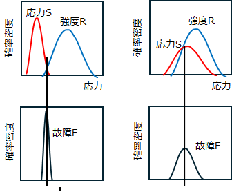
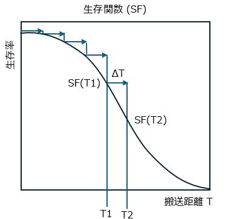
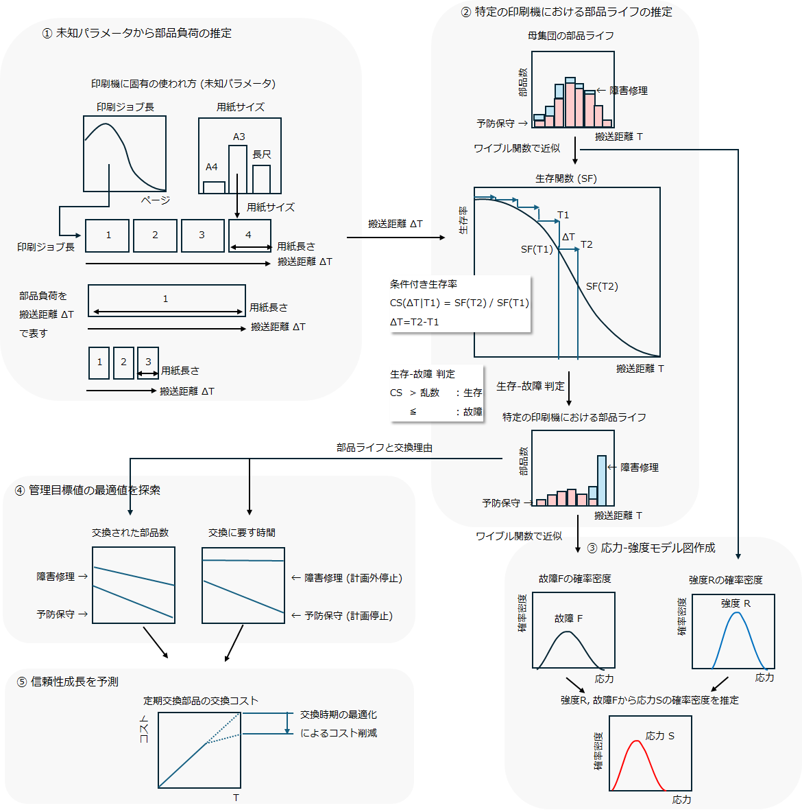
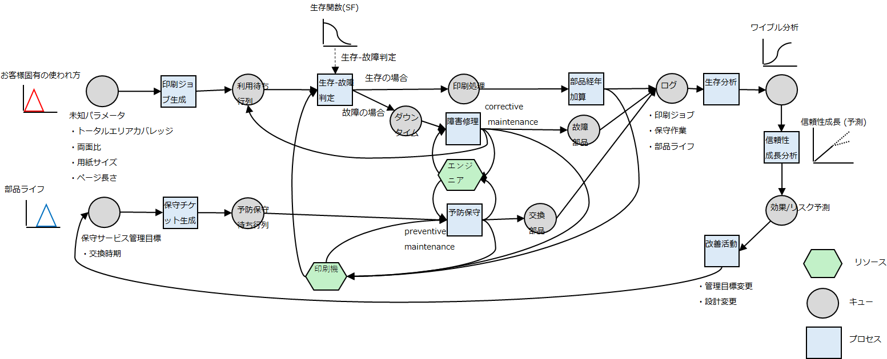
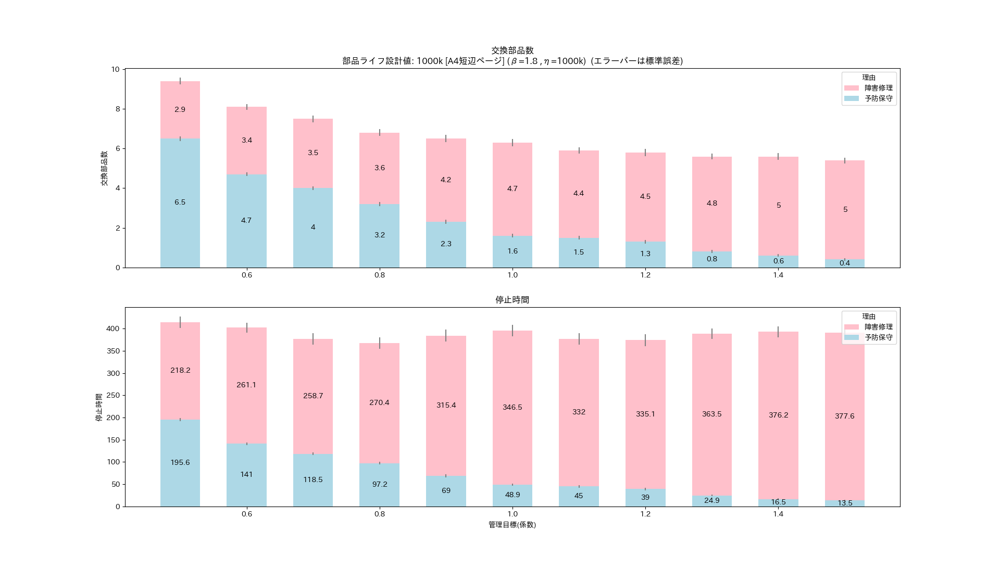
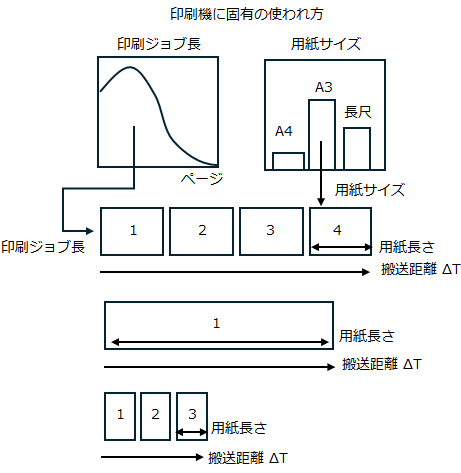
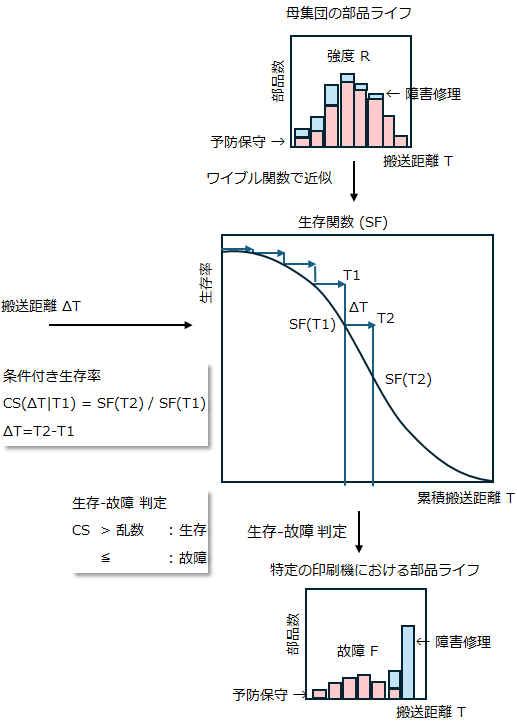
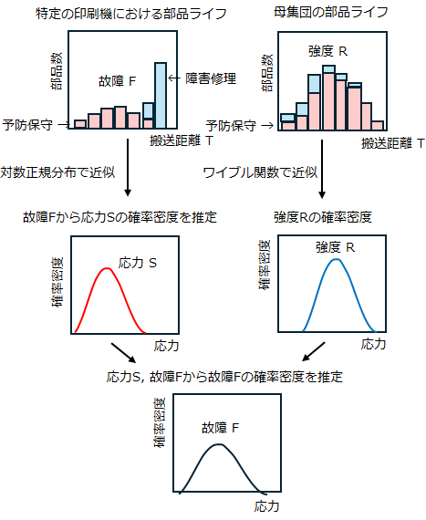
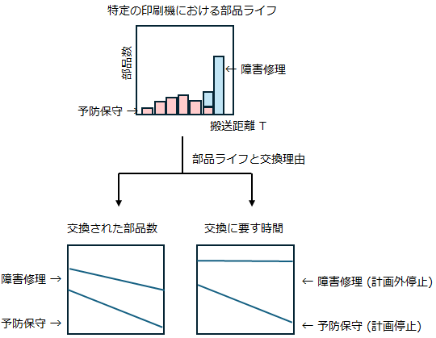
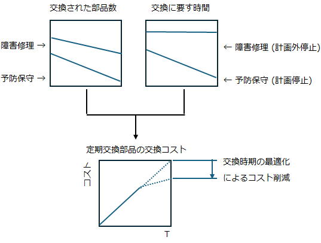

<!-- Written in 2025 by yasuakih -->
# 【制作中】定期交換部品のライフ推定による交換時期の最適化
この記事は、オンデマンド印刷機の定期交換部品の最適な交換時期をコンピュータ・シミュレーションによって推定するスタディである。

## 目的
デジタル印刷機の保守サービスを最適化するプロセスをコンピュータ上でシミュレーションを行う。この記事はプロセス全体を3つのテーマに分割した 2番目のステップを説明する。最初の記事で推定した顧客による<a href="../article1/">印刷機の使われ方</a>をもとに、定期交換部品を計画的に交換する管理目標が、印刷機の停止時間 (ダウンタイム) と交換される部品数 (コスト) に及ぼす影響を推定し、保守サービスにおける最適な交換時期を推定する。汎用プログラミング言語のPythonと無償のシミューレション用パッケージ simpy でシミュレーションを構築する。

- <font color="gray">1 顧客の未知パラメータ推定</font>
- 2 部品ライフ推定 【本記事の範囲】
- <font color="gray">3 機械の信頼度成長</font>

## 部品ライフの推定方法
保守サービスにおける課題は、サービス提供によるコストと、顧客が受け取るサービス品質の両立である。顧客による<a href="../article1/">印刷機の使われ方</a>が部品ライフに影響を与える場合に関心があるのは、サービス品質に直結するパラメータである定期交換部品の交換時期を変化させたとき、サービス提供に生じるコストへの影響と、顧客に生じるリスクへの影響である。一つ一つの部品ライフを推定すれば、部品の交換数 (コスト) と印刷機の停止時間 (ダウンタイム) を子細に検討できる。

### 故障モデル
本スタディでは、確率的に故障が発生する[応力-強度モデル](https://en.wikipedia.org/wiki/Stress%E2%80%93strength_analysis)を参考に、機械の使われ方から部品ライフを推定する故障モデルを作成した。応力-強度モデルは応力 S × 強度 R → 故障確率 F という関係を導く。強度 R (resistance) は設計や製造で決まり、応力 S (stress) は使い方で決まる。SとRの重なる部分で故障が生じると考え、その確率が故障確率 F (failure probability) で与えられる。

<div align="center">
  <figure>
    
	<br/>
    <figcaption>図. 応力-強度モデルによる故障発生。(左) 応力Sと強度Rの分布が離れていれば故障は起こりにくい。(右) 2つの分布が重なるにつれて故障が起こりやすくなる。</figcaption>
  </figure>
</div>

<p/>

保守サービスの課題は、顧客の印刷機ごとに異なる応力 S に対して、どのように信頼性 F を推定するかとなる。顧客先で稼働している印刷機の場合、保守サービスを通じて部品の強度 R を統計的に推定できても、部品にかかる応力 S を直接に測定することはできない。そのため、本スタディでは、応力-強度モデルで故障確率 F を推定せず、顧客の使い方を表す「未知パラメータ」を用いたシミュレーションによって故障確率 F を推定するアプローチを考案した。

この故障モデルは、未知パラメータから生成した印刷ジョブによる部品負荷 ΔT を累積しながら、部品強度 R に基づく[生存関数](https://ja.wikipedia.org/wiki/%E7%94%9F%E5%AD%98%E9%96%A2%E6%95%B0) (survival function, SF) で各時点での生存-故障を判定し、部品の経年とそれによる故障をシミュレートするものである。

<div align="center">
  <figure>
    
	<br/>
    <figcaption>図. 故障モデル-生存関数</figcaption>
  </figure>
</div>

### 部品ライフ推定システム
印刷機のさまざまな定期交換部品のうち、本スタディでは理解しやすい用紙の搬送系の部品 (例: ローラー、ベルト) を取り上げる。部品ライフを推定するシステムは次の5つの機能ブロックから構成され、保守サービスの管理目標値を信頼性・コストの両面から評価する。

<dl>
  <dt>①未知パラメータから部品負荷の生成</dt>
  <dd><a href="../article1/#未知パラメータと推定">未知パラメータ</a>によって表された印刷機の使われ方をもとに、部品にかかる負荷を生成する。搬送系の部品では、印刷ジョブによって移動する用紙の搬送距離がこの負荷に当たる。
  </dd>

  <dt>②特定の印刷機における部品ライフの推定</dt>
  <dd>印刷機全体の母集団における部品ライフを部品強度 R と見なし、これを<a href="https://ja.wikipedia.org/wiki/%E3%83%AF%E3%82%A4%E3%83%96%E3%83%AB%E5%88%86%E5%B8%83">ワイブル分布</a>で近似して生存関数 (SF) を推定する。無作為に作成した印刷ジョブによって部品にかかる負荷を累積して部品ライフを得る。各々の時点における条件付き生存率をもとに部品が生存するか故障するかを無作為に決定する。
  </dd>

  <dt>③応力-強度モデル図作成</dt>
  <dd>(このステップは必須ではない。) 交換した部品の履歴をもとに、特定の印刷機における部品ライフをワイブル分布で近似し、故障確率 F を求める。故障確率 F を強度 R で除し、応力 S を推定する (参考用)。
  </dd>

  <dt>④管理目標値の最適値を探索</dt>
  <dd>交換時期の管理目標値をさまざま変化させ、上記①～③のステップを繰り返して交換部品数や所要時間を算出し、入力に対する出力の変化をグラフィックで可視化する。管理目標の最適値の選択は目視とする。
  </dd>

  <dt>⑤信頼性成長を予測</dt>
  <dd>保守サービスによる交換部品数 (コスト) や、印刷機の停止時間 (ダウンタイム) について、管理目標を変更した場合の着地点を予測する。これによって、導入効果を定量的に評価し、目標達成の時期を推定する。ただし、本スタディには含まず、別のスタディに分ける。
  </dd>

</dl>

<div align="center">
  <figure>
    
	<br/>
    <figcaption>図. 部品ライフ推定システムのブロック図</figcaption>
  </figure>
</div>

## シミュレーションの設計

### 印刷機保守のシミュレーションモデル
デジタル印刷機に関連するさまざまなイベント － 印刷ジョブの生成と印刷機への入力、部品の経年と故障の発生、エンジニアによる部品の交換 － を表現し、コンピューターでシミュレートするためにシミュレーションモデルを作成した。前述した故障モデルを実行するために、リソース、プロセス、データといったオブジェクトを含む。主なものを次に示す。

* リソース <small>(プロセスを機能させる有限の資源)</small>
  * 印刷機ユニット
  * 保守エンジニア <small>(予防保守、障害修理を担当する)</small>
* プロセス <small>(所定の条件のもと、リソースを使ってデータを加工・生成する)</small>
  * 印刷 <small>(内部に、生存-故障判断、部品経年加算を含む)</small>
  * 予防保守 <small>(印刷機ユニットと部品を確保し、短時間で交換する)</small>
  * 障害修理 <small>(予防保守と同様だが長時間を要する)</small>
* データ <small>(プロセスとプロセスをつなぐメッセージ)</small>
  * 印刷ジョブ <small>(印刷ジョブ長、用紙サイズなど保持する)</small>
  * 部品 <small>(部品ライフを保持する)</small>
  * ログ <small>(交換履歴、部品ライフ、印刷ジョブなどを保持する)</small>

<div align="center">
  <figure>
    
	<br/>
    <figcaption>図. 印刷機保守のシミュレーションモデル (<a href="img/印刷機保守のシミュレーションモデル.png" target="_blank">拡大</a>)</figcaption>
  </figure>
</div>

### シミュレーション・フレームワーク
シミュレーションモデルの環境内では、各種イベントが互いに同期を取りながら進行する。こうした複雑な処理を行うために、Python言語向けのシミュレーション・フレームワーク [Simpy](https://simpy.readthedocs.io/en/latest/) を使用した。

### 全体の構造
<details>
<summary>全体の構造を開く</summary>

<div align="center">
図2. 全体の構造
</div>

<pre><code>
<b>シミュレーション</b> (main)
  ├ シミュレーション環境作成
  ├ <b>印刷シミュレーションプロセス</b>
  └ 結果表示
   
    <b><a href="#印刷シミュレーションプロセス">印刷シミュレーションプロセス</a></b> (printingmachine_simulator_process)
      ├ 印刷機ユニットを確保し、部品をインストール
      ├ 印刷機の保守計画を策定し、<b>印刷機の予防保守のスケジュールと実施プロセス</b>を実行
      └ シミュレーション期間中のジョブ受注                                               ← ループ
          └ 定期的(30分間隔)に<b>印刷ジョブ作成</b>し、<b>印刷ジョブの出力プロセス</b>を実行

        印刷機ユニット (class PrintingMachine)
          ├ <b><a href="#予防保守実行プロセス">予防保守実行プロセス</a></b> (preventive_maintenance_process)
          │  ├ <b>交換部品の生成</b>
          │  └ 交換作業 (待機時間: 30分)
          ├ <b><a href="#障害修理実行プロセス">障害修理実行プロセス</a></b> (corrective_maintenance_process)
          │  ├ <b>交換部品の生成</b>
          │  └ 修理作業 (待機時間: 60-90分)
          └ <b><a href="#印刷実行プロセス(含む部品ライフ進行(摩耗))">印刷実行プロセス(含む部品ライフ進行(摩耗))</a></b> (printout_process)
             ├ 印刷実行 (待機時間: 印刷ジョブ長/印刷速度)
             └ <b>部品ライフ進行(摩耗)</b>

        保守作業 (class MaintenanceWork)
          └ <b><a href="#印刷機の予防保守のスケジュールと実施プロセス">印刷機の予防保守のスケジュールと実施プロセス</a></b> (preventive_maintenance_setup_process)
            ├ 次回の予防保守まで待機 (時間: 10日間)
            ├ 現在部品ライフが計画部品ライフを超過したら部品を交換
            │  ├ エンジニアおよび印刷機ユニットを確保
            │  └ <b>予防保守実行プロセス</b>
            └ 印刷機の予防保守のスケジュールと実施プロセス (次回分。再帰している)

        印刷ジョブ (class PrintJob)
          └ <b>印刷ジョブ作成</b> (init)
            └ <b><a href="#顧客の未知パラメータに基づく印刷ジョブを作成">顧客の未知パラメータに基づく印刷ジョブを作成</a></b> (generate_customer_print_job)

        <b>印刷ジョブの出力プロセス</b> (printing_printjob_process)
          ├ 印刷機ユニットを確保
          ├ <b>故障確率の算出と生存-故障判断</b>
          │  ├ 故障時、修理するエンジニアを確保
          │  └ <b>障害修理実行プロセス</b>
          ├ <b>印刷実行プロセス(含む部品ライフ進行(摩耗))</b>
          └ print_job 毎の結果を記録 (印刷所要時間, 終了時刻と成否)

            交換部品 (class ReplacementPart)
              ├ <b><a href="#交換部品の生成">交換部品の生成</a></b> (init)
              │  ├ 計画部品ライフを取得 (所定の値)
              │  └ <b>部品ライフ分布を生成(ワイブル分布)</b> (get_internal_part_life)
              ├ <b>部品ライフ進行(摩耗)</b> (wear)
              │  └ 累積印刷ページに「ページ長」を加算し、部品ライフを進行させる
              └ <b><a href="#故障確率の算出と生存-故障判断">故障確率の算出と生存-故障判断</a></b> (failure)
                 └ 部品固有ライフ ≦ 累積印刷ページ となったら故障
</code></pre>

#### 印刷シミュレーションプロセス<!-- printingmachine_simulator_process -->
シミュレーション環境を構築し、さまざまな初期化をした後、シミュレーション中の印刷ジョブを生成する。シミュレーションは内部時計が上限を超過するか、交換部品数が所定数に達したら終了する。

#### 予防保守実行プロセス<!-- (PrintingMachine.preventive_maintenance_process) -->
エンジニアによる部品の交換を記述した。計画内の作業であるため印刷機を止める作業時間を短くした (30分)。

#### 障害修理実行プロセス<!-- (PrintingMachine.corrective_maintenance_process) -->
予防保守と同様に、エンジニアによる部品の交換であるが、計画外の作業であるため印刷機を止める作業時間を長くした (60-90分)。

#### 印刷実行プロセス(含む部品ライフ進行(摩耗))<!-- (PrintingMachine.printout_process) -->
印刷ジョブを出力を記述する。印刷の所要時間は、印刷ジョブ長/印刷速度 とした。その後、部品ライフを進行させた。

#### 印刷機の予防保守のスケジュールと実施プロセス<!-- (MaintenanceWork.preventive_maintenance_setup_process) -->
予防保守の作業を記述する。予防保守の実施間隔 (check_interval) は、保守サービスの管理目標値として規定される (デフォルト: 10日間)。予防保守の作業内容は、部品ライフが計画部品ライフを超えていたら部品を交換し、次回の予防保守をスケジュールする。なお、交換の際はリソース (エンジニアと印刷機ユニット) の確保を要するとした。

#### 顧客の未知パラメータに基づく印刷ジョブを作成<!-- (PrintJob.generate_customer_print_job) -->
最初の記事で推定した<a href="../article1/#シミュレーション結果の表示">シミュレーション結果</a>を未知パラメータとして採用した。

- 印刷用紙サイズ(重み付きランダム)
  - 用紙サイズ重み[A4:5%, B4:3%, A3:46%, 長尺:46%]
- トータルエリアカバレッジ(用紙サイズにより分布は異なる)
- 印刷ジョブ長(用紙サイズにより分布は異なる)
- 両面/片面(μ=0.5, σ=0.3)

#### 交換部品の生成<!-- (ReplacementPart.init) -->
シミュレーションで使われる部品を生成する。部品強度 F として、印刷機全体の母集団における部品ライフを規定した。本来は保守サービスを介して収集した部品ライフに基づいて設定するところだが、架空の印刷機のものとしてワイブル分布を仮定した。部品ライフは無次元してA4短辺を1とした。

#### 故障確率の算出と生存-故障判断<!-- (ReplacementPart.failure) -->
部品強度 R に対応する生存関数(SF)を元に、印刷ジョブ出力前まで生き残った部品がさらに印刷ジョブの出力後まで生き残る確率 (条件付き生存率CS) を算出した。故障か故障でないか確率的に決定するために一様乱数を使用した。
</details>

## 実験結果
### 実験方法

次のコマンドラインを用いてシミュレーションを実施した。

``` shell
python sim_component_failure.py --designed_life 1000000 --maxt 60*24*30*12 --beta 1.8 --wearout_rate 0.5 0.6 0.7 0.8 0.9 1.0 1.1 1.2 1.3 1.4 1.5 --iter 100
```

| オプション | 意味 | 目的 |
| --- | --- | --- |
| --designed_life 1000000 | 部品ライフ設計値 | 部品ライフ設計値を 1000k [A4短辺ページ] とする |
| --maxt 60*24*30*12 | シミュレーション期間 | 360 日間を経過したらシミュレーションを終了する |
| --beta 1.8 | 母集団における部品ライフのワイブル分布形状パラメータ | 摩耗故障型の |
| --wearout_rate 0.5 0.6 0.7 0.8 0.9 1.0 1.1 1.2 1.3 1.4 1.5 | 予防保守の管理目標(係数) | 500k - 1500k まで100k刻みで行う |
| --iter 100 | シミュレーション回数 | 1つの条件につきシミュレーションを 100 回して平均化する |

### 応力-強度チャート

<details>
<summary>すべてのチャートを表示</summary>
<div align="center"><figure><br/><figcaption>応力-強度モデル (管理目標係数0.50)</figcaption></figure></div>
<div align="center"><figure><br/><figcaption>応力-強度モデル (管理目標係数0.60)</figcaption></figure></div>
<div align="center"><figure><br/><figcaption>応力-強度モデル (管理目標係数0.70)</figcaption></figure></div>
<div align="center"><figure><br/><figcaption>応力-強度モデル (管理目標係数0.80)</figcaption></figure></div>
<div align="center"><figure><br/><figcaption>応力-強度モデル (管理目標係数0.90)</figcaption></figure></div>
<div align="center"><figure><br/><figcaption>応力-強度モデル (管理目標係数1.00)</figcaption></figure></div>
<div align="center"><figure><br/><figcaption>応力-強度モデル (管理目標係数1.10)</figcaption></figure></div>
<div align="center"><figure><br/><figcaption>応力-強度モデル (管理目標係数1.20)</figcaption></figure></div>
<div align="center"><figure><br/><figcaption>応力-強度モデル (管理目標係数1.30)</figcaption></figure></div>
<div align="center"><figure><br/><figcaption>応力-強度モデル (管理目標係数1.40)</figcaption></figure></div>
<div align="center"><figure><br/><figcaption>応力-強度モデル (管理目標係数1.50)</figcaption></figure></div>
</details>

### 停止時間

### 交換部品数

<div align="center">
  <figure>
    
	<br/>
    <figcaption>図. 定期交換部品の計画的な交換時期が、(上)交換部品数 (コスト) に及ぼす影響と、(下)印刷機の停止時間 (ダウンタイム) に及ぼす影響</figcaption>
  </figure>
</div>

## 課題
### 保守作業員コストの反映

### リアリティ向上
複数部品の同時交換

## 結論

## 付録
### ソースコード
* [sim_component_failure.py](sim_component_failure.py)

### コマンドライン
``` shell
TBD
```

## 付録

### 詳細な構造
#### ①未知パラメータから部品負荷の生成
このステップでは、顧客の印刷機の使われ方の推定から得た<a href="../article1/#未知パラメータ">未知パラメータ</a>をもとに、部品に負荷をかけるための印刷ジョブを生成した。印刷ジョブを生成する都度、未知パラメータの分布からジョブ長と用紙サイズをサンプリングした。

>  未知パラメータ<br/>
>  インク関連は画質系の部品ライフに、また用紙関連は搬送系の部品ライフに影響する可能性がある。
>  - インク関連
>    - トータルエリアカバレッジ (用紙の単位面積あたりのインク塗布量)
>  - 用紙関連
>    - ジョブ長 (印刷ジョブに含まれる総ページ数。書籍の場合、ページ数 x 部数)
>    - 用紙サイズ (ページあたりの用紙面積、あるいは部品の回転数や移動距離)

本スタディでは搬送系の部品に着目することから、未知パラメータのうち「印刷ジョブ長分布」と「用紙サイズ種類」を使用した。部品にかかる負荷を用紙の搬送距離として、印刷ジョブで指定されたジョブ長 (面数) と用紙の長さ (紙送り方向) の積で算出した。両面/片面については片面ずつ印刷すると仮定し、特に考慮しなかった 

<div align="center">
  <figure>
    
	<br/>
    <figcaption>図. 故障モデル-①未知パラメータから部品負荷の推定</figcaption>
  </figure>
</div>

#### ②特定の印刷機における部品ライフの推定
次のステップでは、印刷機全体の母集団における部品の強度 R をワイブル分布で近似し、生存関数</a> (SF) を推定した。①で作成した印刷ジョブによる搬送距離 ΔT を累積して経年による部品ライフ T1 とする。次のジョブの搬送距離を ΔT として、T2 における条件付き生存率 CS(ΔT|T1) を算出した。

>  条件付き生存率<br/>
>  部品の故障は条件付き生存率 (CS) で考えることができる。[生存関数](https://ja.wikipedia.org/wiki/%E7%94%9F%E5%AD%98%E9%96%A2%E6%95%B0) (survival function, SF) は経年に伴って生き残った部品の割合である。
>  現在の生存時間 T1 まで生き残った部品がさらに T2 まで生き残る確率は条件付き生存率 CS であり、印刷ジョブによって生じる経年 ΔT = T2 - T1 を用い、CS(ΔT|T1) = SF(T1) / SF(T1) として算出することができる。

次に、各々の時点における条件付き生存率 (CS) を一様乱数と比較することで、部品が生存するか故障するかの判定した。部品が故障した場合、あるいは累積ライフが管理目標を超えた場合は新しい部品で置き換え、古い部品のライフと交換した理由を交換履歴に記録した。

<div align="center">
  <figure>
    
	<br/>
    <figcaption>図. 故障モデル-②特定の印刷機における部品ライフの推定</figcaption>
  </figure>
</div>

#### ③応力-強度モデル図作成
このステップは必須ではないが、本スタディが参考とした「応力-強度モデル」を可視化し、理解を助ける意図がある。②で作成した交換履歴をもとに、特定の印刷機における部品ライフをワイブル分布で近似し、故障確率 F を求めた。このとき、使用した部品は「故障修理」(故障) によって交換されたものに限り、「予防保守」(打ち切り) で交換された部品は除外した。この理由は管理目標の影響を避けるためである。故障確率 F を②で作成した強度 R で除し、応力 S を推定した。

<div align="center">
  <figure>
    
	<br/>
    <figcaption>図. 故障モデル-③応力-強度モデル図作成</figcaption>
  </figure>
</div>

#### ④管理目標値の最適値を探索
このステップは、管理目標が交換部品数や所要時間に与える影響をグラフィックスで可視化する。上記①～③のステップから得た交換部品数や所要時間はバラつきがあるため  (確率的な処理に伴う)、所定回数を繰り返して平均を取った。交換時期の管理目標値を複数設定して、それぞれの管理目標について交換部品数や所要時間をグラフ上にプロットした。

<div align="center">
  <figure>
    
	<br/>
    <figcaption>図. 故障モデル-④管理目標値の最適値を探索</figcaption>
  </figure>
</div>

#### ⑤信頼性成長を予測
本スタディにはこの機能は含まれていない (次のスタディで予定)。最後のステップでは、管理目標を変更した場合に、改善効果の程度を推定するものである。この機能は定期部品交換の交換時期である管理目標を変更するかしないかの意思決定を助けるものである。具体的には、保守サービスに関する経営指標である交換部品数 (コスト) や、印刷機の停止時間 (ダウンタイム) について、管理目標を変更した場合の着地点を予測する。これによって、導入効果を定量的に評価し、目標達成の時期を推定する。

<div align="center">
  <figure>
    
	<br/>
    <figcaption>図. 故障モデル-⑤信頼性成長を予測</figcaption>
  </figure>
</div>


### 応力-強度モデル

<div align="center">
  <figure>
    <a title="Cdang, CC BY-SA 3.0 &lt;https://creativecommons.org/licenses/by-sa/3.0&gt;, via Wikimedia Commons" href="https://upload.wikimedia.org/wikipedia/commons/thumb/8/85/Contrainte_resistance_2d_proche.svg/551px-Contrainte_resistance_2d_proche.svg.png"></a>
	<br/>
    <figcaption>図. 応力-強度モデル。
<br/><a href="https://commons.wikimedia.org/wiki/User:Cdang">Cdang</a>, <a href="https://creativecommons.org/licenses/by-sa/3.0">CC BY-SA 3.0</a>, via Wikimedia Commons
    </figcaption>
  </figure>
</div>

### 部品の使われ方 - _応力_
印刷機の使用に伴って部品にかかる負荷が「応力」となる。
最初の記事で述べたように、<a href="../article1/">印刷機の使われ方は外部から観察できない</a>ため、「未知パラメータ」としてこれを代用した。未知パラメータに基づいて無作為に多数の印刷ジョブを発生させ、保守サービスから得られる統計との差が小さければ、その未知パラメータをもっともらしいと見なした。この時に生じた印刷ジョブが応力で、未知パラメータから生成することができる。

### 部品の強度 - _強度_
部品の強度は保守サービスを介して、サービスエンジニアによる作業報告や、印刷機から通信ネットワークを介して提供される稼働状況から得ることができる。これらの情報には交換時の部品ライフに加え、交換時の状況が詳細に含まれることもあるため、部品強度は比較的正確に把握することができる。部品の強度にはさまざまな理由で「ばらつき」がある。定期交換部品のように (修理されず) 交換される部品の場合、その強度の分布を表すために「ワイブル分布」が使われる。ワイブル分布は2つのパラメータで特徴付けられる確率分布である。パラメータはそれぞれ、形状パラメータ(αまたはm)、尺度パラメータ(βまたはη)と呼ぶ。


----
このページに掲載した作品 (テキスト、プログラムコードなど) はパブリック・ドメインに提供しています。詳細は [CC0 1.0 全世界 コモンズ証](https://creativecommons.org/publicdomain/zero/1.0/deed.ja) をご覧ください。
