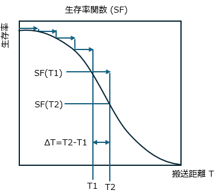
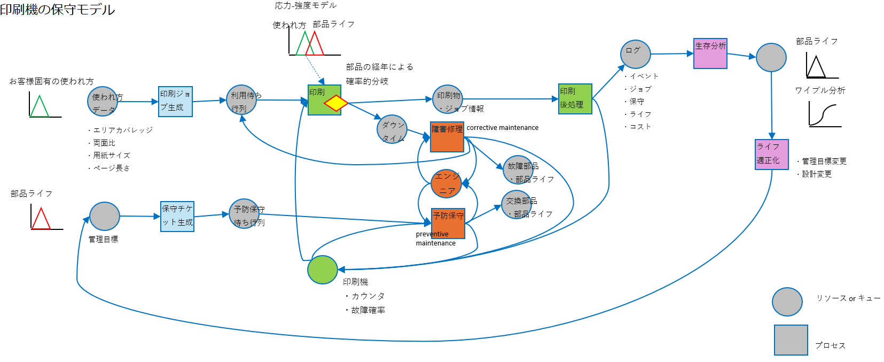
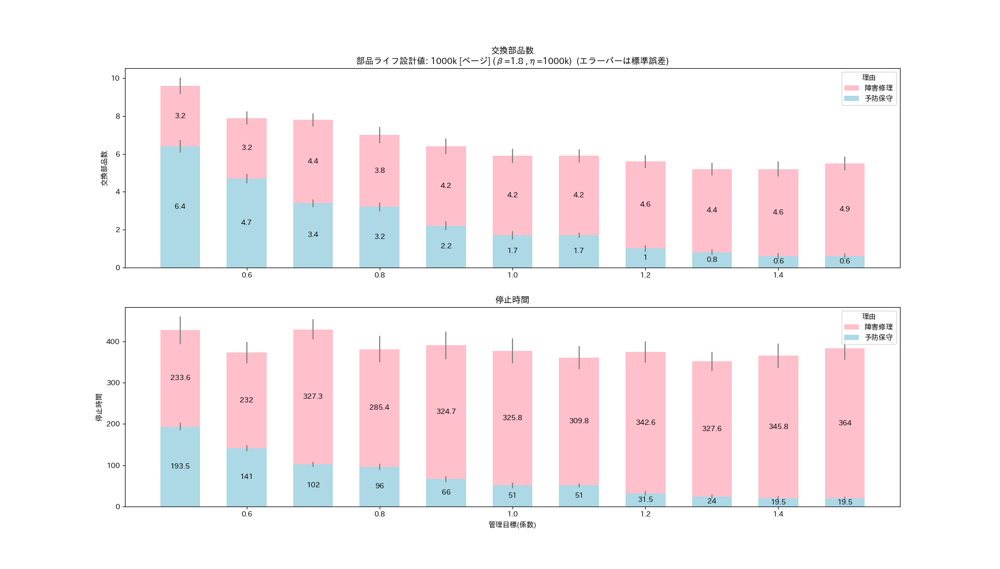

<!-- Written in 2025 by yasuakih -->
# 【制作中】定期交換部品のライフ推定による交換時期の最適化
この記事は、オンデマンド印刷機の定期交換部品の最適な交換時期をコンピュータ・シミュレーションによって推定するスタディである。

## 目的
デジタル印刷機の保守サービスを最適化するプロセスをコンピュータ上でシミュレーションを行う。この記事はプロセス全体を3つのテーマに分割した 2番目のステップを説明する。最初の記事で推定した顧客による<a href="../article1/">印刷機の使われ方</a>をもとに、定期交換部品を計画的に交換する管理目標が、印刷機の停止時間 (ダウンタイム) と交換される部品数 (コスト) に及ぼす影響を推定し、保守サービスにおける最適な交換時期を推定する。汎用プログラミング言語のPythonと無償のシミューレション用パッケージ simpy でシミュレーションを構築する。

- <font color="gray">1 顧客の未知パラメータ推定</font>
- 2 部品ライフ推定 【本記事の範囲】
- <font color="gray">3 機械の信頼度成長</font>

## 考え方
顧客による<a href="../article1/">印刷機の使われ方</a>が部品ライフに影響を及ぼす可能性を考えるとき、保守サービスにおける課題はその評価とサービス品質の向上である。知りたいことは、サービス品質に直結するパラメータである定期交換部品の交換時期を変化させたとき、サービス提供に生じるコストと、顧客に生じるリスクへの影響である。

本スタディの基盤となる故障モデルは、確率的に故障が発生する[応力-強度モデル](https://en.wikipedia.org/wiki/Stress%E2%80%93strength_analysis)で、機械の使われ方から部品ライフを推定した。このモデルは一般に、材料や部品の強度とそれらにかかる応力との干渉を解析したり、ときにはシステム全体に適用される。部品ライフを推定すれば、部品の交換数 (コスト) と、印刷機の停止時間 (ダウンタイム) を子細に検討できる。このスタディでは次のように段階的にこの課題に対応した。

<dl>
  <dt>①未知パラメータから部品負荷の推定</dt>
  <dd><a href="../article1/#未知パラメータと推定">未知パラメータ</a>によって表された印刷機の使われ方を元に、部品にかかる負荷、すなわち応力を推定する。
  </dd>

  <dt>②特定の印刷機における部品ライフの推定</dt>
  <dd>印刷機全体の母集団における部品の強度 R をワイブル関数で近似し、生存率関数を推定する。無作為に作成した印刷ジョブによって部品にかかる負荷の生存率を計算し、一様乱数と比較して部品が生存するか故障するかを判定する。故障した、あるいは累積ライフが管理目標を超えた部品は新しい部品で置き換え、ライフと理由を交換履歴に記録する。
  </dd>

  <dt>③応力-強度モデル図作成</dt>
  <dd>交換履歴を元に、特定の印刷機における部品ライフをワイブル関数で近似し、故障の確率分布 F を求める。故障確率 F を強度 R で除し、応力 S を推定する。
  </dd>

  <dt>④管理目標値の最適値を探索</dt>
  <dd>交換時期の管理目標値をさまざま変化させ、上記①～③のステップを繰り返して交換部品数や所要時間を算出し、入力に対する出力の変化をグラフィックで可視化する。相反する要求が折り合う管理目標を最適値とする。
  </dd>

  <dt>⑤信頼性成長を予測</dt>
  <dd>保守サービスによる交換部品数 (コスト) や、印刷機の停止時間 (ダウンタイム) について、管理目標を変更した場合の着地点を予測する。これによって、導入効果を定量的に評価し、目標達成の時期を推定する。
  </dd>

</dl>


<div align="center">
  <figure>
    
	<br/>
    <figcaption>図. 故障モデル-全体像</figcaption>
  </figure>
</div>


## モデル設計

---
<div align="center">
  <figure>
    
	<br/>
    <figcaption>図. 故障モデル-①未知パラメータから部品負荷の推定</figcaption>
  </figure>
</div>

---
<div align="center">
  <figure>
    
	<br/>
    <figcaption>図. 故障モデル-②特定の印刷機における部品ライフの推定</figcaption>
  </figure>
</div>

---
<div align="center">
  <figure>
    
	<br/>
    <figcaption>図. 故障モデル-③応力-強度モデル図作成</figcaption>
  </figure>
</div>

---
<div align="center">
  <figure>
    
	<br/>
    <figcaption>図. 故障モデル-④管理目標値の最適値を探索</figcaption>
  </figure>
</div>

---
<div align="center">
  <figure>
    
	<br/>
    <figcaption>図. 故障モデル-⑤信頼性成長を予測</figcaption>
  </figure>
</div>

---
<div align="center">
  <figure>
    
	<br/>
    <figcaption>図. 故障モデル-生存率関数</figcaption>
  </figure>
</div>


### 印刷機の使われ方と故障の発生

#### 印刷機の使われ方 - 知りたいこと
#### 応力

印刷機が稼働することによって部品にかかる応力は未知であり、直接に知ることはできない。
応力-強度モデルで導かれる応力と強度と故障確率の関係を利用して、応力 = 故障確率 / 強度 として求めることができる。


「応力-強度モデル」による故障の発生は、次のように表される。

応力(未知) x 強度(既知) → 故障確率

### 分かっているもの
#### 強度
部品の強度は保守サービスを介して得られる。エンジニアによる作業では、交換した理由が故障によるものか予防保守によるものかや、部品の製造ロットなどを特定することができる。一方、印刷業者 (顧客) が交換した場合、正確な部品ライフや交換した状況を把握できないことがある。定期交換部品のように「修理しない」部品の場合、ワイブル分布を使用して、その強度を数個のパラメータで特徴付けることができる。2パラメータのワイブル分布は、形状パラメータと尺度パラメータを持ち、3パラメータのワイブル分布はさらに位置パラメータが加わる。

市場投入されてまもないシステムや高信頼性のシステムでは、市場で故障例が発生しておらず、稼働時間のみしか知られていないこともある。このような場合、形状パラメータの仮定の下、ワイベイズ法で部品ライフを推定することもできる。

#### 故障確率
印刷機が使用されることによって部品に負荷がかかる結果、部品の信頼性が経年とともに低下し、部品が機能しなくなる確率を故障確率という。

事前設定した打ち切りの管理目標に依存して、故障は影響を受けると考えられr、したがって生の故障データを用いることはできない。
未知パラメータと管理目標をもとに推定した故障分布を用いる。
故障の実績で故障の予測はできない。

本スタディでは、故障分布の推定として理解しやすい印刷用紙の搬送系の部品(例: ドラム、ベルト、ロール)で考える。
この場合、印刷ジョブに伴って、部品が運動する回転数や搬送距離として負荷を見積もり、負荷を算出することができる。

部品の故障は条件付き生存率 (CS) で考えることができる。
[生存関数](https://ja.wikipedia.org/wiki/%E7%94%9F%E5%AD%98%E9%96%A2%E6%95%B0) SF は経年に伴って生き残った部品の割合である。

現在の生存時間T1まで生き残った部品がさらにT2まで生き残る確率は条件付き生存率CSであり、印刷ジョブによって生じる経年 ΔT = T2 - T1 を用いて、次のように算出することができる。

CS(ΔT|T1) = SF(T1) / SF(T1) 

前述した「強度」と同様、故障した部品のライフ分布をワイブル関数で表わした場合、
生存率関数SFをで表すことができる。

#### 生存 or 故障判定
本スタディでは、条件付き生存率CSを一様乱数 [0-1) と比較して生存か故障かを決定した。
生存の場合は ΔT を累積して部品ライフを更新し、故障の場合は新しい部品と交換した (累積部品ライフがゼロ)。

#### 故障の確率分布

故障した部品の部品ライフをワイブル関数でモデル化し、故障の確率分布を決定した。

このとき、予防保守で打ち切られた部品のライフは使用しなかった。
これは管理目標を受けて打ち切られたもので、その影響が及ぶことを避けるためである。


#### 搬送系の部品ライフ
故障の確率分布は、顧客の未知パラメータのうち「印刷ジョブ分布」と「用紙サイズ種類」から、それぞれ無作為にサンプリングしたジョブ長と用紙サイズを元に、紙送り方向の用紙の長さにジョブ長を乗じ、部品の運動による負荷と見なした。

この搬送距離を ΔT を、ジョブごとに累積して部品の経年によるライフ累積 T1 とする。
次のジョブの累積 T2 による搬送距離を ΔT として T2 = T1 + ΔT で条件付き生存率 CS(ΔT|T1) を算出した。


## 部品の故障モデル

### 応力-強度モデル

<div align="center">
  <figure>
    <a title="Cdang, CC BY-SA 3.0 &lt;https://creativecommons.org/licenses/by-sa/3.0&gt;, via Wikimedia Commons" href="https://upload.wikimedia.org/wikipedia/commons/thumb/8/85/Contrainte_resistance_2d_proche.svg/551px-Contrainte_resistance_2d_proche.svg.png"></a>
	<br/>
    <figcaption>図. 応力-強度モデル。
<br/><a href="https://commons.wikimedia.org/wiki/User:Cdang">Cdang</a>, <a href="https://creativecommons.org/licenses/by-sa/3.0">CC BY-SA 3.0</a>, via Wikimedia Commons
    </figcaption>
  </figure>
</div>

### 部品の使われ方 - _応力_
印刷機の使用に伴って部品にかかる負荷が「応力」となる。
最初の記事で述べたように、<a href="../article1/">印刷機の使われ方は外部から観察できない</a>ため、「未知パラメータ」としてこれを代用した。未知パラメータに基づいて無作為に多数の印刷ジョブを発生させ、保守サービスから得られる統計との差が小さければ、その未知パラメータをもっともらしいと見なした。この時に生じた印刷ジョブが応力で、未知パラメータから生成することができる。

未知パラメータは複数あるため、応力として代表する

### 部品の強度 - _強度_
部品の強度は保守サービスを介して、サービスエンジニアによる作業報告や、印刷機から通信ネットワークを介して提供される稼働状況から得ることができる。これらの情報には交換時の部品ライフに加え、交換時の状況が詳細に含まれることもあるため、部品強度は比較的正確に把握することができる。部品の強度にはさまざまな理由で「ばらつき」がある。定期交換部品のように (修理されず) 交換される部品の場合、その強度の分布を表すために「ワイブル分布」が使われる。ワイブル分布は2つのパラメータで特徴付けられる確率分布である。パラメータはそれぞれ、形状パラメータ(αまたはm)、尺度パラメータ(βまたはη)と呼ぶ。

### 故障確率
応力と強度が干渉する結果、部品が故障する。2つの分布の重なりが故障の確率となる。

本スタディでは、シミュレーション


### 部品の障害修理と予防交換

(応力) の分布と、部品の強度の分布の

重なりが故障の確率とする。

部品にかかる応力によって部品が故障するという
確率的に故障する


### 未知パラメータ
最初の記事では <a href="../article1/">印刷機の使われ方</a> として「未知パラメータ」を推定した。応力-強度モデルにおいてこれらは、部品に対する「応力」と見なせる。特に、インク量は画質系の部品ライフに、また用紙の分量やサイズは搬送系の部品ライフに、それぞれ影響する可能性がある。本スタディでは、算出が容易で視覚的に理解しやすい搬送系の部品 (物理的に用紙を輸送する) に着目する。

- インク関連
  - トータルエリアカバレッジ (用紙の単位面積あたりのインク塗布量)
- 用紙関連
  - ジョブ長 (印刷ジョブに含まれる総ページ数。書籍の場合、ページ数 x 部数)
  - 用紙サイズ (ページあたりの用紙面積、あるいは部品の回転数や移動距離)


## 印刷機の保守モデル

### 印刷機の保守モデル

<div align="center">
  <figure>
    
	<br/>
    <figcaption>図. 印刷機の保守モデル (<a href="img/印刷機の保守モデル.png" target="_blank">拡大</a>)</figcaption>
  </figure>
</div>

## シミュレーションの設計

### 全体の構造

<div align="center">
図2. 全体の構造
</div>

<pre><code>
<b>シミュレーション</b> (main)
  ├ シミュレーション環境作成
  ├ <b>印刷シミュレーションプロセス</b>
  └ 結果表示
   
    <b><a href="#印刷シミュレーションプロセス">印刷シミュレーションプロセス</a></b> (printingmachine_simulator_process)
      ├ 印刷機ユニットを確保し、部品をインストール
      ├ 印刷機の保守計画を策定し、<b>印刷機の予防保守のスケジュールと実施プロセス</b>を実行
      └ シミュレーション期間中のジョブ受注                                               ← ループ
          └ 定期的(30分間隔)に<b>印刷ジョブ作成</b>し、<b>印刷ジョブの出力プロセス</b>を実行

        印刷機ユニット (class PrintingMachine)
          ├ <b><a href="#予防保守実行プロセス">予防保守実行プロセス</a></b> (preventive_maintenance_process)
          │  ├ <b>交換部品の生成</b>
          │  └ 交換作業 (待機時間: 30分)
          ├ <b><a href="#障害修理実行プロセス">障害修理実行プロセス</a></b> (corrective_maintenance_process)
          │  ├ <b>交換部品の生成</b>
          │  └ 修理作業 (待機時間: 60-90分)
          └ <b><a href="#印刷実行プロセス">印刷実行プロセス(含む部品ライフ進行(摩耗))</a></b> (printout_process)
             ├ 印刷実行 (待機時間: 印刷ジョブ長/印刷速度)
             └ <b>部品ライフ進行(摩耗)</b>

        保守作業 (class MaintenanceWork)
          └ <b><a href="#印刷機の予防保守のスケジュールと実施プロセス">印刷機の予防保守のスケジュールと実施プロセス</a></b> (preventive_maintenance_setup_process)
            ├ 次回の予防保守まで待機 (時間: 10日間)
            ├ 現在部品ライフが計画部品ライフを超過したら部品を交換
            │  ├ エンジニアおよび印刷機ユニットを確保
            │  └ <b>予防保守実行プロセス</b>
            └ 印刷機の予防保守のスケジュールと実施プロセス (次回分。再帰している)

        印刷ジョブ (class PrintJob)
          └ <b>印刷ジョブ作成</b> (init)
            └ <b><a href="#顧客の未知パラメータに基づく印刷ジョブを作成">顧客の未知パラメータに基づく印刷ジョブを作成</a></b> (generate_customer_print_job)

        <b>印刷ジョブの出力プロセス</b> (printing_printjob_process)
          ├ 印刷機ユニットを確保
          ├ <b>故障確率の算出</b>
          │  ├ 故障時、修理するエンジニアを確保
          │  └ <b>障害修理実行プロセス</b>
          ├ <b>印刷実行プロセス(含む部品ライフ進行(摩耗))</b>
          └ print_job 毎の結果を記録 (印刷所要時間, 終了時刻と成否)

            交換部品 (class ReplacementPart)
              ├ <b><a href="#交換部品の生成">交換部品の生成</a></b> (init)
              │  ├ 計画部品ライフを取得 (所定の値)
              │  └ <b>部品ライフ分布を生成(ワイブル分布)</b> (get_internal_part_life)
              ├ <b>部品ライフ進行(摩耗)</b> (wear)
              │  └ 累積印刷ページに「ページ長」を加算し、部品ライフ進行させる
              └ <b><a href="#故障確率の算出">故障確率の算出</a></b> (failure)
                 └ 部品固有ライフ ≦ 累積印刷ページ となったら故障
</code></pre>

## 実験結果
次のコマンドラインを用いてシミュレーションを実施した。

``` shell
python sim_component_failure.py --designed_life 1000000 --maxt 60*24*30*12 --beta 1.8 --wearout_rate 0.5 0.6 0.7 0.8 0.9 1.0 1.1 1.2 1.3 1.4 1.5 --iter 20
```

### 応力-強度チャート

<div align="center">
  <figure>
    
	<br/>
    <figcaption>応力-強度モデル (管理目標係数0.80)</figcaption>
  </figure>
</div>

<div align="center">
  <figure>
    
	<br/>
    <figcaption>応力-強度モデル (管理目標係数1.00)</figcaption>
  </figure>
</div>

<div align="center">
  <figure>
    
	<br/>
    <figcaption>応力-強度モデル (管理目標係数1.20)</figcaption>
  </figure>
</div>

### 停止時間

### 交換部品数

<div align="center">
  <figure>
    
	<br/>
    <figcaption>図. 定期交換部品の計画的な交換時期が、(上)交換部品数 (コスト) に及ぼす影響と、(下)印刷機の停止時間 (ダウンタイム) に及ぼす影響</figcaption>
  </figure>
</div>

## 課題
### 保守作業員コストの反映

### リアリティ向上
複数部品の同時交換

## 結論

## 付録
### ソースコード
* [sim_component_failure.py](sim_component_failure.py)

### コマンドライン
``` shell
TBD
```

----
このページに掲載した作品 (テキスト、プログラムコードなど) はパブリック・ドメインに提供しています。詳細は [CC0 1.0 全世界 コモンズ証](https://creativecommons.org/publicdomain/zero/1.0/deed.ja) をご覧ください。
