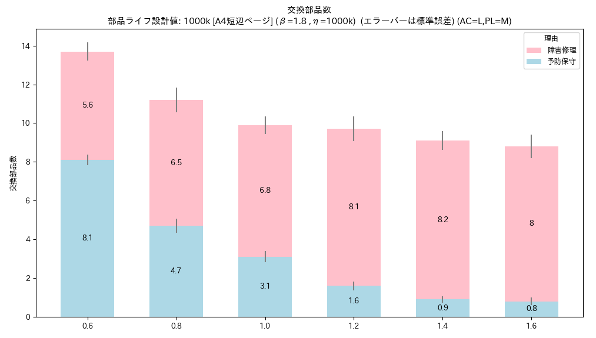
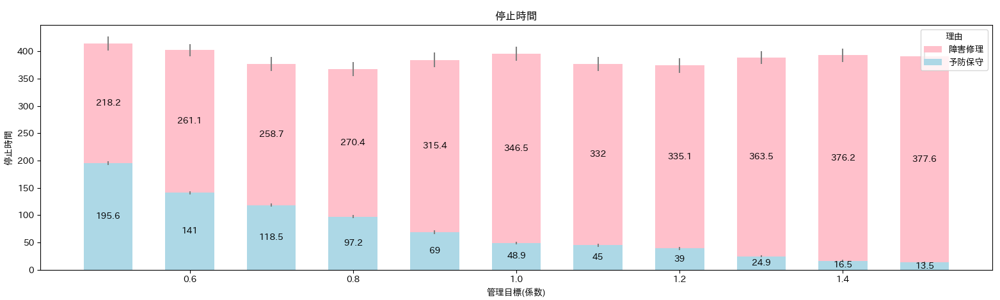
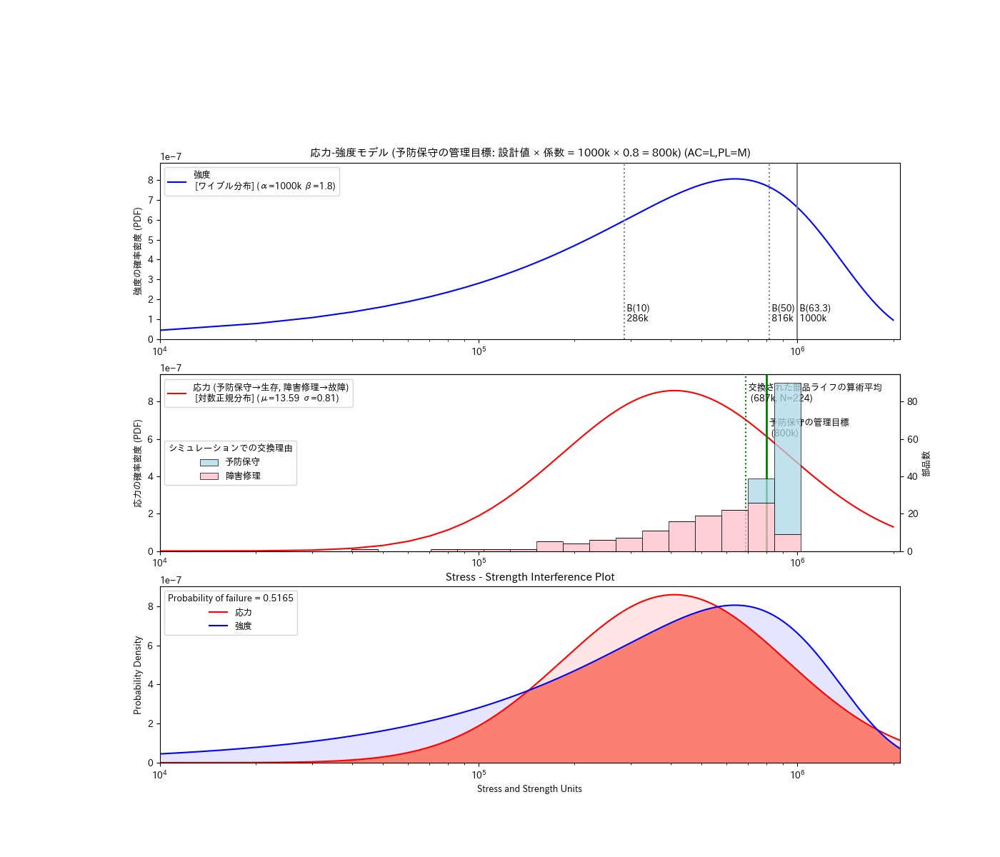
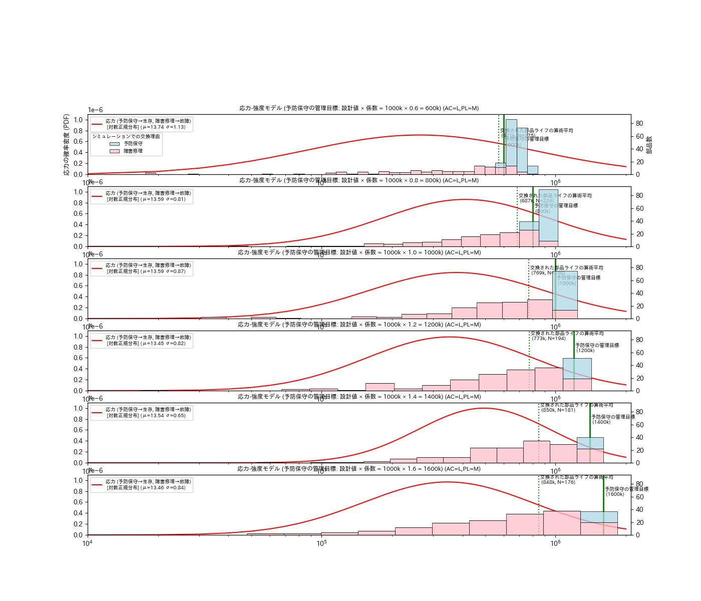
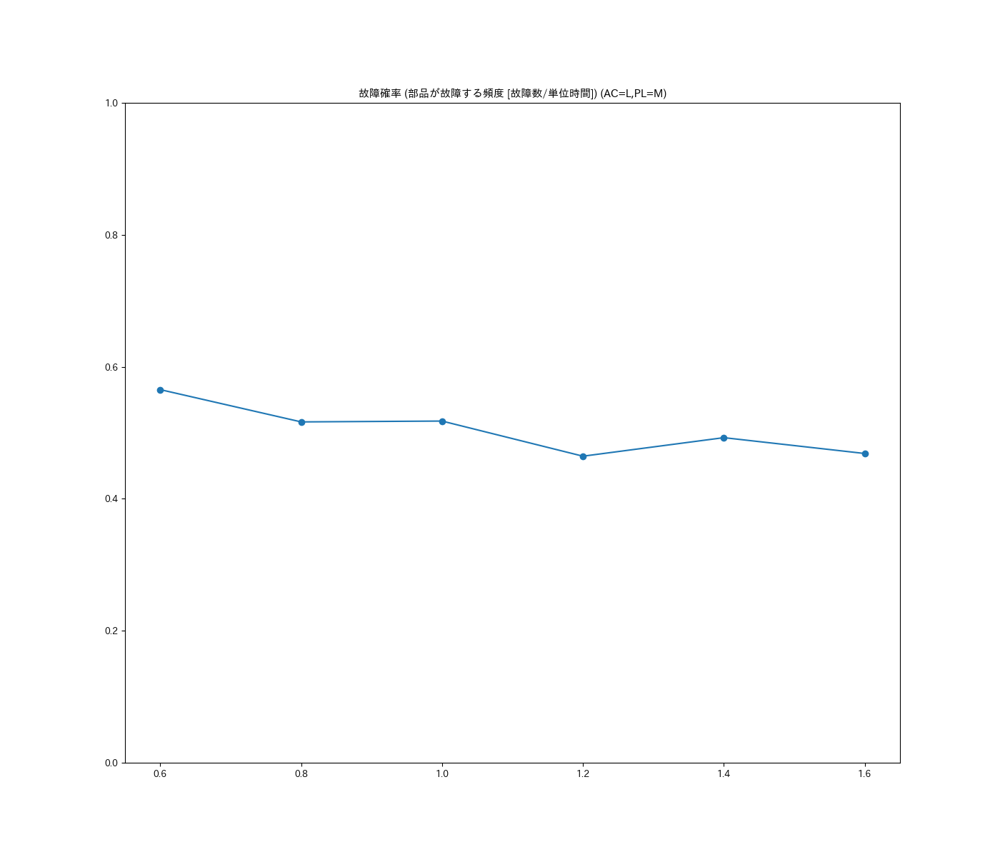
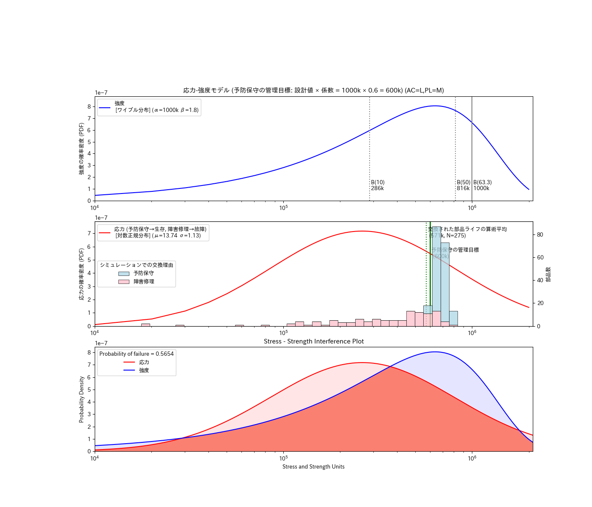
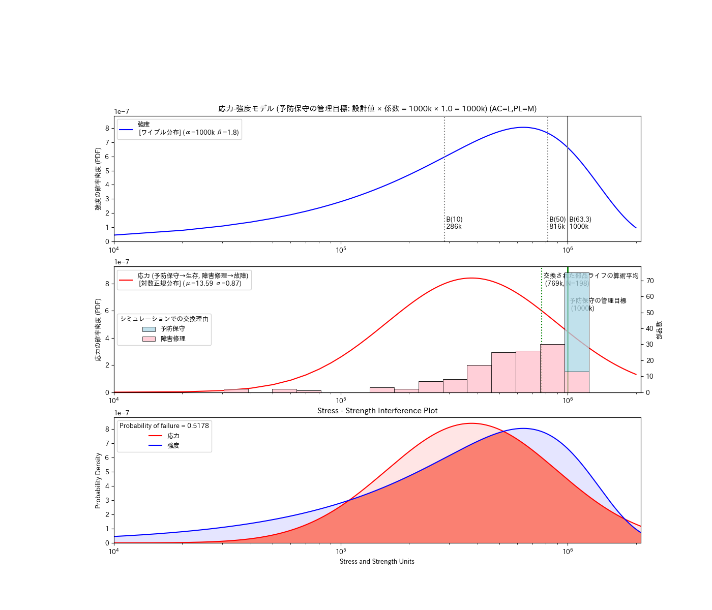
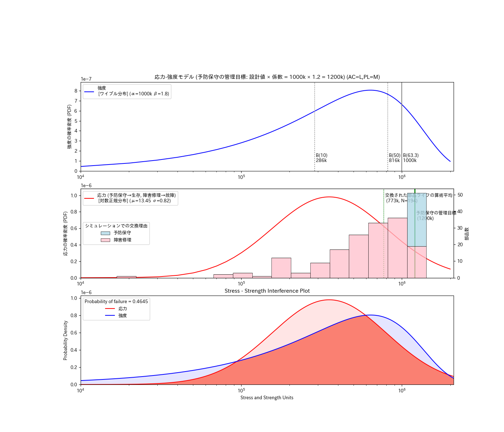
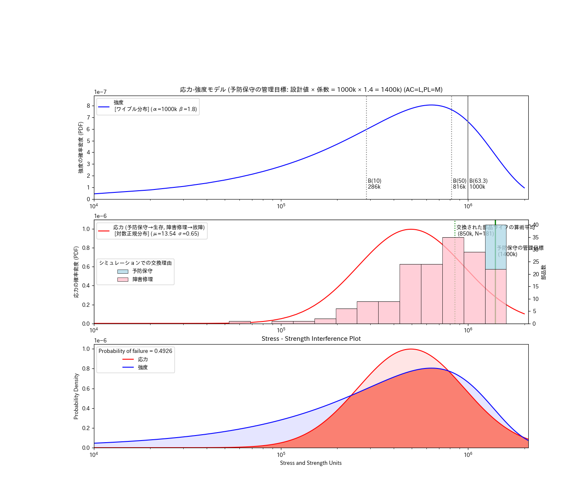
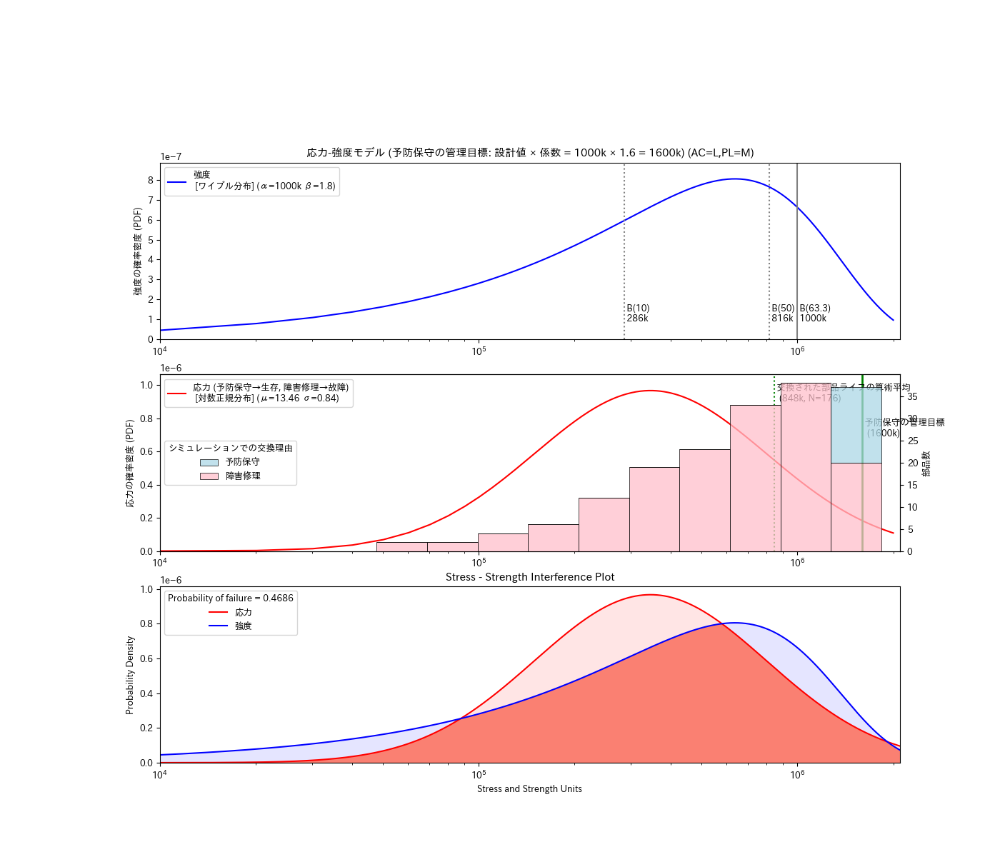

<!-- Written in 2025< by yasuakih -->
# 2.定期交換部品のライフ推定による交換時期の最適化
この記事は、オンデマンド印刷機における定期交換部品の最適な交換時期をコンピュータ・シミュレーションによって推定するスタディである。

## 目的
デジタル印刷機の保守サービスをコンピュータ・シミュレーションで最適化する一連のプロセスのうち、この記事では3分割した2番目のステップを説明する。最初のステップでは顧客による<a href="../article1/">印刷機の使われ方</a>を推定した。これをもとに、定期交換部品を計画的に交換する交換時期が、交換された部品数 (コスト) と印刷機の停止時間 (ダウンタイム) に及ぼす影響を推定する。最適な交換時期は両者が折り合うところになる。シミュレーションは、プログラミング言語Pythonと無償のシミューレション用パッケージsimpyを用いて実装する。

- <font color="gray">1 顧客の未知パラメータ推定</font>
- 2 部品ライフ推定 【本記事の範囲】
- <font color="gray">3 機械の信頼度成長</font>

## 部品ライフの推定方法
保守サービスにおける課題の一つに、サービス提供に要するコストと、顧客が受け取るサービス品質との両立がある。顧客による<a href="../article1/">印刷機の使われ方</a>が部品ライフに影響を及ぼすと仮定し、架空の印刷ジョブを生成する。それらを印刷機へ投入し、部品の摩耗と故障、それに保守サービスによる部品の刷新をシミュレートすることで、部品の交換数 (コスト) と印刷機の停止時間 (ダウンタイム) を予測する。交換時期をさまざま変化させて予測結果を確認する。

### 故障モデル
本スタディでは、確率的に故障が発生する[応力-強度モデル](https://en.wikipedia.org/wiki/Stress%E2%80%93strength_analysis)を採用して、印刷機の「使われ方」から部品ライフを推定する故障モデルを作成した。応力-強度モデルは、既知の応力 S と強度 R から、故障の確率 F を予測する。強度 R (resistance) は設計や製造で決まり、応力 S (stress) は使い方で決まる。どちらも発生確率を与える[確率分布](https://en.wikipedia.org/wiki/Probability_distribution)である。応力 S > 強度 R の場合に故障が起こり、故障確率 F (failure probability) が決まる。

<div align="center">
  <figure>
    
    <br/>
    <figcaption>図. 応力-強度モデルによる故障発生。故障は応力 S > 強度 R の場合に起こる。(左) 応力Sと強度Rの分布が離れていれば故障は起こりにくい。(右) 2つの分布が重なるにつれて故障は起こりやすくなる。</figcaption>
  </figure>
</div>

<p></p>

<!--
保守サービスの課題は、定期交換部品の交換時期を顧客の印刷機ごとに異なる応力 S に合わせて調節し、信頼性 F を受け入れ可能となるように機械を運用することである。顧客先で稼働している印刷機であれば、保守サービスを通じて部品の強度 R を統計的に推定することができる。対して、部品にかかる応力 S を測定することは困難である (顧客による使われ方は機微であるため)。そこで本スタディでは、顧客の使い方を表す「<a href="../article1/#未知パラメータと推定">未知パラメータ</a>」に基づく故障モデルによって応力 S を推定する。
-->

#### 部品の生存-故障判定
印刷機の定期交換部品のうち、本スタディでは用紙の搬送系の部品 (例: ローラー、ベルト) を取り上げる。部品の経年をシミュレートするため、未知パラメータから生成した印刷ジョブによる部品負荷 ΔT を累積する。各時点での生存-故障の判定は、部品強度 R に基づく[生存関数](https://ja.wikipedia.org/wiki/%E7%94%9F%E5%AD%98%E9%96%A2%E6%95%B0) (survival function, SF) を使用する。生存関数は、部品の母集団のうち時刻Tの時点で生存している割合を表し、使用開始時は1、時間経過とともに0に近づく。時刻T1まで生き残った部品がさらに時刻T2まで生き残る確率は、条件付き生存率 CS(ΔT\|T1) = SF(T2)/SF(T1) で求められる。各時点で故障するかどうか、[0-1) の一様乱数によって確率的に判定する。

<p></p>

<div align="center">
  <figure>
    
    <br/>
    <figcaption>図. 故障モデル-生存関数</figcaption>
  </figure>
</div>

### 印刷機保守のシミュレーションモデル
デジタル印刷機の部品の故障と交換に関するイベントを表し、コンピューター・シミュレーションするためにシミュレーションモデルを作成した。前述した故障モデルを表現するためのリソース、プロセス、データといったオブジェクトも含む。主な構成要素を次に示す。

* イベント <small>(シミュレーション環境内で生じる出来事)</small>
  * 印刷ジョブの生成と印刷機への入力
  * 部品の経年と故障の発生
  * エンジニアによる部品の交換
* リソース <small>(プロセスを機能させる有限の資源)</small>
  * 印刷機ユニット
  * 保守エンジニア <small>(予防保守、障害修理を担当する)</small>
* プロセス <small>(所定の条件のもと、リソースを使ってデータを加工・生成する)</small>
  * 印刷 <small>(内部に、生存-故障判断、部品経年加算を含む)</small>
  * 予防保守 <small>(印刷機ユニットと部品を確保し、短時間で交換する)</small>
  * 障害修理 <small>(予防保守と同様だが長時間を要する)</small>
* データ <small>(プロセスどうしをつなぐメッセージを保持する)</small>
  * 印刷ジョブ <small>(印刷ジョブ長、用紙サイズなど保持する)</small>
  * 部品 <small>(部品ライフを保持する)</small>
  * ログ <small>(交換履歴、部品ライフ、印刷ジョブなどを保持する)</small>

<div align="center">
  <figure>
    
    <br/>
    <figcaption>図. 印刷機保守のシミュレーションモデル (<a href="img/印刷機保守のシミュレーションモデル.png" target="_blank">拡大</a>)</figcaption>
  </figure>
</div>

## 部品ライフ推定システムの設計
### システム構成
予防保守による交換時期による信頼性とコストへの影響を評価するためのソフトウェアである。次に構成を説明する。

<dl>
  <dt>①未知パラメータから部品負荷の生成</dt>
  <dd>未知パラメータによって表された印刷機の使われ方に基づき、部品にかかる負荷を生成する。搬送系の部品であれば、印刷ジョブによって移動する用紙の搬送距離が負荷となる。コマンドラインで与えられた未知パラメータから印刷ジョブ長の分布と用紙サイズの分布を取得し、それぞれの分布からサンプリングした印刷ジョブ長と用紙サイズを含む印刷ジョブを生成し、後続の②に出力する。</dd>

  <dt>②印刷機における部品ライフの推定</dt>
  <dd>前述の故障モデルとシミュレーションモデルを実行して、部品ライフを推定する。
    <dl>
      <dt>故障モデル</dt>
      <dd>故障モデルの部品強度 R は<a href="https://ja.wikipedia.org/wiki/%E3%83%AF%E3%82%A4%E3%83%96%E3%83%AB%E5%88%86%E5%B8%83">ワイブル分布</a>とした。ワイブル分布は修理しない部品ライフのモデル化によく使われ、2つの変数 (形状パラメータ、尺度パラメータ) のみで特徴付けられることから運用にも優れる。部品強度 R のワイブル分布から推定した生存関数 (SF) を用いて、印刷ジョブ毎に部品にかかる負荷に対応した条件付き生存率を算出し、一様乱数を用いた生存-故障判定によって故障するかしないかを決定する。
      </dd>
      <dt>シミュレーションモデル</dt>
      <dd>印刷機による印刷ジョブに基づいた部品の経年と故障、それにエンジニアによる予防保守と障害修理に基づいた部品の交換という全体の流れを形作る。部品が交換されるまでの累積負荷が部品ライフの推定値となる。交換履歴として部品ライフ、交換理由、交換に伴う印刷機の停止時間が集められ、後続の③と④に出力される。</dd>
    </dl>
  </dd>

  <dt>③応力-強度モデル図作成</dt>
  <dd>
②から部品の交換履歴を入力して、部品にかかる応力 S を推定する。応力 S は<a href="https://ja.wikipedia.org/wiki/%E5%AF%BE%E6%95%B0%E6%AD%A3%E8%A6%8F%E5%88%86%E5%B8%83">対数正規分布</a>で近似した。対数正規分布は保守可能なシステムの修復時間をモデル化するのによく使用される。部品の交換理由には予防保守と障害修理があるが、その直前まで生きていたという事実から部品の交換理由は問わない。応力 S から故障確率 F を推定し、応力-強度モデル図を作成する。
  </dd>

  <dt>④管理目標値の最適値を探索</dt>
  <dd>②で作成した部品交換履歴を入力し、「交換部品数」および「交換に伴う機械の停止時間」をグラフィック出力する。保守サービスの管理目標値ごとの変化を比較して適切な管理目標を選択するのに役立つものとする。
  </dd>

  <dt>⑤改善効果の予測</dt>
  <dd>交換時期の管理目標値を変更したときの改善効果を推定する。交換部品数を指標とし、シミュレーション時間の経過に対する総数を両対数プロットする。管理目標値を変更した場合としなかった場合を比較して導入効果を定量的に評価する。
  </dd>

</dl>

<div align="center">
  <figure>
    
    <br/>
    <figcaption>図. 部品ライフ推定システムのブロック図</figcaption>
  </figure>
</div>

### シミュレーション・フレームワーク
このシミュレーション環境内には複数のオブジェクトが共存し、互いに同期を取りながら各種イベントが生成、処理されることで全体が進行する。シミュレーションは内部の時計が指定時間に達するまで継続する。これらを簡潔に記述するため、Python言語向けのシミュレーション・フレームワーク [Simpy](https://simpy.readthedocs.io/en/latest/) を使用する。

## 定期交換部品の交換時期がダウンタイムとコストに及ぼす影響評価
保守サービスにおける定期交換部品の最適な交換時期を推定した。

### 方法
定期交換部品を計画的に交換する「管理目標」が、印刷機の停止時間 (ダウンタイム) や交換される部品数 (コスト) に対し、どのような影響を及ぼすかをシミュレーションで推定する。管理目標を一定間隔で変えて停止時間と交換部品数の変化をもとに最適値を検討する。

### シミュレーション条件
シミュレーション条件を表に示す。部品の強度のワイブル分布は架空のものである。顧客未知パラメータも同様に架空のものとした。管理目標は部品強度の尺度パラメータ (1000k) の 0.6～1.6倍の範囲に6箇所設定した。

<p align='center'>表. シミュレーション条件</p>

| 意味 | 値 | 補足 |
| --- | --- | --- |
| 部品の強度 R を表すワイブル分布の尺度パラメータ | --designed_life 1000000 | 1000k [A4短辺ページ] と仮定 |
| (同) 形状パラメータ | --beta 1.8 | 摩耗故障型と仮定 |
| 予防保守の管理目標(係数) | --wearout_rate 0.6 0.8 1.0 1.2 1.4 1.6 | 600k - 1600k まで 200k 刻みで比較する |
| シミュレーション期間 | --maxt 60\*24\*30\*12 | シミュレーション期間を内部時計で 360 日とする |
| シミュレーション回数 | --iter 20 | 20 [回/条件] のシミュレーション結果を平均化する |
| 顧客未知パラメータのトータルエリアカバレッジ | --ac L | トータルエリアカバレッジ(インク被覆率)を低(Low)とする (現状未使用であり、シミュレーションに影響を及ぼさない) |
| (同) 印刷ジョブ長 | --pl L | 印刷ジョブ長(1ジョブ中のページ数)を低(Low)とする |

<details>
<summary>コマンドラインを表示</summary>
python sim_component_failure.py --designed_life 1000000 --maxt 60*24*30*12 --beta 1.8 --eta 1000000 --wearout_rate 0.6 0.8 1.0 1.2 1.4 1.6 --ac L --pl L --iter 20<br/>
python sim_component_failure.py --designed_life 1000000 --maxt 60*24*30*12 --beta 1.8 --eta 1000000 --wearout_rate 0.6 0.8 1.0 1.2 1.4 1.6 --ac L --pl M --iter 20<br/>
python sim_component_failure.py --designed_life 1000000 --maxt 60*24*30*12 --beta 1.8 --eta 1000000 --wearout_rate 0.6 0.8 1.0 1.2 1.4 1.6 --ac L --pl H --iter 20
</details>

### 結果
#### 交換部品数
交換時期を遅らせることによるトータルの部品交換数は低下傾向を示した。交換理由の別では、「予防保守」(水色) は減り続け、一方「障害修理」(桃色) は増え続けた。本シミュレーションでは経年が少ない場合でも確率的に故障が起こるため(故障の確率分布はワイブル分布に従う)、交換時期を早めても初期故障を抑えきれないことがわかる。

<blockquote>
<div align="center">
  <figure>
    
    <br/>
    <figcaption>図. 定期交換部品の計画的な交換時期が交換部品数 (コスト) に及ぼす影響</figcaption>
  </figure>
</div>
</blockquote>

#### 停止時間
交換理由の別では、交換時期を遅らせることで「予防保守」(水色) は減少傾向、「障害修理」(桃色) は増加傾向が見られた。本シミュレーションの停止時間は、(計画的な)予防保守が30分、(突発的な)障害修理はペナルティを加えて60-90分であった。交換部品数の減少は停止時間の増加で相殺され、予防保守と障害修理を合計した機械の停止時間はほぼ一定 (標準誤差の範囲内) となった。

<blockquote>
<div align="center">
  <figure>
    
    <br/>
    <figcaption>図. 定期交換部品の計画的な交換時期が印刷機の停止時間 (ダウンタイム) に及ぼす影響<br/><small>エラーバーは標準誤差</small></figcaption>
  </figure>
</div>
</blockquote>

### 業務視点での影響評価

#### 印刷機メーカーの視点
管理目標を増加させると (交換時期を遅らせると) 保守サービスで消費される部品交換数は低下した。メーカーにとって、部品コストの削減が期待できるため好ましい傾向である。

一方、本スタディでは考慮しなかったが、保守サービスを担当するエンジニアの人的コスト (固定費) の観点では計画的な予防保守が好ましく、突発的な保守作業が生じる「障害修理」は、それが高優先であることも含めて不利といえる。両面を検討した最適値の決定は本スタディの課題である。

#### 顧客の視点
管理目標を増加させると (交換時期を遅らせると) 「障害修理」による停止時間が増加し、交換される部品数 (交換作業の回数) は減っても、障害修理によって業務が止まる時間はむしろ増えてゆくことがわかった。印刷機は信頼性を重視することを考え合わせると、部品が故障するまで運転を続ける保守運用 (Run-to-Failure) 導入は難しいと考える。

#### 最適な交換時期
本スタディでは、部品ライフがワイブル分布に従うと仮定して、(下図/上) 部品の強度 R (青線) の確率密度は裾野が広く、低ライフでの故障 (初期故障) も起こる。(下図/中) 故障あるいは交換される部品ライフは、その生成が強度 R のワイブル分布に基づいていても、途中での打ち切り (ヒストグラム) と対数正規分布での近似によって推定した応力 S (赤線) は異なる形状を示した。(下図/下) 応力-強度干渉モデルで応力 S が強度 R を上回る領域 (濃橙色の面積) で故障が起こることが可視化されている。

<blockquote>
<div align="center"><figure><br/><figcaption>応力-強度干渉グラフ(AC=L,PL=M)(管理目標係数0.80)</figcaption></figure></div>
</blockquote>

<p/>

次の図では、打ち切りによる介入がライフ平均値 (緑破線) に影響を及ぼしていることと、平均ライフ 850k (8.5E5) が上限であることが示されている。管理目標 (係数) が 1.4 (上から5段目) 付近がその上限であった。

<blockquote>
<div align="center"><figure><br/><figcaption></figcaption>応力の推移グラフ(AC=L,PL=M)</figure></div>
</blockquote>

故障確率 (部品が故障する頻度) は、管理目標を増加させるにつれて減少する傾向が示された。これは、低い管理目標が過剰な交換部品を行ったことに対応する。

<blockquote>
<blockquote>
<div align="center"><figure><br/><figcaption></figcaption>故障確率推移グラフ(AC=L,PL=M).png</figure></div>
</blockquote>
</blockquote>

最後に、サービス中に交換時期を延長した場合 (管理目標 (係数): 0.8 → 0.9)、部品交換数がどのように変わるかを推定した。2年後の予測で比較するとは、過去2年間のトレンドを外挿した場合は総数37個、交換時期を延長した場合は総数27個であった。差分の10個は部品コストの削減効果を示すものである。

<blockquote>
<div align="center"><figure><br/><figcaption>保守サービス管理目標の変更による改善効果(0.8, 0.9)(AC=L,PL=L)</figcaption></figure></div>
</blockquote>

<details>
<summary>すべてのチャートを表示</summary>
<div align="center"><figure><br/><figcaption>応力-強度干渉グラフ(AC=L,PL=M)(管理目標係数0.60)</figcaption></figure></div>
<div align="center"><figure><br/><figcaption>応力-強度干渉グラフ(AC=L,PL=M)(管理目標係数0.80)</figcaption></figure></div>
<div align="center"><figure><br/><figcaption>応力-強度干渉グラフ(AC=L,PL=M)(管理目標係数1.00)</figcaption></figure></div>
<div align="center"><figure><br/><figcaption>応力-強度干渉グラフ(AC=L,PL=M)(管理目標係数1.20)</figcaption></figure></div>
<div align="center"><figure><br/><figcaption>応力-強度干渉グラフ(AC=L,PL=M)(管理目標係数1.40)</figcaption></figure></div>
<div align="center"><figure><br/><figcaption>応力-強度干渉グラフ(AC=L,PL=M)(管理目標係数1.60)</figcaption></figure></div>
</details>

## 課題
現時点の課題は次の2点である。1番目は今後スタディする。2番目は計算方法として[信頼性成長モデル](https://reliability.readthedocs.io/en/latest/Reliability%20growth.html)での考え方が役に立つ可能性がある。

* 保守作業員コストの反映
* 複数部品の同時交換

## 結論
オンデマンド印刷機の定期交換部品の最適な交換時期を推定するため、Python言語とSimpyパッケージによるコンピュータ・シミュレーションを構築した。応力-強度干渉モデルを用い、部品強度 R をワイブル分布で、応力 S を対数正規分布で近似することで搬送系の部品の故障確率をシミュレートした。印刷機の使われ方を示す応力Sは直接測定できないが、顧客の未知パラメータに基づく仮想的な印刷ジョブのジョブ長を累積する故障モデルと、故障Rの生存関数(SF)に基づく生存-故障判断によって推定した。シミュレーションの結果、保守サービスにおける部品交換時期の変更は応力Sに作用し、交換部品数(コスト)と機械停止時間(ダウンタイム)に影響を及ぼすことが分かった。さらに改善効果として交換部品の削減数を見積もれることも確認した。課題として、人的なコスト(工数)を含めたより包括的な最適化の検討がある。

## 付録
### ソースコード
* [sim_component_failure.py](sim_component_failure.py)

### コマンドラインオプション
``` shell
usage: sim_component_failure.py [-h] [--step] [--debug] [--wearout_rates WEAROUT_RATES [WEAROUT_RATES ...]] [--designed_life DESIGNED_LIFE] [--beta BETA] [--eta ETA] [--check_interval CHECK_INTERVAL]
                                [--maxt MAXT] [--maxx MAXX] [--iter ITER] [--seed SEED] [--area_coverage AREA_COVERAGE] [--page_length PAGE_LENGTH]

options:
  -h, --help            show this help message and exit
  --step
  --debug
  --wearout_rates WEAROUT_RATES [WEAROUT_RATES ...]
                        予防保守の管理目標(係数)。部品ライフ設計値を1.0とした場合の管理目標(係数)を指定する。(デフォルト: 1.0)。(例: --wearout_rates 1.0, --wearout_rates 0.9 1.0 1.1)
  --designed_life DESIGNED_LIFE
                        部品ライフ設計値。算術平均やB(10)ライフなどで指定される (デフォルト: 1000000)。(例: --designed_life 1000000)
  --beta BETA           βは、部品ライフをワイブル分布で表した際の形状パラメータ。β＜1で初期故障型、β=1で偶発故障型、1<βで摩耗型故障を示す (デフォルト: 1.0)。(例: --beta 1.0)
  --eta ETA             ηは、部品ライフをワイブル分布で表した際の尺度パラメータ。 (デフォルト: 部品ライフ設計値)。(例: --eta 1000000)
  --check_interval CHECK_INTERVAL
                        保守計画における保守間隔 [単位:[分]] (デフォルト: 60*24*10 (10日間の意味))。(例: --check_interval 60*24*10)
  --maxt MAXT           シミュレーション期間 [単位:[分]] (デフォルト: 60*24*30*12 (1年間の意味))。(例: --maxt 60*24*30*12)
  --maxx MAXX           交換部品数の最大値。この指定に達した時点でシミュレーションを終了する (デフォルト: 200)。(例: --maxx 200)
  --iter ITER           シミュレーション回数 (デフォルト: 1)。(例: --iter 10)
  --seed SEED           random.seed() 初期値。(デフォルト: None)。(例: --seed 42)
  --area_coverage AREA_COVERAGE, --ac AREA_COVERAGE
                        area_coverage [L, M, H] (デフォルト: M)。(例: --area_coverage M)
  --page_length PAGE_LENGTH, --pl PAGE_LENGTH
                        page_length [L, M, H] (デフォルト: M)。(例: --page_length M)
```

### 全体の構造
シミュレータの概ねの設計を次に示す。ソースコードは付録に添付した。
<details>
<summary>全体の構造を表示</summary>

<div align="center">
図2. 全体の構造
</div>

<pre><code>
<b>シミュレーション</b> (main)
  ├ シミュレーション環境作成
  ├ <b>印刷シミュレーションプロセス</b>
  └ 結果表示
   
    <b><a href="#印刷シミュレーションプロセス">印刷シミュレーションプロセス</a></b> (printingmachine_simulator_process)
      ├ 印刷機ユニットを確保し、部品をインストール
      ├ 印刷機の保守計画を策定し、<b>印刷機の予防保守のスケジュールと実施プロセス</b>を実行
      └ シミュレーション期間中のジョブ受注                                               ← ループ
          └ 定期的(30分間隔)に<b>印刷ジョブ作成</b>し、<b>印刷ジョブの出力プロセス</b>を実行

        印刷機ユニット (class PrintingMachine)
          ├ <b><a href="#予防保守実行プロセス">予防保守実行プロセス</a></b> (preventive_maintenance_process)
          │  ├ <b>交換部品の生成</b>
          │  └ 交換作業 (待機時間: 30分)
          ├ <b><a href="#障害修理実行プロセス">障害修理実行プロセス</a></b> (corrective_maintenance_process)
          │  ├ <b>交換部品の生成</b>
          │  └ 修理作業 (待機時間: 60-90分)
          └ <b><a href="#印刷実行プロセス(含む部品ライフ進行(摩耗))">印刷実行プロセス(含む部品ライフ進行(摩耗))</a></b> (printout_process)
             ├ 印刷実行 (待機時間: 印刷ジョブ長/印刷速度)
             └ <b>部品ライフ進行(摩耗)</b>

        保守作業 (class MaintenanceWork)
          └ <b><a href="#印刷機の予防保守のスケジュールと実施プロセス">印刷機の予防保守のスケジュールと実施プロセス</a></b> (preventive_maintenance_setup_process)
            ├ 次回の予防保守まで待機 (時間: 10日間)
            ├ 現在部品ライフが計画部品ライフを超過したら部品を交換
            │  ├ エンジニアおよび印刷機ユニットを確保
            │  └ <b>予防保守実行プロセス</b>
            └ 印刷機の予防保守のスケジュールと実施プロセス (次回分。再帰している)

        印刷ジョブ (class PrintJob)
          └ <b>印刷ジョブ作成</b> (init)
            └ <b><a href="#顧客の未知パラメータに基づく印刷ジョブを作成">顧客の未知パラメータに基づく印刷ジョブを作成</a></b> (generate_customer_print_job)

        <b>印刷ジョブの出力プロセス</b> (printing_printjob_process)
          ├ 印刷機ユニットを確保
          ├ <b>故障確率の算出と生存-故障判断</b>
          │  ├ 故障時、修理するエンジニアを確保
          │  └ <b>障害修理実行プロセス</b>
          ├ <b>印刷実行プロセス(含む部品ライフ進行(摩耗))</b>
          └ print_job 毎の結果を記録 (印刷所要時間, 終了時刻と成否)

            交換部品 (class ReplacementPart)
              ├ <b><a href="#交換部品の生成">交換部品の生成</a></b> (init)
              │  ├ 計画部品ライフを取得 (所定の値)
              │  └ <b>部品ライフ分布を生成(ワイブル分布)</b> (get_internal_part_life)
              ├ <b>部品ライフ進行(摩耗)</b> (wear)
              │  └ 累積印刷ページに「ページ長」を加算し、部品ライフを進行させる
              └ <b><a href="#故障確率の算出と生存-故障判断">故障確率の算出と生存-故障判断</a></b> (failure)
                 └ 部品固有ライフ ≦ 累積印刷ページ となったら故障
</code></pre>

#### 印刷シミュレーションプロセス<!-- printingmachine_simulator_process -->
シミュレーション環境を構築し、さまざまな初期化をした後、シミュレーション中の印刷ジョブを生成する。シミュレーションは内部時計が上限を超過するか、交換部品数が所定数に達したら終了する。

#### 予防保守実行プロセス<!-- (PrintingMachine.preventive_maintenance_process) -->
エンジニアによる部品の交換を記述した。計画内の作業であるため印刷機を止める作業時間を短くした (30分)。

#### 障害修理実行プロセス<!-- (PrintingMachine.corrective_maintenance_process) -->
予防保守と同様に、エンジニアによる部品の交換であるが、計画外の作業であるため印刷機を止める作業時間を長くした (60-90分)。

#### 印刷実行プロセス(含む部品ライフ進行(摩耗))<!-- (PrintingMachine.printout_process) -->
印刷ジョブを出力を記述する。印刷の所要時間は、印刷ジョブ長/印刷速度 とした。その後、部品ライフを進行させた。

#### 印刷機の予防保守のスケジュールと実施プロセス<!-- (MaintenanceWork.preventive_maintenance_setup_process) -->
予防保守の作業を記述する。予防保守の実施間隔 (check_interval) は、保守サービスの管理目標値として規定される (デフォルト: 10日間)。予防保守の作業内容は、部品ライフが計画部品ライフを超えていたら部品を交換し、次回の予防保守をスケジュールする。なお、交換の際はリソース (エンジニアと印刷機ユニット) の確保を要するとした。

#### 顧客の未知パラメータに基づく印刷ジョブを作成<!-- (PrintJob.generate_customer_print_job) -->
最初の記事で推定した<a href="../article1/#シミュレーション結果の表示">シミュレーション結果</a>を未知パラメータとして採用した。

- 印刷用紙サイズ(重み付きランダム)
  - 用紙サイズ重み[A4:5%, B4:3%, A3:46%, 長尺:46%]
- トータルエリアカバレッジ(用紙サイズにより分布は異なる)
- 印刷ジョブ長(用紙サイズにより分布は異なる)
- 両面/片面(μ=0.5, σ=0.3)

#### 交換部品の生成<!-- (ReplacementPart.init) -->
シミュレーションで使われる部品を生成する。部品強度 F として、印刷機全体の母集団における部品ライフを規定した。本来は保守サービスを介して収集した部品ライフに基づいて設定するところだが、架空の印刷機のものとしてワイブル分布を仮定した。部品ライフは無次元してA4短辺を1とした。

#### 故障確率の算出と生存-故障判断<!-- (ReplacementPart.failure) -->
部品強度 R に対応する生存関数(SF)を元に、印刷ジョブ出力前まで生き残った部品がさらに印刷ジョブの出力後まで生き残る確率 (条件付き生存率CS) を算出した。故障か故障でないか確率的に決定するために一様乱数を使用した。
</details>


<!--

### 詳細な構造
#### ①未知パラメータから部品負荷の生成
このステップでは、顧客の印刷機の使われ方の推定から得た<a href="../article1/#未知パラメータ">未知パラメータ</a>をもとに、部品に負荷をかけるための印刷ジョブを生成した。印刷ジョブを生成する都度、未知パラメータの分布からジョブ長と用紙サイズをサンプリングした。

>  未知パラメータ<br/>
>  インク関連は画質系の部品ライフに、また用紙関連は搬送系の部品ライフに影響する可能性がある。
>  - インク関連
>    - トータルエリアカバレッジ (用紙の単位面積あたりのインク塗布量)
>  - 用紙関連
>    - ジョブ長 (印刷ジョブに含まれる総ページ数。書籍の場合、ページ数 x 部数)
>    - 用紙サイズ (ページあたりの用紙面積、あるいは部品の回転数や移動距離)

本スタディでは搬送系の部品に着目することから、未知パラメータのうち「印刷ジョブ長分布」と「用紙サイズ種類」を使用した。部品にかかる負荷を用紙の搬送距離として、印刷ジョブで指定されたジョブ長 (面数) と用紙の長さ (紙送り方向) の積で算出した。両面/片面については片面ずつ印刷すると仮定し、特に考慮しなかった 

<div align="center">
  <figure>
    
    <br/>
    <figcaption>図. 故障モデル-①未知パラメータから部品負荷の推定</figcaption>
  </figure>
</div>

#### ②特定の印刷機における部品ライフの推定
次のステップでは、印刷機全体の母集団における部品の強度 R をワイブル分布で近似し、生存関数</a> (SF) を推定した。①で作成した印刷ジョブによる搬送距離 ΔT を累積して経年による部品ライフ T1 とする。次のジョブの搬送距離を ΔT として、T2 における条件付き生存率 CS(ΔT\|T1) を算出した。

>  条件付き生存率<br/>
>  部品の故障は条件付き生存率 (CS) で考えることができる。[生存関数](https://ja.wikipedia.org/wiki/%E7%94%9F%E5%AD%98%E9%96%A2%E6%95%B0) (survival function, SF) は経年に伴って生き残った部品の割合である。
>  現在の生存時間 T1 まで生き残った部品がさらに T2 まで生き残る確率は条件付き生存率 CS であり、印刷ジョブによって生じる経年 ΔT = T2 - T1 を用い、CS(ΔT\|T1) = SF(T1) / SF(T1) として算出することができる。

次に、各々の時点における条件付き生存率 (CS) を一様乱数と比較することで、部品が生存するか故障するかの判定した。部品が故障した場合、あるいは累積ライフが管理目標を超えた場合は新しい部品で置き換え、古い部品のライフと交換した理由を交換履歴に記録した。

<div align="center">
  <figure>
    
    <br/>
    <figcaption>図. 故障モデル-②特定の印刷機における部品ライフの推定</figcaption>
  </figure>
</div>

#### ③応力-強度モデル図作成
このステップは必須ではないが、本スタディが参考とした「応力-強度モデル」を可視化し、理解を助ける意図がある。②で作成した交換履歴をもとに、特定の印刷機における部品ライフをワイブル分布で近似し、故障確率 F を求めた。このとき、使用した部品は「故障修理」(故障) によって交換されたものに限り、「予防保守」(打ち切り) で交換された部品は除外した。この理由は管理目標の影響を避けるためである。故障確率 F を②で作成した強度 R で除し、応力 S を推定した。

<div align="center">
  <figure>
    
    <br/>
    <figcaption>図. 故障モデル-③応力-強度モデル図作成</figcaption>
  </figure>
</div>

#### ④管理目標値の最適値を探索
このステップは、管理目標が交換部品数や所要時間に与える影響をグラフィックスで可視化する。上記①～③のステップから得た交換部品数や所要時間はバラつきがあるため  (確率的な処理に伴う)、所定回数を繰り返して平均を取った。交換時期の管理目標値を複数設定して、それぞれの管理目標について交換部品数や所要時間をグラフ上にプロットした。

<div align="center">
  <figure>
    
    <br/>
    <figcaption>図. 故障モデル-④管理目標値の最適値を探索</figcaption>
  </figure>
</div>

#### ⑤信頼性成長を予測
本スタディにはこの機能は含まれていない (次のスタディで予定)。最後のステップでは、管理目標を変更した場合に、改善効果の程度を推定するものである。この機能は定期部品交換の交換時期である管理目標を変更するかしないかの意思決定を助けるものである。具体的には、保守サービスに関する経営指標である交換部品数 (コスト) や、印刷機の停止時間 (ダウンタイム) について、管理目標を変更した場合の着地点を予測する。これによって、導入効果を定量的に評価し、目標達成の時期を推定する。

<div align="center">
  <figure>
    
    <br/>
    <figcaption>図. 故障モデル-⑤信頼性成長を予測</figcaption>
  </figure>
</div>

### 応力-強度モデル

<div align="center">
  <figure>
    <a title="Cdang, CC BY-SA 3.0 &lt;https://creativecommons.org/licenses/by-sa/3.0&gt;, via Wikimedia Commons" href="https://upload.wikimedia.org/wikipedia/commons/thumb/8/85/Contrainte_resistance_2d_proche.svg/551px-Contrainte_resistance_2d_proche.svg.png"></a>
    <br/>
    <figcaption>図. 応力-強度モデル。
<br/><a href="https://commons.wikimedia.org/wiki/User:Cdang">Cdang</a>, <a href="https://creativecommons.org/licenses/by-sa/3.0">CC BY-SA 3.0</a>, via Wikimedia Commons
    </figcaption>
  </figure>
</div>

### 部品の使われ方 - _応力_
印刷機の使用に伴って部品にかかる負荷が「応力」となる。
最初の記事で述べたように、<a href="../article1/">印刷機の使われ方は外部から観察できない</a>ため、「未知パラメータ」としてこれを代用した。未知パラメータに基づいて無作為に多数の印刷ジョブを発生させ、保守サービスから得られる統計との差が小さければ、その未知パラメータをもっともらしいと見なした。この時に生じた印刷ジョブが応力で、未知パラメータから生成することができる。

### 部品の強度 - _強度_
部品の強度は保守サービスを介して、サービスエンジニアによる作業報告や、印刷機から通信ネットワークを介して提供される稼働状況から得ることができる。これらの情報には交換時の部品ライフに加え、交換時の状況が詳細に含まれることもあるため、部品強度は比較的正確に把握することができる。部品の強度にはさまざまな理由で「ばらつき」がある。定期交換部品のように (修理されず) 交換される部品の場合、その強度の分布を表すために「ワイブル分布」が使われる。ワイブル分布は2つのパラメータで特徴付けられる確率分布である。パラメータはそれぞれ、形状パラメータ(αまたはm)、尺度パラメータ(βまたはη)と呼ぶ。

-->
----
このページに掲載した作品 (テキスト、プログラムコードなど) はパブリック・ドメインに提供しています。詳細は [CC0 1.0 全世界 コモンズ証](https://creativecommons.org/publicdomain/zero/1.0/deed.ja) をご覧ください。
