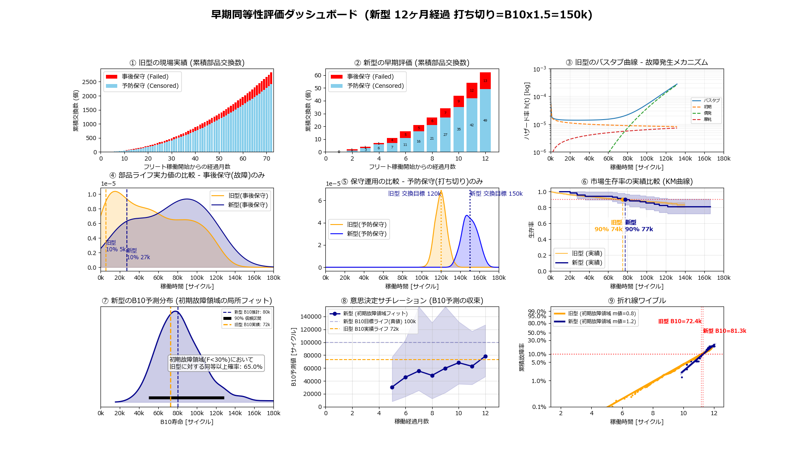

<!-- Written in 2026 by yasuakih -->
# フリート早期同等性検証ダッシュボード

## 目的
本ノートは、新型機導入の初期段階において、部品ライフの同等性を早期に評価するためのシミュレーション手法と検討結果をまとめたものである。主に自身の備忘録としての役割を持つが、同様の課題を抱えるエンジニアの参考となれば幸いである。

## 背景
品質工学や信頼性工学を実践する現場では、「新型機の部品ライフが旧型機と同等以上であるか」を確認することがある。しかし、製造用の機械などにおいては信頼性が高いこと、また新型機導入直後の稼働台数が少ないことから、部品ライフなどの故障データは極めて乏しい。

一般的に、B10ライフ (フリートの10%が故障する時点) などBライフの評価にはワイブルプロットが用いられるが、有意な評価に必要な故障データ (部品数 N > 20) が揃うまでに長期の観測期間 (例: 半年～1年以上) を要する場合もある。そこで「データが少ない初期段階 (関心のあるBライフ近傍) で、いかに前倒しして同等性を評価するか」という現場の課題を解決を想定し、本シミュレータを作成した。

## 概要
本スクリプトは、市場における機械の稼働と部品ライフをモンテカルロ法ベースでシミュレーションし、少数の初期観測データから真の寿命 (B10ライフ) を推定し、比較するPythonプログラムである。

## 手法
- **バスタブ曲線モデル**<br/>
   シミュレーション用データ作成においては、初期故障 (β<1)、偶発故障 (β=1)、摩耗故障 (β>1) の各故障モードを想定したワイブル分布をもとにライフ値をサンプリングし、バスタブ曲線を模した分布をもつ部品ライフデータを作成した。

- **カプラン・マイヤー法による生存曲線**<br/>
   予防保守 (打ち切り) によって寿命前に交換された部品ライフ (打ち切りデータ) を破棄せず、カプラン・マイヤー法 (KM法) を用いて生存率計算に組み込んだ。

- **ブートストラップ法によるB10推定**<br/>
   限られた観測データからランダムリサンプリングを繰り返し、B10推定値の「バラツキ」を擬似的な信頼区間として可視化し、予測の不確実性を定量的に評価した。

## シミュレーション結果
新型機稼働後12ヶ月時点でのシミュレーション例を示す。<br/>
<div align="center">
  <figure>
    
    <br/>
    <figcaption>シミュレーション結果<a href="img/fleet_reliability_simulator.png" target="_balnk"> [別ウィンドウで開く]</a></figcaption>
  </figure>
</div>

## ダッシュボードの解説
ダッシュボード上に配置された各チャートが示す意味と、そこから得られる知見は以下の通りである。

### 上段：全体サマリと真のモデル状態
- **① 総交換数に対する故障の割合 (旧型機)**<br/>
    旧型フリートで発生した部品交換の総数 (累積) を「事後保守(故障)」と「予防保守(打ち切り)」に分けて表示。運用コストの全体感を把握する。旧型の稼働開始からの経過月数は72ヶ月 (6年) である。

    事後保守 (赤色) は、寿命を迎えて壊れて交換された部品。予防保守 (青色) は、まだ使える部品であるが寿命が近づいたため交換された部品。後者の割合が多いほど予防保守が機能しているが、真のライフ限界が見えにくくなるというジレンマを示す。

	フリートが市場に投入され、稼働している台数は、この経過月数と一致させた。(1月目=1台、2月目=2台、...)

- **② 総交換数に対する故障の割合 (新型機)**<br/>
    新型フリートについて①と同様に作成した。新型は稼働開始からの経過日数は少なく、12ヶ月 (1年) である。

    シミュレーションでは、新型は旧型と比べてB10ライフが長く設定されており (新型:旧型 = 100k:80k) [サイクル]、機械の台数とサイクル数が同じであれば部品交換数は少ないことが期待される。

- **③ バスタブ曲線モデルのハザード関数**<br/>
    シミュレーションの裏側で動いている「真の故障率の推移」を示すバスタブ型のハザード関数を示す。初期故障が立ち下がり、水平な船底を示す偶発故障を経、摩耗故障へ立ち上がりと、予防保守のタイミングを可視化する。

    グラフ①の「事後保守」(赤色)に該当するデータを使用した。

### 中段：現場の運用評価と生存率
- **④ 事後保守による部品ライフ**<br/>
    事後保守 (故障) によって交換された部品ライフの分布 (カーネル密度推定) を新型と旧型に分けて表示。稼働時間 (X軸) が短い部品から数えて10%が故障したライフ値を縦線で示す。新型が旧型よりも縦線が右にあり、また分布の形状も右に寄っていることは、新型の寿命が長いことを示す。

- **⑤ 予防保守による部品ライフ**<br/>
    予防保守 (打ち切り) によって交換されたときの部品ライフの分布 (カーネル密度推定) を新型と旧型に分けて表示。

	シミュレーションでは、交換の目安となる目標ライフ値として旧型は新型の80%に設定しており、縦線で示した。部品ライフはこの縦線を中心に分布していることがわかる。

    目標ライフ値は、現場のダウンタイム評価や、保守サポート戦略におけるコスト評価によって決定される。

- **⑥ KM生存曲線**<br/>
    カプラン・マイヤー法 (KM法) で作成した、打ち切りデータを考慮したノンパラメトリックな生存曲線を示す。ラインの落ち込みは故障の発生を示す。新型と旧型のラインが離れるほど部品ライフに差異があることを示す。

### 下段：高度なライフ予測と意思決定

本シミュレーションでは初期故障をターゲットとしており、下記 ⑦ ⑧ ⑨ では、新・型旧型ともに累積故障率 F < 30% のデータポイントのみを使用した。

- **⑦ B10ライフ予測分布**<br/>
    ブートストラップ法で推定したB10値の確率分布。分布の裾の広さが「現時点での予測の不確実性」を表す。黒の水平線は90%の予測値が収まる範囲に対応する。サンプル数が少ない場合は裾野が広く、不確実性が高い。旧型のB10予測 (燈) に対して、新型のB10予測 (青) を比較し、右側に移動するほど新型の部品ライフが優れていることを示す。

    新型機のB10が旧型機のB10を上回っている「確率」をパーセンテージでグラフ上に提示することで、経営的・工学的なGO/NO-GO判断を支援する。

- **⑧ 意思決定サチュレーション**<br/>
    評価期間 (すなわちN数) が増えるにつれて、B10推定値の信頼区間がどのように収束 (サチる) していくかを示す。いつ判断を下すべきかの目安となる。

   累積故障率 F < 30% のデータポイントを用いたが、特に稼働開始まもない初期段階ではN数が少ないため、参考用として全データを用いてプロット、色で区別した。

    新型機の12ヶ月目では、B10推定値 (青; 折れ線) が上昇傾向にあり、サチっていない。6ヶ月目以降、B10推定値の信頼区間 (青色のバンド) が真値 (青点線) を含んでいるが、その幅が広いことからより多くのサンプルが必要と言える。

- **⑨ 累積ハザードワイブルプロット**<br/>
    部品ライフ解析のベースとなる折れ線ワイブルプロット。ここでは全データポイントを、累積故障率 F < 30%の領域と、それ以上の領域とに分けて、それぞれ直線をフィッティングした。十分なデータ点がない場合、直線は表示しない。この手法は教科書的には好ましくないことに注意。

### まとめ
予防保守のタイミング(打ち切り目標値)を変更した際の、故障発生数とB10予測精度への影響(トレードオフ)をシミュレーションで可視化した。ただし、観測期間が短すぎる場合、推定区間はブロードになり、判断は困難である。

---

## 付録

### A. 実行手順
1. Pythonインストール
   ```bash
   バージョン3.10で確認済
   ```

2. Python仮想環境の構築
   ```bash
   python -m venv .env
   .env\Scripts\activate.bat (UNIX系OSの場合、source .env/bin/activate)
   ```

3. 必要パッケージの導入
   ```Bash
   pip install numpy pandas matplotlib scipy reliability
   ```

4. スクリプトの実行
   ```Bash
   python fleet_reliability_simulator.py
   ```

### B. 添付ファイル
* Pythonスクリプト
  * [fleet_reliability_simulator.py](fleet_reliability_simulator.py)

* 保守用プロンプト
  * [フリート早期同等性検証ダッシュボード構築プロンプト.txt](フリート早期同等性検証ダッシュボード構築プロンプト.txt)

### C. 主要なパラメータ一覧
シミュレーションの挙動は、コード冒頭のグローバル変数を変更することで制御可能。

* EVAL_MONTHS_NEW / EVAL_MONTHS_OLD: 評価対象となる稼働期間(月数)
* CYCLES_PER_DAY: 1日あたりの部品稼働サイクル数(例: 4000)
* CENSORING_FACTOR: 予防保守のタイミングを決定する係数。設計ライフ(B10)に対する倍率(例: 1.5)。この値を下げると故障は減るが、摩耗故障データが取れなくなり予測分布が広がる。
* B10_TARGET_NEW / B10_TARGET_OLD: 新型・旧型の設計B10ライフ目標値
* modes: バスタブ曲線を構成する3つの故障モード(初期・偶発・摩耗)の確率(prob)と形状パラメータ(beta)


----
このページに掲載した作品 (テキスト、プログラムコードなど) はパブリック・ドメインに提供しています。詳細は [CC0 1.0 全世界 コモンズ証](https://creativecommons.org/publicdomain/zero/1.0/deed.ja) をご覧ください。
