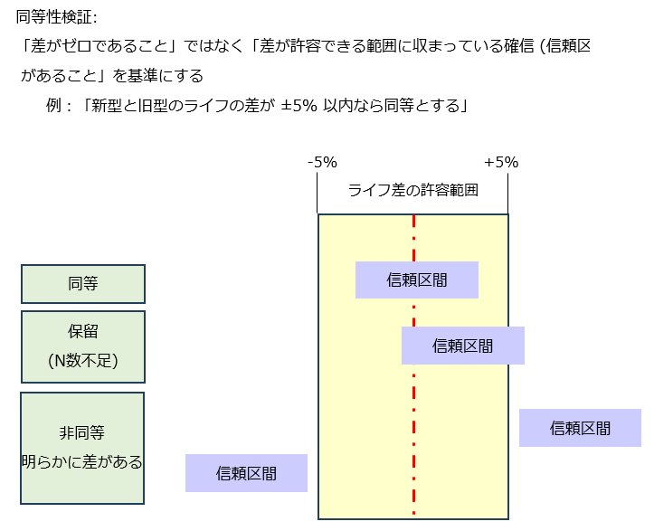
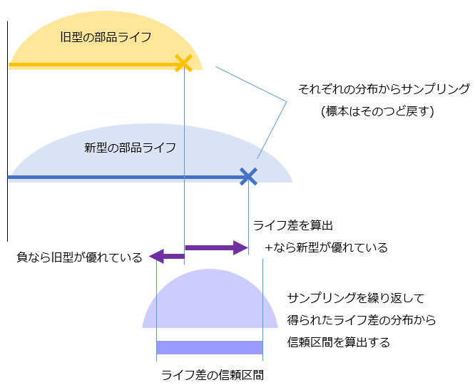

<!-- Written in 2026 by yasuakih -->

# フリート早期同等性検証ダッシュボード

## 目的

本ノートは、新型機導入の初期段階において、部品ライフの同等性を早期に評価するためのシミュレーション手法と検討結果をまとめたものである。主に自身の備忘録としての役割を持つが、同様の課題を抱えるエンジニアの参考となれば幸いである。

## 背景

品質工学や信頼性工学を実践する現場では、「新型機の部品ライフが旧型機と同等以上であるか」を確認することがある。しかし製造用の機械などにおいては信頼性が高いこと、また新型機導入直後の稼働台数が少ないことから、部品ライフなどの故障データは極めて乏しい。

本質的な問いは、「何ヶ月のデータを集め、何件の故障を観測すれば、新型機の同等性を客観的に判断できるか」である。

一般的に、B10ライフ (機群(=フリート)の10%が故障する時点) などBライフの評価にはワイブルプロットが用いられるが、有意な評価に必要な故障データ (部品数:N) が揃うまでに長期の観測期間(例: 半年～1年以上)を要する場合もある。本シミュレーターは、この「早期評価」の難しさに対して、現場で馴染みのあるワイブル分析を足場にした計算的ソリューションを提供する。

現場には技術的な障壁もある。予防保守(PM)によって部品は故障前に交換され、その稼働サイクルは打ち切りデータ (Censored) になる。Censored を無視して故障データだけで B10 を計算すると寿命分布の推定にバイアスが生じ、一般的には B10 が過小評価される可能性がある。この問題を正しく扱うために Kaplan-Meier (カプラン・マイヤー) 法を組み込んだ。

## 概要

本スクリプトは、市場における機械の稼働と部品ライフをモンテカルロ法ベースでシミュレーションし、少数の初期観測データから真の寿命 (B10ライフ) を推定・比較するPythonプログラムである。機械部品の故障をモデル化するのにしばしば使われる「バスタブ型モデル」を起点に、B10ライフを Weibull (ワイブル) 回帰で推定し、ワイブルプロットで確認する」という一貫したストーリーで構成した。

## 手法

- **混合ワイブルモデルによるバスタブ型データ生成**<br/>
  初期故障(β&lt;1)、偶発故障(β=1)、摩耗故障(β&gt;1)の3つの故障モードを混合したワイブル分布から部品寿命データを生成し、バスタブ曲線を模した教科書的な分布を再現した。Weibull モデルは本シミュレーション全体を通じた共通言語である。

- **Kaplan-Meier法 - Weibull 回帰への橋渡し**<br/>
  予防保守による打ち切りデータ (Censored) を破棄せず、Kaplan-Meier 法 (KM法) を用いて生存率計算に組み込んだ。ここでの KM 法の役割は、Censored が持つライフ情報を保持した上で Weibull 回帰を実行するための変換であり、統計学的な厳密さよりも処理速度を優先した。

- **ブートストラップ法による B10 推定と不確実性の可視化**<br/>
  新型機において関心の対象となるのは初期故障領域での故障が多い。そこで、ワイブル回帰による推定点を Weibull 確率紙 (X = ln(t), Y = ln(−ln(S(t)))) 上に変換し、初期故障領域 (累積故障確率 F &lt; 30%) のデータ点を使用して線形回帰して β を推定、B10 を逆算した。この処理をブートストラップ法で反復することで、B10 推定値の「バラツキ」を信頼区間として可視化し、予測の不確実性を定量的に評価した。

- **TOST(Two One-Sided Tests)による同等性判定**<br/>
  新型・旧型の B10 推定値の差の分布をブートストラップ法で生成し、その90%信頼区間の下限 (すなわちワーストケース) が許容下限 (旧型B10比 −10%) を上回るかどうかで同等性を判定した。許容区間の上限は +50%とした。

## 同等性判定の考え方

### 少N数では「ライフ差がない」ことの証明は困難

典型的な仮説検定 (t検定など) は「差がゼロである」という帰無仮説 (H0) を棄却することで差の有無を議論する。しかし、N数が少ないと新型・旧型の間で「部品ライフ差」の検出力が不足し、「差がない」という結論 (誤判定) を出しやすくなるリスクが生じやすくなる。

同等性検証の場合、考え方を逆転させて、「差がゼロである」ことではなく、「差が許容できる範囲に収まっている確信 (信頼区間) があること」を基準にする。

  　　　　　　　　　例：「新型と旧型のライフの差が ±10% 以内なら同等とする」

<p>

### 許容範囲と信頼区間の照合による判定

二重片側検定 (TOST: Two One-Sided Tests) と呼ばれる同等性検証の手法は、あらかじめ「この範囲に収まれば同等」という許容範囲を設定する (本シミュレーターでは旧型のB10ライフ比で −10%～+50%)。算出した信頼区間をこの許容範囲と照合して、次の3通りで判定する。

 | 判定 | 条件 | 意味 |
 |---|---|---|
 | 同等 | 信頼区間が許容範囲の内側に納まる | ライフ差は許容範囲に確信をもって収まっている |
 | 保留 | 信頼区間が広く、許容範囲をまたぐ | 方向性はあるが確信には至らない。データを増やして再評価する。 |
 | 非同等 | 信頼区間が許容範囲から外れる | ライフ差が許容限界を超えている。差が正なら新型のライフが優れ、差が負なら旧型のライフが優れている。 |

<br/>
<div align="center">
  <figure>
    
  </figure>
</div>
<br/>


### ブートストラップによる差の分布の構築

旧型・新型それぞれの B10 推定値は、観測データにバラツキがあるため「単一の値」として確定できない。そこでブートストラップ法を使用して、両者の B10 推定値の「分布」を生成する。

手順は次のとおりである。

1. 旧型の観測データ (全件) から、同じ件数を復元抽出 (1件引いては戻す) し、疑似データセットを作成する。新型からも同様に作成する。
2. それぞれの疑似データセットから B10 ライフを推定し、両者のライフ差 (新型 − 旧型) を1点として記録する。差が正なら新型が優れ、負なら旧型が優れていることを意味する。
3. この操作を数千回繰り返し、ライフ差の分布を構築する。
4. その分布から信頼区間 (ここでは90%) を算出する。

<br/>
<div align="center">
  <figure>
    
  </figure>
</div>
<br/>

## シミュレーション結果

新型機稼働後12ヶ月時点でのシミュレーション例を示す。<br/>
<div align="center">
  <figure>
    
    <br/>
    <figcaption>シミュレーション結果 <a href="img/fleet_reliability_simulator(12, 4.0).png" target="_blank">[別ウィンドウで開く]</a></figcaption>
  </figure>
</div>

## ダッシュボードの解説

ダッシュボードは「前提モデルの提示 → 市場実績の確認 → 推定・判断 → ワイブルプロットで確認」という流れに沿って各チャートを配置した。

### 上段：前提モデルの提示と市場実績の確認

- **① バスタブ曲線(模式図) - ストーリーの起点**<br/>
  シミュレーション全体の前提となる混合ワイブルモデルのハザード関数を模式的に示す。初期故障(β&lt;1、右下がり)・偶発故障(β=1、水平)・摩耗故障(β&gt;1、右上がり)の3成分と、それらを所定の混合比で重み付けした合成バスタブ曲線を描画した。ただし、教科書的なバスタブ形状を描画するため、実データからの逆推定 (最尤推定) ではなく、シミュレーションに使用した真のパラメータ(`WEIBULL_MODES`)から計算した。

  本シミュレーターでは、サンプルデータを生成するため、`WEIBULL_MODES` に定義したパラメータを用いた。

- **② 総交換数に対する故障の割合(旧型機)**<br/>
  旧型フリートで発生した部品交換の総数(累積)を「事後保守 (故障)」と「予防保守 (打ち切り) 」に分けて表示した。旧型の稼働開始からの経過月数は 72ヶ月(6年)である。

  事後保守 (赤色) は寿命を迎えて壊れて交換された部品、予防保守 (青色) はまだ使えるが寿命が近づいたため交換された部品を示す。フリートが市場に投入されて稼働している台数は、この経過月数と一致させた (1月目=1台、2月目=2台、...)。

- **③ 総交換数に対する故障の割合(新型機)**<br/>
  新型フリートについて②と同様に作成した。新型の稼働開始からの経過月数は12ヶ月 (1年) である。シミュレーションでは、新型は旧型と比べてB10ライフを長く設定しており (新型:旧型 = 100k:80k サイクル)、同じ台数・サイクル数であれば部品交換数が少ないことが期待される。

### 中段：現場データの詳細把握

- **④ 事後保守による部品ライフ**<br/>
  事後保守 (故障) によって交換された部品ライフの分布 (カーネル密度推定) を新型と旧型に分けて表示する。稼働時間 (X軸) が短い部品から数えて10%が故障したライフ値を縦線で示す。新型の縦線が旧型より右にあり、分布の重心も右に寄っているほど、新型の寿命が長いことを示す。

- **⑤ 予防保守による部品ライフ**<br/>
  予防保守 (打ち切り) によって交換されたときの部品ライフの分布 (カーネル密度推定) を新型と旧型に分けて表示する。縦線で示した予防保守目標ライフ (旧型: 320k サイクル、新型: 400k サイクル) を中心に分布していることが確認できる。一般的に、現場のダウンタイム評価や保守サポート戦略におけるコスト評価によって目標ライフ値が決定される。

- **⑥ KM生存曲線 - Weibull 回帰への橋渡し**<br/>
  Kaplan-Meier 法で作成した、打ち切りデータを考慮したノンパラメトリックな生存曲線を示す。ラインの落ち込みは故障の発生を示し、グレーの帯はGreenwoodの公式 (Greenwood's formula) による95%信頼区間である。

  ここではシミュレーション速度を優先し、KM 法で打ち切り情報を保持した生存曲線を推定し、その形状をもとに Weibull 確率紙上へ対応させ、B10 を推定するアプローチを採った。ただし統計学的に厳密ではなく、通常は打ち切りを含む Weibull 最尤推定法 (MLE) が推奨される。

### 下段：Weibull 回帰による B10 推定・判断・確認

本シミュレーションでは初期故障領域をターゲットとしており、チャート⑦～⑨では新型・旧型ともに累積故障率 F &lt; 30% のデータポイントのみを使用して局所フィットを行った。

- **⑦ 同等性検証：B10ライフ差の信頼区間 vs 許容限界**<br/>
  TOST(Two One-Sided Tests)の考え方に基づいた同等性検証チャート。KM → Weibull回帰で推定した新型・旧型それぞれのB10ブートストラップサンプルからペアワイズ差の分布を生成し、90%信頼区間が許容限界 (緑色帯) の範囲に収まるか否かで同等性を判定する。

  - 許容下限 (緑帯左端): 旧型B10比 −10%。CI下限がこれを上回れば「同等以上 (OK)」と判定する。
  - 許容上限 (緑帯右端): 旧型B10比 +50%。参考表示のみで判定には使用しない。

  判定結果と「旧型以上の確率」をチャート上に表示することで、経営的および工学的なGO/NO-GO判断を支援する。

<br/>

<div align="center">
  <figure>
    
    <br/>
    <figcaption>新型機の12ヶ月目: B10推定値の信頼区間 (青色帯) が許容限界 (緑色帯) を完全に含んでおり、より多くのサンプルが必要。赤矢印は、90%信頼限界の下限 (ワーストケース) が許容限界の下限を下回っていることを強調する。</figcaption>
  </figure>
</div>
<br/>

<br/>

<div align="center">
  <figure>
    
    <br/>
    <figcaption>新型機の24ヶ月目: B10推定値の信頼区間は許容限界の下限を上回っいることから、旧型機と同等以上と判断できる。</figcaption>
  </figure>
</div>

<br/>

- **⑧ 意思決定サチュレーション**<br/>
  評価期間 (すなわちN数) が増えるにつれて、B10推定値の信頼区間がどのように収束してゆくかを示す。「いつ判断を下すべきか」の目安となるチャートで、本シミュレーターの中心的な問いへの直接の回答でもある。

  累積故障率 F &lt; 30% のデータポイントを用いた局所フィット (青実線) を行い、点推定および90%信頼区間 (青帯) を表示した。N数が不足する初期段階では、参考用として、全データを用いた全域フィット (グレー破線) を表示した。

- **⑨ 折れ線ワイブルプロット - 最終確認**<br/>
  ストーリーの締めくくりとして、推定結果をワイブル確率紙で目視確認するチャートである。

  KM法で推定した累積故障率を Weibull確率紙へ変換 (X = ln(t), Y = ln(−ln(S(t)))) してプロットし、累積故障率 F &lt; 30% の初期故障領域とそれ以上の領域に分けて線形回帰 (折れ線フィット) を行った。この作図法は一般的ではないことに注意。設置台数が少ない時点では初期故障領域に関心があることと、バスタブ曲線モデルではしばしば打点が屈曲するため、単一の直線フィットが困難であることから考案した。

  回帰直線の傾きがワイブル形状パラメータ β の推定値となり、B10交点も直接読み取れる。信頼区間はStudent-t分布による予測区間として描画する。

## まとめ

「新型機の部品ライフが旧型機と同等以上か」を早期に客観的に判断するという問いに対し、混合ワイブルモデル・KM法・ブートストラップ・TOSTを組み合わせたシミュレーターを構築した。⑧サチレーションチャートが示すように、判断を下せる時点は観測データの量と質によって変わる。N数が少ない初期段階では信頼区間がブロードになり判断が困難であるが、評価月数を変えながらシミュレートすることで「いつ・どれだけのデータが必要か」を事前に見積もることができる。

---

## 付録

### A. 実行手順

1. Python インストール(バージョン 3.10 以降で確認済み)

2. Python 仮想環境の構築
   ```bash
   python -m venv .env
   .env\Scripts\activate.bat   # Windows
   source .env/bin/activate    # Unix / macOS
   ```

3. 必要パッケージの導入
   ```bash
   pip install numpy pandas matplotlib scipy
   ```

4. スクリプトの実行
   ```bash
   python fleet_reliability_simulator.py
   ```

### B. 添付ファイル

- Pythonスクリプト
  - [fleet_reliability_simulator.py](fleet_reliability_simulator.py)

### C. 主要なパラメータ一覧

シミュレーションの挙動は、コード冒頭のグローバル定数を変更することで制御可能。

| 定数名 | デフォルト値 | 説明 |
|---|---|---|
| `EVAL_MONTHS_NEW` | `12` | 新型機の評価対象期間(月数)。値を変えてフェーズをシミュレート |
| `EVAL_MONTHS_OLD` | `72` | 旧型機の評価対象期間(月数) |
| `CYCLES_PER_DAY` | `4000` | 1日あたりの部品稼働サイクル数 |
| `CENSORING_FACTOR` | `4.0` | 予防保守のタイミング係数。B10設計ライフに対する倍率。下げると故障が減るが予測分布が広がる |
| `B10_DESIGN_NEW` | `100,000` | 新型機の B10 設計ライフ目標値 [サイクル] |
| `B10_DESIGN_OLD` | `80,000` | 旧型機の B10 設計ライフ目標値 [サイクル] |
| `WEIBULL_MODES` | 下記参照 | バスタブ曲線を構成する3つの故障モードの形状パラメータ(beta)と発生確率(prob) |
| `EQUIV_MARGIN_LOWER_RATIO` | `-0.10` | TOST 判定の許容下限(旧型B10比 −10%)|
| `EQUIV_MARGIN_UPPER_RATIO` | `+0.50` | 同等性検証の参考上限(旧型B10比 +50%)|
| `N_BOOTSTRAP_MAIN` | `2000` | ⑦⑧で使うブートストラップ反復数 |

`WEIBULL_MODES` のデフォルト設定:

```python
WEIBULL_MODES = [
    {'beta': 0.7, 'prob': 0.3},  # 初期故障モード (β < 1)
    {'beta': 1.0, 'prob': 0.4},  # 偶発故障モード (β = 1)
    {'beta': 2.5, 'prob': 0.3},  # 摩耗故障モード (β > 1)
]
```

---

このページに掲載した作品（テキスト、プログラムコードなど）はパブリック・ドメインに提供しています。詳細は [CC0 1.0 全世界 コモンズ証](https://creativecommons.org/publicdomain/zero/1.0/deed.ja) をご覧ください。
