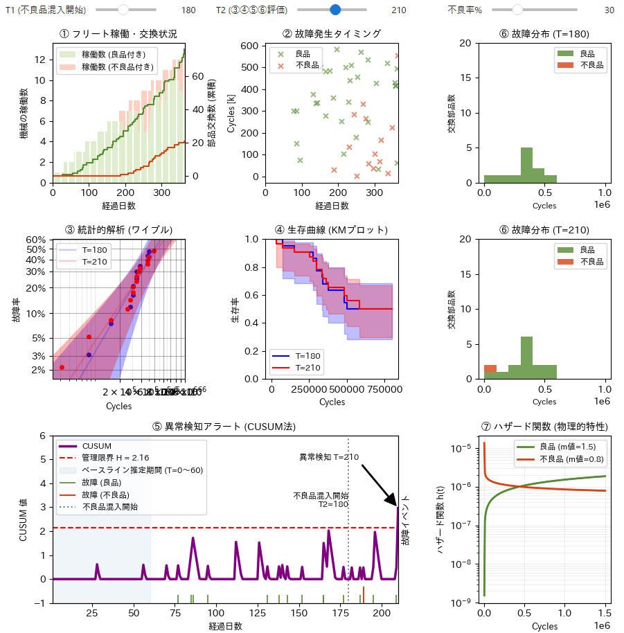

<!-- Written in 2026 by yasuakih -->
# フリート異常検出ダッシュボード - CUSUM法による部品ライフの早期異常検知

> **Note:** このページは学習の記録であり、パブリックドメインで公開するものである。

---

## 1. 目的

本ページは、品質工学・信頼性工学の学習成果として、機械フリート (fleet: 機群) における**定期交換部品の異常を早期に検知する手法**を Python でシミュレーションした記録である。

コードは JupyterLab 上で動作するインタラクティブなダッシュボードとして実装されており、スライダー操作でパラメータを変えながら、異常検知アルゴリズムの挙動をリアルタイムで確認できる。

---

## 2. 背景と課題

### 部品ライフ異常検知の難しさ

製造行などの機械が稼働する現場では、機械フリートにおける定期交換部品に「不良品」が混入した場合、その影響がすぐに顕在化しないことが起こることがある。これには次のような構造的な理由があげられる。

- **初期故障型の不良品**：<br/>
    不良品は初期時点での故障する場合が多くある一方、中には「生き残る個体」もあり、見かけ上安定して動作する。そのため、フリート全体ではシグナルが埋もれやすい。
- **少数サンプル**：<br/>
    フリート全体数が少ない初期段階では検出される不良品の絶対数が少なく、統計的な有意差が現れにくい。
- **予防保守による打ち切り**：<br/>
    予防保守による部品交換は「故障していない打ち切りデータ」を生み出し、単純な故障カウントでは状況を誤判断しやすい。

これらの課題に対して、ワイブル分布の物理的モデルとCUSUM法による統計的プロセス管理を組み合わせることで、感度の高い早期検知をスタディした。

---

## 3. 概要

### ワイブル分布

品質工学におけるワイブル分布は、部品の故障率の時間的推移を示すモデルである。

 | フェーズ | 故障率の傾向 | ワイブル形状パラメータ β |
 |---|---|---|
 | 初期故障期 | 時間とともに減少 | β < 1(例: β = 0.8)|
 | 偶発故障期 | ほぼ一定 | β ≈ 1 |
 | 摩耗故障期 | 時間とともに増加 | β > 1(例: β = 1.5)|

本シミュレーションでは、良品を「摩耗故障モード(β = 1.5)」、不良品を「初期故障モード(β = 0.8)」でモデル化している。

### CUSUM 法(累積和管理図)

[CUSUM(Cumulative Sum Control Chart)法](https://en.wikipedia.org/wiki/CUSUM)は、プロセスの平均値からの微小な逸脱を累積することで、シューハートのX-R管理図よりも早くシフトを検出できる手法である。

C<sub>i</sub> = max(0, C<sub>i-1</sub> + (x<sub>i</sub> - μ<sub>0</sub>) - k)

- μ<sub>0</sub>: ベースライン期間 (T=0～T=60) の故障率平均
- k: 許容変化量 (= 2σ) 検出感度調整
- H: 管理限界 (= 12σ) アラート閾値

ベースラインを T=0～T=60のデータで推定し、以降の逸脱を累積することで、不良品混入のタイミングを検出する。

---

## 4. シミュレーション結果

以下は、T1 = 180 日(不良品混入開始)、T2 = 210 日(判定日)、不良混入率 30% の条件での出力である。



図：フリート異常検出ダッシュボードの出力例 (T1=180, T2=210, 不良率=30%)

---

## 5. ダッシュボードの解説

ダッシュボードは 3×3 のグリッドレイアウトに 8つのチャートで構成されている。

### ① フリート稼働・交換状況 (上段左)

棒グラフ (左軸) で各日の稼働台数 (良品搭載／不良品搭載) を積み上げ表示し、階段グラフ (右軸) で累積交換数を表している。

- 棒グラフ: T1 (不良品の混入開始日) 以降、稼働中の機械に不良品が組み込まれている様子が確認できる。
- 階段グラフ: 不良品の累積交換数が増加している。もし不良品が良品を上回るペースで増加している場合、部品寿命の短命化も疑われる。

### ② 故障発生分布 (上段中)

横軸を経過日数、縦軸を部品寿命 (サイクル数) とした散布図である。良品故障 (緑×) と不良品故障 (赤×) をマーカーで区別する。

- T1 以降に赤× が低サイクル (短寿命) 領域に集中して現れており、不良品の初期故障モードが視覚的に確認できる。

### ③ 統計的解析 - ワイブル (中段左)

T1 時点と T2 時点のデータをそれぞれワイブル確率紙にプロットし、推定された直線 (良品・不良品混合) を比較する。

- T2 時点のフィット直線 (赤) が T1 のフィット直線 (青) に対して上左方向にシフトしていれば、早期故障の増加を示唆する。また、プロットの非線形性 (屈曲) は複数の故障モードの混在を示す。

### ④ 生存曲線 - KM プロット (中段中)

Kaplan-Meier 推定量による生存曲線 (打ち切りデータを考慮) である。T1 時点 (青) と T2 時点 (赤) を比較する。

- T2 時点の曲線が T1 時点より下方に位置する場合 (生存率が早期に低下する) 場合、不良品混入後の部品ライフの寿命短縮を示す。

### ⑤ 異常検知アラート - CUSUM 法 (下段左・中)

日々の故障発生率のベースライン (T=0 ～ T60) からの逸脱を累積した管理図である。グラフ下端の枠線から上向きに描画された小さな刻み線は良品故障 (緑)、不良品故障 (赤) の発生に対応する (区別のため色と高さを変えた)。Y軸 (CUSUM値) が -1 の管理限界線(H、赤破線)を最初に超えた時点で「異常検知」の矢印が引き出される。

- 図では T = 210日でアラートが発生しており、不良品混入開始 (T1=180日) から30日後に検知した。この時点での不良品の故障は 1個であり、CUSUM の感度の高さを確認した。

### ⑥ 故障分布ヒストグラム (上段右・中段右)

T1 時点と T2 時点それぞれの故障寿命 (サイクル数) の分布を積み上げヒストグラムで表示する。

- T2 時点では低サイクル側で不良品 (橙) が増加する。不良品の初期故障モード (β < 1) により、短命故障が集中する様子が分布の形状変化として現れる。

### ⑦ ハザード関数(物理的特性) (下段右)

ワイブル分布のハザード関数 h(t) を対数スケールで描画し、良品 (緑、β = 1.5) と不良品 (橙、β = 0.8) の物理的な故障メカニズムの違いを示す。

- 良品の h(t) は時間とともに単調増加する摩耗故障型であるのに対し、不良品の h(t) は単調減少する初期故障型である。この形状の違いによって混合フリートでワイブルプロットが歪む理由が説明される。

---

## 付録 A：実行手順

### 前提環境
- Python 3.10 以上
- JupyterLab

### 1. Python 仮想環境の構築

```bash
# 仮想環境の作成
python -m venv .env

# 有効化 (Windows)
.env\Scripts\activate

# 有効化 (macOS / Linux)
source .env/bin/activate
```

### 2. 必要ライブラリのインストール

```bash
pip install numpy pandas matplotlib japanize-matplotlib \
            ipywidgets lifelines reliability scipy jupyterlab
```

### 3. JupyterLab の起動

```bash
jupyter lab
```

ブラウザが開いたら、%run コマンドでスクリプトを実行する。

```bash
%run fleet_anomaly_detection.py
```

### 4. スライダー操作

ノートブック実行後、以下の 3 つのスライダーが表示される。

| スライダー | 説明 | デフォルト値 |
|---|---|---|
| T1(不良品混入開始日) | 不良品が混入し始める日 | 180 日 |
| T2(③④⑤⑥評価) | ワイブル・KM・CUSUM・ヒストグラムの評価日 | 210 日 |
| 不良率 % | 交換時に不良品が混入する確率 | 30 % |

---

## 付録 B：添付ファイル

- Python スクリプト
  [fleet_anomaly_detection.py](./fleet_anomaly_detection.py)

- フリート異常検出ダッシュボード — LLM 編集引き継ぎプロンプト
  [CUSUM法による部品ライフの早期異常検知構築プロンプト.md](./CUSUM法による部品ライフの早期異常検知構築プロンプト.md)

---

## 付録 C：主要パラメータ一覧

| パラメータ | 変数名 | デフォルト値 | 説明 |
|---|---|---|---|
| 目標 B10 寿命 | `TARGET_B10` | 800,000 サイクル | 良品部品の設計寿命(10% 故障点) |
| 1 日あたりの稼働サイクル数 | `CYCLES_PER_DAY` | 20,000 サイクル/日 | 1 台の機械が 1 日に消費するサイクル |
| 予防保守間隔 | `INSPECTION_INTERVAL` | 14 日 | 予防保守(インスペクション)の実施間隔 |
| フリート増加間隔 | `RAMP_UP_INTERVAL` | 30 日 | 30 日ごとに機械を 1 台追加 |
| シミュレーション期間 | `TOTAL_DAYS` | 360 日 | 総シミュレーション日数 |
| 良品のワイブル形状 β | `BETA_GOOD` | 1.5 | 摩耗故障モード(β > 1) |
| 不良品のワイブル形状 β | `BETA_BAD` | 0.8 | 初期故障モード(β < 1) |
| 年間想定交換件数 | `EXPECTED_REPLACEMENTS_PER_YEAR` | 50 件 | 良品スケール α を逆算するための目標値 |
| 不良品混入開始日(UI) | `T1` | 180 日 | スライダーで変更可能 |
| 評価判定日(UI) | `T2` | 210 日 | ワイブル・KM・ヒストグラムの評価日。スライダーで変更可能 |
| 不良混入率(UI) | `mix_rate` | 40 % | スライダーで変更可能 |
| CUSUM スラック係数 | `k` | 0.5 σ | 許容変化量 (小さいほど感度が高い) |
| CUSUM 管理限界 | `H` | 8.0 σ | アラート閾値 (大きいほど誤検知が減る) |

----
このページに掲載した作品 (テキスト、プログラムコードなど) はパブリック・ドメインに提供しています。詳細は [CC0 1.0 全世界 コモンズ証](https://creativecommons.org/publicdomain/zero/1.0/deed.ja) をご覧ください。
